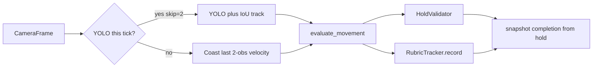

# Dynamic throw/catch movements — design proposal

**Date:** 2026-08-17  
**Status:** Design only. This document does not change runtime behavior.  
**First candidate:** `Basic Toss` (single bottle, same-hand)

This is a self-contained design for a throw/catch assessment family beside today’s hold movements. It is not an implementation plan and it does not add code to existing Python, Flutter, test, or documentation files.

---

## 1. Context

ELIXR’s scored catalog is a **per-frame geometry check** plus **time-on-target**. Each active tick, `backend/api/websocket.py` `process_frame` runs YOLO on a skip schedule, Hands and/or Pose, then `evaluate_movement(...)`. The rule returns a frozen `CriterionCheck` / `RuleResult` for that frame. `HoldValidator` treats `feedback_type == "positive"` and `posture_status == "stable"` as hold credit. `RubricTracker.snapshot` derives completion from that hold (`hold_confirmed` / `hold_progress`). The default confirmation target is `HOLD_CONFIRMATION_SECONDS = 2.5`.

`movement_state` already exists for short histories (for example `track_bottle_stability` with `STALL_HISTORY_FRAMES = 12`). It is not a throw lifecycle.

No catalog movement currently sets both `requires_hands` and `requires_pose`. `_hands_needed` and `_pose_needed` in `PracticeSession` are independent flags; they have never both been true for a scored movement.

### 1.1 Pipeline (today)



### 1.2 Constants this design cites

| Constant | Current value | Role |
| --- | --- | --- |
| `TARGET_FPS` | `20` | Frame loop target (50 ms ticks) |
| `YOLO_FRAME_SKIP` | `2` | YOLO about every other tick (~10 Hz) |
| `PROP_TRACK_MIN_IOU` | `0.3` | Greedy AABB identity match |
| `PROP_TRACK_MAX_MISSED_FRAMES` | `5` | Unmatched YOLO updates before a track is dropped |
| `HOLD_CONFIRMATION_SECONDS` | `2.5` | Hold completion target |
| `HAND_BOTTLE_PROXIMITY` | `0.15` | Scaled palm–prop gate used by grips |

Tracker coasting lead is `2 * YOLO_FRAME_SKIP / TARGET_FPS` (0.20 s at current constants). That clamp lives in `max_extrapolation_lead_s()`.

### 1.3 What this family is for

A flair toss is not a 2.5 s hold. The detector must recognize a **grip → release → airborne arc → catch** cycle, score height and catch quality, and complete on one successful cycle without pretending the bottle was held still.

---

## 2. Non-goals

This proposal does **not**:

- Change `CriterionCheck` from a per-tick snapshot into a multi-frame object.
- Turn `rule_engine.py` into a state machine. It stays a dispatcher.
- Change global `YOLO_FRAME_SKIP` for stalls and grips.
- Add protocol-v1 WebSocket phase fields on the first candidate (needed later for a real progress UI; not required to prototype the detector).
- Design spin, bottle rotation, or oriented boxes. YOLO AABBs have no rotation.
- Define multi-prop exchanges, behind-the-back throws, opposite-hand catch as the success definition, shaker toss, or multi-rep height consistency.
- Implement Flutter catalog/UI in this document. When `Basic Toss` is implemented, the movement name remains a cross-layer identifier (`MOVEMENT_CONFIG`, rule registry, Flutter catalog).
- Claim measured FPS, YOLO milliseconds, or toss-detection accuracy. Timing figures below are kinematic estimates or order-of-magnitude budget comments unless labeled otherwise.

---

## 3. Five design questions

Each question states current code fact, the recommendation, and rejected alternatives.

### 3.1 Structure: how should throw/catch sit beside holds?

#### Current fact

`CriterionCheck` is an independent pass/fail for one rubric criterion on a **single frame** (`observed`, `satisfied`, optional `reason_code`). `RuleResult` is the per-tick coaching snapshot. `evaluate_movement` dispatches to a registered evaluator and returns `(RuleResult, hip, movement_state)`.

Completion is hold-shaped:

- `HoldValidator.update` accumulates wall-clock time while the frame is positive and stable.
- `RubricTracker.snapshot(hold)` scores `completion` from `hold.hold_confirmed` / peak `hold_progress` (`hold_confirmed`, `hold_partial_progress`, `hold_brief_progress`, `hold_not_started`).
- Protocol v1 `FeedbackMessage` already carries `hold_progress`, `hold_duration_ms`, `hold_confirmed`, `hold_target_ms`. Evidence JPEG emission is keyed off first `hold_confirmed`.

There is no `assessment_family` in `MOVEMENT_CONFIG`. Every scored movement uses the hold path.

#### Recommendation

Keep `CriterionCheck` as a per-tick snapshot. Add a throw/catch family whose **rule** owns an explicit phase machine in `movement_state`:

`awaiting_grip` → `gripped` → `airborne` → `catching` → `caught`  
(or `failed` → back to `awaiting_grip`)

`releasing` is an **edge** (grip + proximity lost + speed up), not a long-lived phase.

Plug-in that keeps static holds working:

- Keep the `evaluate_movement` signature and per-tick dispatch. Register one new evaluator like any other rule.
- Add `MOVEMENT_CONFIG` flag `assessment_family: "hold" | "throw_catch"`. Existing holds omit it; default `"hold"`.
- `rule_engine.py` stays a dispatcher. It does not become a state machine.
- `process_frame` still calls `evaluate_movement` every tick. **Only** `throw_catch` movements skip `HoldValidator` for completion. Holds keep today’s path unchanged.
- Completion: a small `ThrowCatchTracker` (or equivalent fields already in `movement_state`) maps a successful catch onto the existing WebSocket hold fields for the prototype (`hold_confirmed=true`, `hold_progress` = phase fraction, `hold_target_ms` = the short catch-confirmation window). That avoids a protocol-v1 field change on the first candidate. This is a **compatibility mapping**, not a claim that the toss is a 2.5 s hold.
- Rubric: per-phase `criterion_results` (grip and catch observe technique; airborne mostly positioning and stability; a missing or unconfirmed prop during a short airborne grace is `unknown` / unobserved, not an instant drop). `RubricTracker.snapshot` completion must be **family-gated** so `throw_catch` does not require 2.5 s of positive frames.

Suggested prototype phase → `hold_progress` mapping (UI-compatible, not physics):

| Phase | `hold_progress` | `hold_confirmed` |
| --- | --- | --- |
| `awaiting_grip` | 0.00 | false |
| `gripped` | 0.25 | false |
| `airborne` | 0.50 | false |
| `catching` | 0.75 | false |
| `caught` | 1.00 | true |
| `failed` | 0.00 | false (retry same session) |

`hold_target_ms` for this family should be the catch-hold window (~400–600 ms), not `HOLD_CONFIRMATION_SECONDS * 1000`.

#### Alternatives

- **Rejected:** Drive `HoldValidator` with “positive only while airborne.” Airborne is the opposite of a hold; that path encodes the wrong physics and would fight unknown-grace and dropout-budget logic.
- **Rejected for v1:** New WebSocket phase fields. Useful later for a real progress UI; not required to prototype the detector.
- **Rejected:** Fold the phase machine into `CriterionCheck`. That would make every hold rule carry throw lifecycle it does not need.

---

### 3.2 Velocity signal: is proximity-plus-speed enough, and what does the tracker already provide?

#### Current fact

The **idea** is right: proximity lost + speed up ≈ release; proximity regained + speed down ≈ catch. Hands already run every scored-hand tick, so palm–bottle proximity can be sampled at `TARGET_FPS` (20 Hz) against whatever box the rule sees.

Tracker infrastructure after the “Keep live prop tracks through a one-frame YOLO miss” change:

- `PropDetection` carries `track_id` and `yolo_confirmed` (default `True`). It does **not** carry `vx` / `vy`.
- `PropTracker.update()` still returns **only** detections present in the current YOLO input, each stamped `yolo_confirmed=True`.
- Unmatched tracks remain in `self._tracks` for up to `PROP_TRACK_MAX_MISSED_FRAMES` YOLO updates. `update([])` still returns `[]`.
- `PropTracker.live_detections(now)` returns this-tick matches **plus** still-alive unmatched tracks:
  - `missed_frames == 0` → `yolo_confirmed=True` (this-tick YOLO match or newly created track).
  - unmatched but within grace → `yolo_confirmed=False`, AABB coasted by last-known velocity.
- `CombinedPropDetector.detect_all()` now returns `live_detections()`, so a one-frame empty YOLO result no longer collapses the lists rules see to empty. Skip-frame ticks still coast via `extrapolate()` from the last stored live boxes.
- Velocity remains **internal**: `_coast_detection` derives `vx` / `vy` from the last **two YOLO-confirmed** `(timestamp, bbox)` observations and applies them up to `max_extrapolation_lead_s()`. Rules never receive those components.
- Identity match is still greedy IoU of the new YOLO box against `track.detection` (the last matched/confirmed AABB, not the coasted live box), threshold `PROP_TRACK_MIN_IOU = 0.3`.
- YOLO AABBs have **no rotation/spin**.

`yolo_confirmed` is therefore already a rule-visible bit: this-tick match versus coasted-within-grace. No current evaluator reads it. Hold rules still treat `bottle is None` as `PROP_NOT_DETECTED`; they do not distinguish confirmed vs coasted when a box is present.

#### Is `yolo_confirmed` / `live_detections()` enough for release and catch?

**No.** The distinction is necessary infrastructure and closes the old “empty YOLO ⇒ `bottle is None` ⇒ `PROP_NOT_DETECTED`” hole for a short miss. It is **not** a release/catch detector.

| What the flag actually means | Why that is not release/catch |
| --- | --- |
| `True` | YOLO matched this track **this update**. A clean toss can stay `True` the whole airborne arc. Release is not “YOLO disappeared.” |
| `False` | Unmatched this update, still inside miss grace, box coasted. A **held** bottle with one blur miss looks the same as an airborne bottle YOLO failed to box. |

Consequences for the throw/catch family:

1. **Release still needs proximity + speed**, sampled on the rule side. A `False` bit without a speed-up is a miss, not a throw. A `True` bit with the box leaving the palm at rising speed is a throw.
2. **Catch still needs proximity regain + speed down**, then a short caught hold. `True` after a miss can be a new `track_id`, a coasted re-display, or a flying bottle that happened to get a box near the hand.
3. **Two YOLO observations at ~10 Hz smear the release impulse.** In-hand velocity is ~0, so skip-frame coasting keeps the box on the hand until the next YOLO hit. Extrapolation assumes constant velocity from the last in-hand pair; it does not invent a launch. `live_detections()` coasts with that same two-point estimate; it does not add a longer history.
4. **IoU 0.3 can mint a new `track_id`** when the bottle jumps a large fraction of its box between YOLO frames. Matching uses the last confirmed AABB, not a predicted center. `live_detections()` does not change association. A teaching toss that YOLO reacquires far from the last in-hand box can look like a different object.
5. **Coast lead (0.20 s) is shorter than a teaching toss** (~0.4–0.6 s kinematic estimate). After the clamp, a still-alive unmatched track **freezes** at the last allowed prediction while the bottle continues. Grace of five YOLO misses is ~0.5 s at skip=2 and ~0.25 s at skip=1 — useful for a one-frame miss, not a full airborne identity strategy.
6. **Do not design spin into v1.**

#### Recommendation

Build **directly** on `live_detections()` / `yolo_confirmed` as existing tracker output. Do not re-propose adding those fields.

Still add, on the throw/catch path (design only):

- **Rule-side center/velocity history** in `movement_state`, longer than two frames, appended every evaluate tick (20 Hz), not only on YOLO confirmations. This is the source of truth for “speed up” / “speed down.” Optional: stamp `vx` / `vy` (px/s) on the detection as a tracker hint derived from the existing two-observation pair; do not let that two-point hint replace the rule history.
- **Predicted-center reassociation** when a new YOLO box appears after a jump or miss: match by predicted center (and `track_id` when it survived), not IoU against the last in-hand box alone.
- **Use `yolo_confirmed` for observability, not for phase edges.** During `airborne`, a coasted `yolo_confirmed=False` box inside grace is predicted / unobserved for rubric purposes, not `PROP_NOT_DETECTED`. `yolo_confirmed=True` refreshes the airborne track. Release and catch edges remain proximity + speed.
- Treat unmatched tracks as predicted airborne **while grace holds**; after `PROP_TRACK_MAX_MISSED_FRAMES` (or a throw-family grace, if skip=1 makes five YOLO ticks too short) identity is lost and the cycle fails.
- Hands already run every frame — proximity stays 20 Hz against the live (confirmed or coasted) box.

#### Alternatives

- **Rejected:** Detect release as `yolo_confirmed` flipping `True` → `False`. Collides with ordinary YOLO misses while gripped; misses releases that YOLO still boxes.
- **Rejected:** Detect catch as `yolo_confirmed` returning `True`. Collides with a new `track_id` and with a flying box that YOLO sees near the palm.
- **Rejected for v1:** Kalman / full SORT in `PropTracker`. Predicted-center matching plus rule-side history is the smaller coherent step; the tracker is still “simplified SORT without a Kalman filter.”
- **Rejected:** Rely on skip-frame coasting alone as the airborne trajectory. Constant-velocity coast from an in-hand pair is the wrong motion model for a toss apex.

---

### 3.3 Temporal resolution: is `YOLO_FRAME_SKIP = 2` enough?

#### Current fact

`TARGET_FPS = 20` → 50 ms ticks. `YOLO_FRAME_SKIP = 2` → YOLO ~10 Hz, 100 ms between confirmations. Hands (when required) run every tick. Pose (when required) runs every tick.

Kinematic estimates (not measured tosses): a teaching toss of ~20–40 cm apex is ~0.4–0.6 s airborne (~8–12 ticks, ~4–6 YOLO hits at skip=2). A short pop (~10 cm) is ~0.28 s (~3 YOLO hits) and can lose the release to a skip or a blur miss.

Extrapolation does not fix release: it assumes constant velocity from the last in-hand pair.

#### Recommendation

For this family, set `yolo_frame_skip = 1` for the **whole active session** of `throw_catch` movements (simplest prototype). Do **not** change global `YOLO_FRAME_SKIP` for stalls and grips.

Optional later: every-frame YOLO only from `gripped` through `caught` / `failed`.

If skip=1 is used, revisit miss grace and coast lead for this family: `PROP_TRACK_MAX_MISSED_FRAMES` and `max_extrapolation_lead_s()` are currently scaled in YOLO updates and skip-2 frame-times. Five misses become ~0.25 s and the lead cap becomes 0.10 s unless throw/catch overrides them. That is a session-family constant choice, not a global tracker rewrite.

**Cost (order-of-magnitude, not a measured claim):** the frame budget is 50 ms. Skip=1 adds a YOLO inference to every previously skipped tick. Dual Pose+Hands adds Pose on every tick (new versus today’s grips). If the logged `yolo` stage is already ≳35 ms, 20 FPS will slip during this movement. Read existing `CV session FPS` / `stages:` logs (`backend/api/websocket.py`) and treat 12–15 FPS as a possible short-window cost.

#### Alternatives

- **Rejected:** Keep skip=2 and hope coasting reconstructs the launch. The in-hand pair has ~0 velocity.
- **Rejected:** Lower `TARGET_FPS` globally to make skip=1 “fit.” That would coarsen every hold movement.
- **Deferred:** Adaptive skip only while airborne. Better efficiency; more lifecycle branches than a first prototype needs.

---

### 3.4 Pose + Hands: does height need both?

#### Current fact

`compute_calibration_scale` samples whichever modality the caller already produced. When both Pose and Hands are passed, **shoulders win**; palm is fallback. Callers must not start a detector solely for scale.

Readiness profiles are modality-split today: grips use camera + one prop + `grip_landmarks_visible`; stalls use palm/index or `upper_body_visible`. `readiness_needs_hands` / `readiness_needs_pose` follow the profile. No public movement currently requires both detectors for **active** scoring (`_EXPECTED_DETECTOR_REQUIREMENTS` in `backend/tests/test_rules.py`).

`_pass_upper_body_visible` already means both shoulders plus one complete arm chain.

#### Recommendation

Yes for this family. Release height that a flairtender would recognize (“at least about shoulder / not a tiny pop”) wants Pose shoulders (and optionally the head) as a body ruler. Catch quality wants Hands (Pose wrists are too coarse for fumble vs catch).

**First dual-modality scored movement:** `requires_hands: True`, `requires_pose: True`. Readiness gets a new profile: camera + one bottle + grip landmarks + `upper_body_visible`. Active `_hands_needed` / `_pose_needed` stay independent; both become true for this movement only.

**Calibration:** do **not** change `compute_calibration_scale`. Dual-modality callers already prefer shoulders. The “do not start a detector only for scale” rule still holds: both detectors run for **technique**. Palm remains fallback if shoulders are missing during readiness.

#### Alternatives

- **Rejected:** Hands-only height vs palm. Cheaper, weaker body-relative meaning; a large person and a close camera would pass a tiny pop.
- **Rejected:** Pose-only catch using wrists. Too coarse for fumble vs catch at teaching distance.
- **Rejected:** Start Pose only during readiness for scale, then drop it for active toss scoring. Height scoring needs shoulders on the airborne ticks.

---

### 3.5 First candidate: which movement should prototype the family?

#### Current fact

The catalog is grips, stalls, Double Hand Stall, and Bottle in a tin. All are hold-shaped. Flutter `lib/core/constants/movements.dart` and `MOVEMENT_CONFIG` must stay aligned when a new name is added. That catalog/UI work is a later implementation task.

#### Recommendation

**Name:** `Basic Toss`. **Difficulty:** Medium. **Prop:** bottle only for the prototype.

Grip-agnostic start (not Normal Grip): one bottle, `track_id` stable, scaled hand–bottle proximity (`HAND_BOTTLE_PROXIMITY` via `scaled_proximity`), speed below a hold threshold. Record `grip_origin` (palm + bottle center) and `track_id`.

One successful cycle confirms, same as holds confirming once.

Coaching vs rubric: live `RuleResult` follows the current phase; rubric maps height → `prop_positioning`, fumble/drop → `stability` (and technique on catch contact), cycle success → completion.

Explicitly out of scope for this candidate: multi-prop exchanges, behind-the-back, opposite-hand catch as the success definition, spin, shaker toss, multi-rep height consistency, Flutter catalog/UI until a later implementation task.

---

## 4. Basic Toss criteria

```mermaid
stateDiagram_v2
  awaitingGrip --> gripped: proximity and low speed
  gripped --> airborne: proximity lost and speed up
  gripped --> awaitingGrip: fumble no toss
  airborne --> catching: proximity regained and speed down
  airborne --> failed: drop timeout or lost track
  catching --> caught: hold short catch window
  catching --> failed: fumble
  failed --> awaitingGrip: retry same session
```

### 4.1 Start (`awaiting_grip` → `gripped`)

- One bottle in frame.
- `track_id` present and stable across a short run of ticks (not a brand-new ID on the previous frame).
- Scaled hand–bottle proximity within the grip gate.
- Speed below a hold threshold (rule-side history, not the tracker’s two-point coast velocity alone).
- Record `grip_origin` (palm center + bottle center) and `track_id`.
- Do **not** require a named grip (Normal / Bartender’s / Reverse / Claw).

### 4.2 Pass (one successful cycle)

- **Release height:** apex of bottle center reaches at least the nearer shoulder `y` (image y smaller = higher), and stays in-frame. A tiny pop that never reaches the shoulder fails positioning.
- **Airborne:** minimum hang time (~0.20 s) so a hand still glued to the bottle cannot count as a toss; same `track_id` or predicted-center reacquire.
- **No drop / fumble:** after airborne, proximity regained, speed falls back toward the hold threshold, and that caught state holds ~0.4–0.6 s (not 2.5 s). Fail if the box sinks below hip/waist, identity is lost beyond grace, or the bottle leaves the frame.
- **Catch near origin:** catch bottle/palm within a scaled radius of `grip_origin` (same-hand return). Do not require a named catch grip for v1.

### 4.3 Fail / retry

- Fumble while still `gripped` with no launch → `awaiting_grip`.
- Airborne timeout, lost track beyond grace, out of frame, or sink below hip/waist → `failed` → `awaiting_grip`.
- Catch contact without speed-down or without the short caught hold → `failed`.
- Same session may retry; confirmation is sticky once `caught` (same as hold confirmation today).

### 4.4 Rubric mapping (Assessment V2 unchanged bounds)

Criteria stay 0..3 each, total 0..12, `performance_level` derived from total only.

| Evidence | Criterion | Notes |
| --- | --- | --- |
| Apex vs nearer shoulder | `prop_positioning` | Unobserved if shoulders missing on that tick |
| Drop / fumble / out of frame after launch | `stability` | Visibility codes must not reduce the rubric |
| Grip and catch contact | `technique` | Observe in `gripped` / `catching`; not while coasting unconfirmed |
| Successful cycle (`caught`) | `completion` | Family-gated; not `HOLD_CONFIRMATION_SECONDS` |

During a short airborne grace, a coasted `yolo_confirmed=False` box is **unobserved** for technique, not an instant stability fail.

---

## 5. Implementation implications (later work)

This section lists files a future prototype would touch. Nothing here is implemented by this document.

| Area | Files that would change | Why |
| --- | --- | --- |
| Family flag | `backend/config.py` | `MOVEMENT_CONFIG["Basic Toss"]` with `difficulty`, `requires_hands`, `requires_pose`, `assessment_family: "throw_catch"`, bottle-only; optional per-session `yolo_frame_skip` |
| Dispatch | `backend/assessment/rule_engine.py` | Register evaluator; keep dispatcher-only |
| New rule | `backend/assessment/rules/basic_toss.py` (new) | Phase machine, proximity+speed edges, `grip_origin`, criterion map |
| Shared types | `backend/assessment/rules/base.py` | Unchanged `CriterionCheck`; no multi-frame promotion |
| Completion | `backend/assessment/scoring.py`, new tracker beside `hold_validator.py` | Family-gated `snapshot`; skip `HoldValidator` for `throw_catch` |
| Session loop | `backend/api/websocket.py` | Still `evaluate_movement` every tick; skip hold update for this family; map `ThrowCatchTracker` onto existing `hold_*` fields; optional skip=1 for this session only |
| Tracker (if prototype includes identity work) | `backend/vision/prop_tracker.py`, possibly `backend/vision/types.py` | Predicted-center reassociation; optional `vx`/`vy` stamp. **Do not add `yolo_confirmed` or `live_detections()` — they already exist.** |
| Readiness | `backend/assessment/readiness.py` | New dual-modality profile; keep `assert_readiness_profiles_complete` green |
| Tests | `backend/tests/test_rules.py` detector table, new rule tests, rubric completion tests, tracker association tests | Dual-modality expectation; synthetic toss sequences |
| Cross-layer name | `lib/core/constants/movements.dart`, Flutter catalog tests | Only when the movement becomes user-selectable |
| Protocol | `backend/schemas/feedback.py`, Dart parsers | Unchanged for v1 prototype if `hold_*` mapping is used |

Holds, Free Practice, readiness for existing movements, and global `YOLO_FRAME_SKIP` stay as they are.

Cleanup: phase state lives in `movement_state` (and a session-scoped `ThrowCatchTracker` if that stays clearer than a dict). Reset on `activate`, `stop`, disconnect, and movement change, same as `HoldValidator` / `RubricTracker`.

---

## 6. Test strategy for a future prototype

Unit tests must not depend on a physical webcam, Firebase, or downloading a model. Prefer synthetic `PropDetection` / `BottleDetection`, hand landmarks, pose landmarks, and `movement_state`.

### 6.1 Phase machine

- Grip: proximity + low speed → `gripped`; records `grip_origin` and `track_id`.
- Release edge: proximity lost + speed up → `airborne`; a glued hand (proximity held) never enters `airborne` even if the box jitters.
- `yolo_confirmed=False` while still in palm proximity does **not** count as release.
- Minimum hang time: ~0.20 s airborne required; shorter pop with immediate re-grip fails.
- Catch edge: proximity regain + speed down → `catching`; short 0.4–0.6 s hold → `caught` / `hold_confirmed`.
- Fail paths: out of frame, hip/waist sink, identity lost beyond grace, catch without speed-down.
- Retry: `failed` → `awaiting_grip` without confirming.
- Sticky confirm: later frames cannot un-confirm `caught`.

### 6.2 Tracker / identity (synthetic)

- `live_detections()` coasted `yolo_confirmed=False` box is visible to the rule (already covered for holds; throw tests should assert airborne does not become `PROP_NOT_DETECTED` on a one-frame miss).
- Large inter-frame jump: IoU-only match mints a new id (documents current gap); predicted-center match keeps id (prototype acceptance).
- After `PROP_TRACK_MAX_MISSED_FRAMES` empty updates, live list is empty and the cycle fails.

### 6.3 Height and dual modality

- Apex at nearer shoulder `y` passes positioning; apex clearly below fails.
- Missing shoulders during airborne → positioning `observed=False`, not a technique fail.
- Hands missing at catch → uncertain catch, not a silent pass.

### 6.4 Scoring / protocol compatibility

- `throw_catch` does not require 2.5 s of positive/stable frames.
- `hold_progress` follows phase fraction; `hold_target_ms` is the catch window, not 2500.
- Holds still confirm via `HoldValidator` with `HOLD_CONFIRMATION_SECONDS`.
- Rubric totals remain 0..12; visibility codes do not reduce scores.
- Criterion bounds 0..3; completion family-gated.

### 6.5 Session wiring (when implemented)

- `process_frame` still evaluates every tick.
- `HoldValidator.update` is not called for `assessment_family == "throw_catch"`.
- Skip=1 applies only to that active session.
- Existing grip/stall tests remain green.

### 6.6 Manual / integration (not unit tests)

Physical tosses, live YOLO milliseconds, and whether IoU survives a real throw belong in a camera checklist after a prototype exists. Until then they stay **Not verified**.

---

## 7. Not verified

The following were **not** measured for this proposal. Do not treat them as observed results.

- Live toss hang time, apex height, or catch success on this machine or any camera.
- YOLO stage milliseconds, Pose+Hands combined budget, or achieved FPS at skip=1 with both landmark detectors.
- Whether 12–15 FPS actually occurs if the `yolo` stage is ≳35 ms (budget comment only).
- Whether `PROP_TRACK_MIN_IOU = 0.3` keeps `track_id` across a real throw, or how often a new id is minted.
- Whether five-miss grace plus 0.20 s coast lead covers a teaching-toss apex miss streak.
- Whether `live_detections()` coasted boxes stay near enough to the true airborne bottle for Hands proximity to be meaningful at apex.
- Catch-window length (0.4–0.6 s) and minimum hang time (~0.20 s) as teaching-appropriate thresholds — they are design starting points.
- Shoulder-y apex as a height that instructors would accept versus a head-relative or scaled-cm rule.
- Dual-modality readiness UX (grip landmarks + `upper_body_visible` in one checklist) on a 640×480 teaching frame.
- Flutter hold UI readability when `hold_target_ms` is ~500 instead of 2500 under the compatibility mapping.

---

## 8. Summary of recommendations

1. **Structure:** Phase state machine in the throw/catch rule’s `movement_state`; `CriterionCheck` stays per-tick; holds unchanged; completion mapped onto existing `hold_*` fields for v1.
2. **Velocity:** Use existing `yolo_confirmed` / `live_detections()` as observability and miss-grace infrastructure. Release and catch still need rule-side velocity history and predicted-center reassociation. Do not treat the confirmed/coasted bit as the phase edge.
3. **Timebase:** `yolo_frame_skip = 1` for the throw/catch session only; leave global skip at 2 for holds.
4. **Modalities:** First movement with both Hands and Pose; calibration function unchanged (shoulders win).
5. **Candidate:** `Basic Toss`, Medium, bottle only, same-hand return, one cycle confirms.
)
