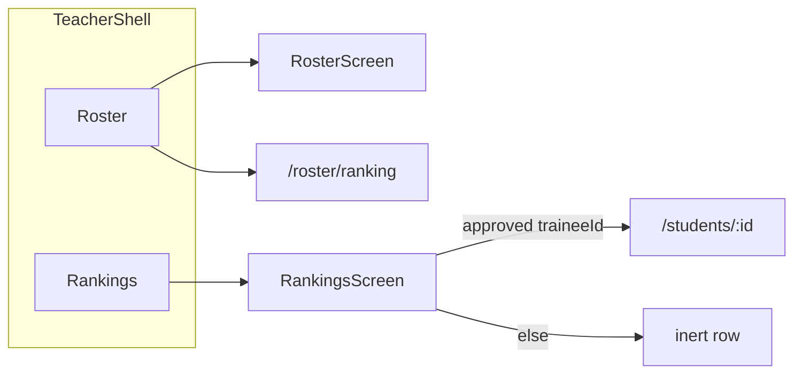

# Phase 1 Teacher Rankings Implementation Plan

**Phase 1 adds a teacher-app platform Rankings tab that reads the existing signed-in leaderboard through shared `elixr_core` APIs. It is not a Firestore rules change, not a write/award move, and not a copy of the Windows Fluent leaderboard.**

---

## Verified context

Live-repo check, 2026-08-16. These line numbers are the source of truth for this plan; re-verify them at implementation time if the files have moved.

### Rules and indexes — no Phase 1 change

| Location | Verified fact |
| --- | --- |
| [firestore.rules](../firestore.rules) `match /leaderboard/{userId}` line 1236 | `allow read: if isSignedIn();` — any signed-in Teacher can list/get the full platform board. |
| [firestore.rules](../firestore.rules) `isOrdinaryPlayer()` lines 1597–1601 | `role == 'Trainee'` only (missing legacy roles default to Trainee). Teachers are not ordinary players. |
| [firestore.rules](../firestore.rules) `public_profiles/{userId}/details/summary` and `.../sessions/{sessionId}` lines 1668–1680 | Readable when `canReadProtectedPublicProfile` **or** `hasApprovedProgressAccess`. Teachers fail the ordinary-player path. |
| [firestore.rules](../firestore.rules) `hasApprovedProgressAccess` lines 1862–1876 | Requires an approved `teacher_student_links` document **and** `progress_access == 'granted'` (version 1, granted timestamp). |
| [storage.rules](../storage.rules) | No `leaderboard` matches. |
| [firestore.indexes.json](../firestore.indexes.json) lines 20–46 | Composite indexes already exist for all-time (`total_xp`, `best_score`, `__name__`), daily (`daily_key`, `daily_xp`, `daily_best_score`, `__name__`), and monthly (`monthly_key`, `monthly_xp`, `monthly_best_score`, `__name__`). |

Phase 1 must not edit `firestore.rules`, `storage.rules`, or `firestore.indexes.json`.

### Shared reads are not importable by teacher_app today

- [teacher_app/pubspec.yaml](../teacher_app/pubspec.yaml) depends on `elixr_core` plus Firebase, `go_router`, `provider`, and `qr_flutter`. It cannot import `package:elixr_application/...`.
- Precedent shim: [lib/core/utils/manila_day.dart](../lib/core/utils/manila_day.dart) re-exports `package:elixr_core/utils/manila_day.dart`.
- [packages/elixr_core/lib/database/firestore_collections.dart](../packages/elixr_core/lib/database/firestore_collections.dart) already defines `leaderboard`.
- [packages/elixr_core/pubspec.yaml](../packages/elixr_core/pubspec.yaml) already depends on `cloud_firestore`. No new package dependency is required for the Firebase read implementation.
- Existing triad precedent to copy: [teacher_progress_repository.dart](../packages/elixr_core/lib/repositories/teacher_progress_repository.dart) + `firebase_teacher_progress_repository.dart` + `in_memory_teacher_progress_repository.dart`, and the same pattern for roster ranking.

### Correction: teacher_app is not ranking-less

| Location | Verified fact |
| --- | --- |
| [TeacherRoutes.ranking](../teacher_app/lib/core/router/teacher_routes.dart) line 11 | `static const ranking = '/ranking';` |
| [teacher_router.dart](../teacher_app/lib/core/router/teacher_router.dart) lines 53–56 | Mounts [RosterRankingScreen](../teacher_app/lib/features/ranking/roster_ranking_screen.dart) at `/ranking`. |
| [roster_screen.dart](../teacher_app/lib/features/roster/roster_screen.dart) lines 120–123 | App-bar `IconButton` tooltip `Roster ranking` calls `context.push(TeacherRoutes.ranking)`. |
| [RosterLeaderboardRepository.fetchRosterRanking](../packages/elixr_core/lib/repositories/roster_leaderboard_repository.dart) | Roster-only list of approved trainees, not the platform board. |

Phase 1 Rankings is a **new platform list**. Relocate roster ranking so `/ranking` can become the tab destination. Do not delete roster ranking.

### Main-app leaderboard today

[lib/data/repositories/leaderboard_repository.dart](../lib/data/repositories/leaderboard_repository.dart) is a single class that owns both reads and writes. Call sites construct `LeaderboardRepository()` in the Windows app ([lib/app.dart](../lib/app.dart), [leaderboard_screen.dart](../lib/features/leaderboard/leaderboard_screen.dart), [session_service.dart](../lib/services/session_service.dart), sidebar, achievements, profile). Test fakes use `_FakeLeaderboardRepository extends LeaderboardRepository`.

[leaderboard_screen.dart](../lib/features/leaderboard/leaderboard_screen.dart) is the structural reference for period selector + paginated list. It also starts `syncCurrentUserLeaderboard` (line 87) through `AuthService` and navigates to `/profile/:id` via `PublicProfileRepository`. **Do not copy those into teacher_app.** Teacher Rankings is Material 3, read-only, and has no public-profile tap-through.

---

## Current behavior vs desired behavior

| Area | Current | Desired after Phase 1 |
| --- | --- | --- |
| teacher_app nav | Flat routes: `/roster`, `/ranking` (roster-only), `/students/:traineeId`. No bottom tabs. | 2-destination `StatefulShellRoute.indexedStack`: Roster \| Rankings. Auth, legal, verify-email, and `/students/:traineeId` stay **outside** the shell. |
| `/ranking` | [RosterRankingScreen](../teacher_app/lib/features/ranking/roster_ranking_screen.dart) via `RosterLeaderboardRepository.fetchRosterRanking`. | New platform `RankingsScreen` reading `leaderboard` through core `LeaderboardRepository.fetchPlayersPage`. Default period `LeaderboardPeriod.allTime`. |
| Roster app-bar ranking button | `context.push(TeacherRoutes.ranking)` (`/ranking`). | `context.push(TeacherRoutes.rosterRanking)` (`/roster/ranking`). Same screen, new path. |
| Leaderboard reads | Only in `package:elixr_application/data/repositories/leaderboard_repository.dart`. teacher_app cannot import them. | Abstract + Firebase + in-memory triad in `elixr_core`. Main app keeps a **subclass** named `LeaderboardRepository` that adds writes. |
| Leaderboard writes / XP awards | Same main-app class: `recordCompletedSession`, `syncCurrentUserLeaderboard`, `syncPublicProfile`, `syncDisplayName`. | Unchanged location. Teacher_app must never call them. |
| Platform row tap | N/A | Tappable only when `entry.userId` is an **approved** trainee of the signed-in teacher (`link.isApproved`). Do **not** require `hasEffectiveProgressAccess` for the gate. Non-roster rows are inert (no chevron, no splash). |
| Firestore rules | Signed-in read of `leaderboard/{userId}`. Teacher progress details still gated. | Unchanged. Approved-without-progress-access already lands on `StudentProgressState.waitingForAccess` ([student_progress_controller.dart](../teacher_app/lib/features/student_progress/student_progress_controller.dart) lines 105–110). |
| Windows leaderboard UI | Fluent, background sync, `/profile/:id`. | Unchanged. Shims keep existing `package:elixr_application/...` imports compiling. |



---

## Constraints and acceptance criteria

### Constraints (non-negotiable)

1. Python still owns the camera. Phase 1 must not add a Flutter/teacher camera owner.
2. Do not weaken authentication or Firestore authorization. UI tap gates are not security controls; `firestore.rules` remain authoritative.
3. Do not silently change persisted field names. Leaderboard documents stay snake_case.
4. Rubric assessment stays bounded 0..3 per criterion and 0..12 total. Do not mix legacy 0–100 scores with rubric totals in ranking display. Existing `best_score` aggregates stay as stored.
5. Leaderboard identity stays tied to the Firebase UID (`leaderboard/{userId}` document ID and `user_id` field).
6. Leaderboard session awards stay idempotent and stay in the main app. Do not move `recordCompletedSession` or processed-session markers into `elixr_core`.
7. Do not claim the client-written leaderboard is tamper-proof.
8. Smallest coherent change: no opportunistic Fluent restyle, no public-profile viewer in teacher_app, no `AuthService` port, no background `syncCurrentUserLeaderboard` from the teacher Rankings tab.
9. teacher_app types the provided repository as the **core abstract** `LeaderboardRepository` so write methods are not visible.

### Acceptance criteria

1. `elixr_core` exports a read-only leaderboard triad: abstract + `FirebaseLeaderboardRepository` + `InMemoryLeaderboardRepository`.
2. Main-app `LeaderboardRepository` remains the write-capable subclass; existing call sites and `_FakeLeaderboardRepository extends LeaderboardRepository` keep compiling without importing the core abstract (name collision).
3. Main-app shims re-export moved models/constants so `package:elixr_application/data/models/leaderboard_entry.dart` and `.../gamification_rules.dart` still resolve.
4. teacher_app authenticated shell shows Roster \| Rankings. `/ranking` is the platform list. `/roster/ranking` is the relocated roster list. `/students/:traineeId` is not a tab.
5. Rankings supports Today / This month / All time, defaults to all-time, paginates, and restarts page 1 on `LeaderboardPageCursorExpiredException`.
6. Empty, loading, error, and retry states are implemented.
7. Platform rows for non-approved user IDs are not tappable. Approved trainee IDs push `TeacherRoutes.student(...)`.
8. No edits to `firestore.rules`, `storage.rules`, or `firestore.indexes.json`.
9. Verification commands in [section 7](#7-verification) pass.

---

## 1. Read vs write split

### Move into the `elixr_core` triad (reads)

From [leaderboard_repository.dart](../lib/data/repositories/leaderboard_repository.dart):

| Symbol | Destination |
| --- | --- |
| `watchTopPlayers` | Abstract + Firebase + in-memory |
| `watchPlayer` | Abstract + Firebase + in-memory |
| `fetchPlayersPage` | Abstract + Firebase + in-memory |
| `computeRankForUser` | Abstract + Firebase + in-memory |
| `LeaderboardPageCursor` | Abstract file |
| `FakeLeaderboardPageCursor` | Abstract file (`@visibleForTesting`) |
| `LeaderboardPageCursorExpiredException` | Abstract file |
| `LeaderboardPage` | Abstract file |
| `isCursorCompatible` | Abstract **static** |
| `buildPage` | Abstract **static** |
| `compareLeaderboardEntries` | Abstract **static** |
| `sortLeaderboardEntries` | Abstract **static** |
| `_FirestoreLeaderboardPageCursor` | `firebase_leaderboard_repository.dart` only (`DocumentSnapshot`) |
| `_readInt` | Firebase read impl only (used by `computeRankForUser`) |
| `LeaderboardEntry`, `LeaderboardPeriod`, `LeaderboardMetrics`, `GamificationRules` | Core models/constants |

Abstract signatures to preserve:

```dart
abstract class LeaderboardRepository {
  Stream<List<LeaderboardEntry>> watchTopPlayers({int limit = 10});
  Stream<LeaderboardEntry?> watchPlayer(String userId);
  Future<LeaderboardPage> fetchPlayersPage({
    LeaderboardPeriod period = LeaderboardPeriod.allTime,
    int limit = 50,
    LeaderboardPageCursor? startAfter,
    DateTime? nowUtc,
  });
  Future<int?> computeRankForUser(
    String userId, {
    LeaderboardPeriod period = LeaderboardPeriod.allTime,
    DateTime? nowUtc,
  });
}
```

Firebase `fetchPlayersPage` keeps today's behavior: query `FirestoreCollections.leaderboard`, filter by `period.keyField` when the period has a key, order by `xpField` desc / `bestScoreField` desc / document id, `startAfterDocument` on a compatible `_FirestoreLeaderboardPageCursor`, throw `LeaderboardPageCursorExpiredException` on period/key mismatch, `ArgumentError` for a non-Firestore cursor.

### Stay in the main-app subclass (writes / awards)

| Symbol | Why it stays |
| --- | --- |
| `recordCompletedSession` | Session award + `leaderboard_processed_sessions` marker. Trainee Windows client only. |
| `syncCurrentUserLeaderboard` / `_syncCurrentUserLeaderboardImpl` / `runWithSyncGuard` / `_syncInFlight` / `clearSyncInFlightForTest` | Background self-heal used by Fluent `LeaderboardScreen`. |
| `syncPublicProfile` / `syncDisplayName` / `buildPublicProfileFields` / `publicProfileNeedsUpdate` | Public profile mirror, not a teacher read. |
| `readSessionAssessment` / `_readScore` / `_readSessionCreatedAtUtc` / `_createdAtMs` / `_logError` | Award/sync helpers. |
| `SessionAwardAssessment` / `LeaderboardAwardException` | Write-path types. |
| [leaderboard_award_plan.dart](../lib/data/models/leaderboard_award_plan.dart) | Award planning. |
| [leaderboard_period_aggregate.dart](../lib/data/models/leaderboard_period_aggregate.dart) | Award aggregation. |

### Subclass / name collision (must follow exactly)

Main-app keeps the name `LeaderboardRepository` as a **subclass of** `FirebaseLeaderboardRepository` so existing constructors and `_FakeLeaderboardRepository extends LeaderboardRepository` keep compiling.

That library must **not** import the core abstract `LeaderboardRepository` (same identifier). Re-export read types with `show` that **omits** the abstract class:

```dart
import 'package:elixr_core/repositories/firebase_leaderboard_repository.dart';

export 'package:elixr_core/repositories/leaderboard_repository.dart'
    show
        LeaderboardPageCursor,
        FakeLeaderboardPageCursor,
        LeaderboardPageCursorExpiredException,
        LeaderboardPage;

class LeaderboardRepository extends FirebaseLeaderboardRepository {
  LeaderboardRepository({super.firestore});
  // write/award methods remain here
}
```

Dart does not inherit statics onto the subclass. After the move, `LeaderboardRepository.buildPage` / `sortLeaderboardEntries` / `isCursorCompatible` in tests must call the **core** abstract class. That is why those tests move into `elixr_core` and why `leaderboard_period_repository_test.dart` is renamed to `leaderboard_query_test.dart`.

Teacher_app imports the core abstract + `FirebaseLeaderboardRepository` / `InMemoryLeaderboardRepository`. It must never call write/sync APIs and must never depend on the main-app subclass.

---

## 2. Usage and test move/stay

### Moved tests (update imports to `package:elixr_core/...`)

Call statics on the **core** abstract `LeaderboardRepository`, not the main-app subclass.

| From | To |
| --- | --- |
| `test/core/gamification_rules_test.dart` | `packages/elixr_core/test/constants/gamification_rules_test.dart` |
| `test/data/models/leaderboard_entry_test.dart` | `packages/elixr_core/test/models/leaderboard_entry_test.dart` |
| `test/data/models/leaderboard_period_test.dart` | `packages/elixr_core/test/models/leaderboard_period_test.dart` |
| `test/data/repositories/leaderboard_page_test.dart` | `packages/elixr_core/test/repositories/leaderboard_page_test.dart` |
| `test/data/repositories/leaderboard_period_repository_test.dart` | `packages/elixr_core/test/repositories/leaderboard_query_test.dart` |

Moved tests must keep covering:

- `GamificationRules`: 0 sessions → 0 XP; 0 XP → level 1; 10 sessions → 250 XP / level 2; 25 XP per session.
- `LeaderboardEntry.tryFromMap` identity/display-name rejection, clamping, period metrics.
- `LeaderboardPeriod` keys, field names, `isValidKey`.
- `buildPage`: full page requires cursor; short/empty page clears cursor; `hasMore` without cursor throws.
- Period sort: XP desc, best desc, UID asc for today / this month / all-time.
- `isCursorCompatible` includes period and resolved key.

### New `elixr_core` tests (required)

Add `packages/elixr_core/test/repositories/in_memory_leaderboard_repository_test.dart`:

1. Period filter: today/this-month rows whose stored key does not match `period.keyFor(nowUtc)` are omitted; all-time includes every seed row.
2. Sort matches `LeaderboardRepository.sortLeaderboardEntries` for the requested period.
3. Pagination: `limit` + opaque memory cursor returns the next slice; `hasMore` is true iff the returned seed count equals `limit`.
4. Cursor period/key mismatch throws `LeaderboardPageCursorExpiredException` (do not append a different period).
5. Wrong cursor type throws `ArgumentError`.
6. `watchPlayer` emits the seeded row or null.
7. `computeRankForUser` is 1-based on the same sort; null when the user has no row or the period key does not match.

### Stay in the main app

| File | Why it stays |
| --- | --- |
| `test/features/leaderboard/leaderboard_list_controller_test.dart` | Imports `FakeLeaderboardPageCursor` via the main-app re-export. Does not call moved statics. |
| `test/data/repositories/leaderboard_sync_guard_test.dart` | Write/sync path. |
| `test/data/repositories/leaderboard_public_profile_sync_test.dart` | Write/sync path. |
| `test/data/repositories/leaderboard_session_assessment_test.dart` | Award helper. |
| `test/data/models/leaderboard_award_plan_test.dart` | Award model. |
| `test/data/models/leaderboard_period_aggregate_test.dart` | Award aggregate. |
| `test/features/leaderboard/leaderboard_presentation_test.dart` | Fluent presentation. |
| `test/features/leaderboard/leaderboard_widgets_test.dart` | Fluent widgets. |
| Dashboard / profile / achievements tests that construct `LeaderboardEntry` or `_FakeLeaderboardRepository extends LeaderboardRepository` | They need the write subclass name. |

Do not move `LeaderboardListController`, Fluent widgets, `AuthService`, `PublicProfileRepository`, or `/profile/:id`.

After the shim/re-export, remaining main-app tests that import `package:elixr_application/data/models/leaderboard_entry.dart` or `.../leaderboard_repository.dart` (`FakeLeaderboardPageCursor`, subclass type) must keep passing without import-path edits except where they currently call `LeaderboardRepository.buildPage` / `sortLeaderboardEntries` / `isCursorCompatible` — those tests are the ones that move.

---

## 3. Target paths in elixr_core

Match the layout of [teacher_progress_repository.dart](../packages/elixr_core/lib/repositories/teacher_progress_repository.dart) and [coaching_movement_names.dart](../packages/elixr_core/lib/constants/coaching_movement_names.dart).

### NEW files

| Path | Responsibility |
| --- | --- |
| `packages/elixr_core/lib/constants/gamification_rules.dart` | Move `GamificationRules` unchanged (`xpPerSession = 25`, `xpPerLevel = 250`). |
| `packages/elixr_core/lib/models/leaderboard_entry.dart` | Move `LeaderboardEntry`. Import `package:elixr_core/constants/gamification_rules.dart` and `leaderboard_period.dart`. |
| `packages/elixr_core/lib/models/leaderboard_period.dart` | Move `LeaderboardPeriod` and `LeaderboardMetrics`. ManilaDay import becomes `package:elixr_core/utils/manila_day.dart` (today it goes through the main-app shim). |
| `packages/elixr_core/lib/repositories/leaderboard_repository.dart` | Abstract read API + page/cursors/expiry + read statics. |
| `packages/elixr_core/lib/repositories/firebase_leaderboard_repository.dart` | Firestore reads via `FirestoreCollections.leaderboard`. Owns `_FirestoreLeaderboardPageCursor`. Constructor `{FirebaseFirestore? firestore}` defaulting to `FirebaseFirestore.instance`, same as [FirebaseTeacherProgressRepository](../packages/elixr_core/lib/repositories/firebase_teacher_progress_repository.dart). |
| `packages/elixr_core/lib/repositories/in_memory_leaderboard_repository.dart` | Seedable rows, period filter, opaque memory cursor, production sort, `LeaderboardPageCursorExpiredException` on period/key mismatch. |

### Barrel exports

Add to [packages/elixr_core/lib/elixr_core.dart](../packages/elixr_core/lib/elixr_core.dart):

```dart
export 'constants/gamification_rules.dart';
export 'models/leaderboard_entry.dart';
export 'models/leaderboard_period.dart';
export 'repositories/leaderboard_repository.dart';
export 'repositories/firebase_leaderboard_repository.dart';
export 'repositories/in_memory_leaderboard_repository.dart';
```

Do not export the main-app write subclass. Do not export award types.

### In-memory contract (implement exactly)

```dart
class InMemoryLeaderboardRepository implements LeaderboardRepository {
  InMemoryLeaderboardRepository({
    List<LeaderboardEntry>? rows,
    DateTime Function()? nowUtc,
  });
}
```

- Seed list is the full platform board (not roster-filtered).
- `fetchPlayersPage` filters by `period.keyFor(nowUtc())`, sorts with `LeaderboardRepository.sortLeaderboardEntries`, slices with `limit` / memory cursor.
- Memory cursor stores `period`, `periodKey`, and offset. It implements `LeaderboardPageCursor` but is private to this library.
- `watchTopPlayers` / `watchPlayer` are broadcast streams that emit the current seed (sorted / single-doc) so widget tests can drive updates if needed. A simple `Stream.value` / `StreamController` is enough; do not talk to Firestore.
- `computeRankForUser` uses the same filtered+sorted list as `fetchPlayersPage`.

### Shims left behind (manila_day pattern)

Replace bodies with a single export. Do not leave duplicate class definitions.

| Shim | Export |
| --- | --- |
| [lib/core/constants/gamification_rules.dart](../lib/core/constants/gamification_rules.dart) | `package:elixr_core/constants/gamification_rules.dart` |
| [lib/data/models/leaderboard_entry.dart](../lib/data/models/leaderboard_entry.dart) | `package:elixr_core/models/leaderboard_entry.dart` |
| [lib/data/models/leaderboard_period.dart](../lib/data/models/leaderboard_period.dart) | `package:elixr_core/models/leaderboard_period.dart` |

Main-app [leaderboard_repository.dart](../lib/data/repositories/leaderboard_repository.dart) becomes the subclass + write methods + the `show` re-export described in section 1. Delete the moved read helpers from this file once the subclass compiles.

---

## 4. Teacher nav shell

### Route map

| Path | Screen | Shell? |
| --- | --- | --- |
| `/roster` | existing `RosterScreen` (tab 0) | Yes |
| `/ranking` | **new** platform `RankingsScreen` (tab 1) | Yes |
| `/roster/ranking` | relocated `RosterRankingScreen` | Yes (Roster branch nested route) |
| `/students/:traineeId` | existing `StudentProgressScreen` | **No** — full-screen push stays outside the shell |
| `/login`, `/register`, `/forgot-password`, `/verify-email`, `/privacy-policy`, `/terms-of-service` | unchanged | No |

`TeacherRoutes.ranking` stays `'/ranking'`. Add `TeacherRoutes.rosterRanking = '/roster/ranking'`. Authenticated `/ranking` and `/roster/ranking` already pass `resolveTeacherRedirect` via `return null` ([teacher_routes.dart](../teacher_app/lib/core/router/teacher_routes.dart) `authenticatedTeacher` branch). Still add both constants to [teacher_routes_test.dart](../teacher_app/test/core/router/teacher_routes_test.dart) `locations` so redirect-loop coverage includes them.

### Router shape

Replace the standalone `/roster` and `/ranking` `GoRoute`s in [teacher_router.dart](../teacher_app/lib/core/router/teacher_router.dart) with:

```dart
StatefulShellRoute.indexedStack(
  builder: (context, state, navigationShell) {
    return TeacherShell(navigationShell: navigationShell);
  },
  branches: [
    StatefulShellBranch(
      routes: [
        GoRoute(
          path: TeacherRoutes.roster,
          builder: (context, state) => const RosterScreen(),
          routes: [
            GoRoute(
              path: 'ranking',
              builder: (context, state) => const RosterRankingScreen(),
            ),
          ],
        ),
      ],
    ),
    StatefulShellBranch(
      routes: [
        GoRoute(
          path: TeacherRoutes.ranking,
          builder: (context, state) => const RankingsScreen(),
        ),
      ],
    ),
  ],
)
```

Keep `/students/:traineeId` as a sibling `GoRoute` **outside** this shell so student progress does not show the bottom bar.

### TeacherShell

Create `teacher_app/lib/core/widgets/teacher_shell.dart`:

- Material 3 `Scaffold` + `NavigationBar` with two destinations: Roster, Rankings.
- `navigationShell.currentIndex` selects the tab.
- On destination tap, call `navigationShell.goBranch(index)`.
- **Recommended:** when tapping Roster (`index == 0`), use `goBranch(0, initialLocation: true)` so a previous `/roster/ranking` visit does not silently restore. Rankings has no nested route, so `goBranch(1)` is enough.
- Keys: `Key('teacher_shell')`, `Key('teacher_nav_roster')`, `Key('teacher_nav_rankings')` for router tests.

### DI in [teacher_app/lib/app.dart](../teacher_app/lib/app.dart)

Same pattern as `rankingRepository` (`RosterLeaderboardRepository`):

```dart
class ElixrTeacherApp extends StatefulWidget {
  const ElixrTeacherApp({
    // existing params...
    this.leaderboardRepository,
  });

  final LeaderboardRepository? leaderboardRepository;
  // rankingRepository remains RosterLeaderboardRepository?
}
```

Provide:

```dart
Provider<LeaderboardRepository>(
  create: (_) =>
      widget.leaderboardRepository ?? FirebaseLeaderboardRepository(),
)
```

The type is the **core abstract**. Production default is Firebase. Tests inject `InMemoryLeaderboardRepository`.

`rankingRepository` / `RosterLeaderboardRepository` stays as-is for roster ranking.

### IndexedStack test implication

go_router's indexed stack constructs the Rankings branch when the shell first appears. Rankings will `context.read<LeaderboardRepository>()` during first build.

Today [teacher_router_test.dart](../teacher_app/test/core/router/teacher_router_test.dart) `pumpRoutedApp` provides only auth + `InMemoryTeacherRelationshipRepository`. After Phase 1 it must also provide `InMemoryLeaderboardRepository` (and, for `ElixrTeacherApp(...)` cases, pass `leaderboardRepository: InMemoryLeaderboardRepository()` so the Firebase default is never hit in widget tests).

Assert:

- Authenticated teacher sees `TeacherShell` and `RosterScreen`.
- Tapping Rankings shows `RankingsScreen` without leaving the shell.
- `/students/:id` does **not** show `TeacherShell`.
- Signed-out / unverified paths still have no shell.

Relocate the `/ranking` fixture in [roster_ranking_controller_test.dart](../teacher_app/test/features/ranking/roster_ranking_controller_test.dart) to `/roster/ranking`.

### Rankings screen / controller

Create:

- `teacher_app/lib/features/rankings/rankings_controller.dart`
- `teacher_app/lib/features/rankings/rankings_screen.dart`
- `teacher_app/test/features/rankings/rankings_controller_test.dart`

Keep roster files under existing `teacher_app/lib/features/ranking/` (singular). Platform Rankings uses the plural folder so the two features do not share a screen class.

`RankingsController` (ChangeNotifier):

- Constructor: `LeaderboardRepository`, `TeacherRelationshipRepository`, `teacherId`. Optional `nowUtc` for tests.
- Subscribes to `watchTeacherLinks(teacherId: teacherId)` and stores `approvedTraineeIds` as the set of `link.traineeId` where `link.isApproved`. Do **not** filter on `hasEffectiveProgressAccess`.
- `bool canOpenTrainee(String userId) => approvedTraineeIds.contains(userId)`.
- Pagination modeled on [leaderboard_list_controller.dart](../lib/features/leaderboard/leaderboard_list_controller.dart): `loadInitial`, `setPeriod`, `loadMore`, `refresh`, generation counter, dispose guard.
- Default period: `LeaderboardPeriod.allTime`.
- On `LeaderboardPageCursorExpiredException` during `loadMore`, restart page 1 (same as list-controller lines 105–115): bump generation, clear entries/cursor/errors, call `_loadFirstPage()`.
- Do not call `syncCurrentUserLeaderboard`.
- Dispose the links subscription.

`RankingsScreen`:

- Material 3 `Scaffold` + `AppBar` title `Rankings`.
- Period selector: Material `SegmentedButton<LeaderboardPeriod>` (or equivalent) using `LeaderboardPeriod.selectorLabel`. Not Fluent.
- Body states: loading spinner; empty copy; error + `Try again`; ready list with load-more.
- Row UI may follow roster ranking's `Card` + `ListTile` (avatar, name, period XP / sessions) but **must not** copy Fluent, podium, `AuthService`, or `/profile/:id`.
- Row `onTap` follows [section 5](#5-roster-tap-through-rule).

[roster_screen.dart](../teacher_app/lib/features/roster/roster_screen.dart) line 122: change `TeacherRoutes.ranking` → `TeacherRoutes.rosterRanking`. Keep tooltip `Roster ranking`.

---

## 5. Roster tap-through rule

Platform list is **not** roster-filtered. Teachers see the same signed-in `leaderboard` collection the Windows client reads.

The tap gate is UI-only and lives in `RankingsScreen` row `onTap`, not in the repository query.

```dart
onTap: controller.canOpenTrainee(entry.userId)
    ? () => context.push(TeacherRoutes.student(entry.userId))
    : null,
trailing: controller.canOpenTrainee(entry.userId)
    ? const Icon(Icons.chevron_right)
    : null,
```

Use `onTap: null` so Material applies no splash / no chevron on inert rows.

`canOpenTrainee` is true iff `entry.userId` is in `approvedTraineeIds` from `watchTeacherLinks` where `link.isApproved` ([TeacherStudentLink.isApproved](../packages/elixr_core/lib/models/teacher_student_link.dart) line 75: `status == approved`).

Do **not** require `hasEffectiveProgressAccess` (lines 76–80). Approved-without-progress-access already shows `waitingForAccess` in [student_progress_controller.dart](../teacher_app/lib/features/student_progress/student_progress_controller.dart) lines 105–110. Phase 1 reuses that screen instead of inventing a second waiting state.

Teachers who themselves have a leaderboard row appear on the platform list. They are tappable only if that UID is also an approved trainee of the signed-in teacher (unusual; still handle as inert otherwise).

### Controller tests to add

In `rankings_controller_test.dart`:

1. Seed mixed leaderboard rows (roster trainee, stranger, teacher UID). `canOpenTrainee` is true only for the approved trainee.
2. Approved link without progress access: `canOpenTrainee` is still true.
3. Pending/revoked link: `canOpenTrainee` is false.
4. `setPeriod` + `loadMore` with an expired cursor (in-memory repo seeded to throw, or a cursor from a different `nowUtc` day key) restarts page 1 and does not append mixed periods.
5. Loading / empty / error / retry transitions.

Optional widget test: tappable row pushes `/students/:id`; inert row does not.

Roster ranking rows remain fully tappable as today (they are already approved-only).

---

## 6. File inventory

### Create

| File | Why |
| --- | --- |
| `packages/elixr_core/lib/constants/gamification_rules.dart` | Shared XP/level rules. |
| `packages/elixr_core/lib/models/leaderboard_entry.dart` | Shared ranking row. |
| `packages/elixr_core/lib/models/leaderboard_period.dart` | Period + metrics. |
| `packages/elixr_core/lib/repositories/leaderboard_repository.dart` | Abstract reads + statics. |
| `packages/elixr_core/lib/repositories/firebase_leaderboard_repository.dart` | Production reads. |
| `packages/elixr_core/lib/repositories/in_memory_leaderboard_repository.dart` | Tests + teacher_app injection. |
| `packages/elixr_core/test/constants/gamification_rules_test.dart` | Moved coverage. |
| `packages/elixr_core/test/models/leaderboard_entry_test.dart` | Moved coverage. |
| `packages/elixr_core/test/models/leaderboard_period_test.dart` | Moved coverage. |
| `packages/elixr_core/test/repositories/leaderboard_page_test.dart` | Moved `buildPage` coverage. |
| `packages/elixr_core/test/repositories/leaderboard_query_test.dart` | Moved sort + cursor-compat coverage. |
| `packages/elixr_core/test/repositories/in_memory_leaderboard_repository_test.dart` | New in-memory contract. |
| `teacher_app/lib/core/widgets/teacher_shell.dart` | 2-tab Material shell. |
| `teacher_app/lib/features/rankings/rankings_controller.dart` | Platform list + approved-id gate. |
| `teacher_app/lib/features/rankings/rankings_screen.dart` | Material Rankings UI. |
| `teacher_app/test/features/rankings/rankings_controller_test.dart` | Gate, pagination restart, states. |

### Modify

| File | Why |
| --- | --- |
| `packages/elixr_core/lib/elixr_core.dart` | Barrel exports. |
| `lib/core/constants/gamification_rules.dart` | Shim export. |
| `lib/data/models/leaderboard_entry.dart` | Shim export. |
| `lib/data/models/leaderboard_period.dart` | Shim export. |
| `lib/data/repositories/leaderboard_repository.dart` | Subclass + writes + `show` re-export; delete moved reads. |
| `teacher_app/lib/app.dart` | Provide core `LeaderboardRepository`. |
| `teacher_app/lib/core/router/teacher_routes.dart` | Add `rosterRanking`. |
| `teacher_app/lib/core/router/teacher_router.dart` | Indexed-stack shell; nest roster ranking; platform `/ranking`. |
| `teacher_app/lib/features/roster/roster_screen.dart` | Push `TeacherRoutes.rosterRanking`. |
| `teacher_app/test/core/router/teacher_router_test.dart` | Provide in-memory leaderboard; assert shell. |
| `teacher_app/test/core/router/teacher_routes_test.dart` | Include `/ranking` and `/roster/ranking`. |
| `teacher_app/test/features/ranking/roster_ranking_controller_test.dart` | Fixture path `/roster/ranking`. |

### Delete after move (source tests only; coverage lives in `elixr_core`)

- `test/core/gamification_rules_test.dart`
- `test/data/models/leaderboard_entry_test.dart`
- `test/data/models/leaderboard_period_test.dart`
- `test/data/repositories/leaderboard_page_test.dart`
- `test/data/repositories/leaderboard_period_repository_test.dart`

### Do not touch

- `firestore.rules`, `storage.rules`, `firestore.indexes.json`
- Python backend, WebSocket contract, camera lifecycle
- `LeaderboardListController`, Fluent leaderboard widgets, `PublicProfileRepository`, `/profile/:id`
- `RosterLeaderboardRepository` triad (still used by relocated roster ranking)
- Award/sync tests listed in section 2

### Recommended later-session order

1. Move constants/models + their tests into `elixr_core`; leave shims; run `elixr_core` tests.
2. Move abstract + statics + page/query tests; add in-memory repo + tests.
3. Add `FirebaseLeaderboardRepository`; convert main-app class to subclass; keep write methods; run main-app `flutter test`.
4. Teacher routes + `TeacherShell` + DI; update router/routes tests.
5. `RankingsController` / `RankingsScreen` + tap-through tests.
6. Relocate roster ranking path and fixture.
7. Full verification in section 7.

---

## 7. Verification

From repo root. Python, `firebase deploy`, and `flutter build windows` are **not** in scope for Phase 1.

```
dart format --output=none --set-exit-if-changed lib
flutter analyze
flutter test
```

Plus package-proportional:

```
dart format --output=none --set-exit-if-changed packages/elixr_core/lib teacher_app/lib
cd packages/elixr_core
flutter analyze
flutter test
cd ..\teacher_app
flutter analyze
flutter test
```

Must-pass:

- Moved `elixr_core` leaderboard/gamification tests plus new in-memory leaderboard tests.
- Remaining main-app write + `leaderboard_list_controller` tests (and other fakes that extend the subclass).
- teacher_app router/routes tests, new rankings tests, relocated roster-ranking fixture.

Manual product checks after implementation (not this planning session):

1. Sign in as Teacher → shell shows Roster and Rankings.
2. Rankings shows platform rows, not only roster.
3. Period selector switches Today / This month / All time without mixing rows.
4. Approved trainee row opens student progress; stranger row does nothing.
5. Approved-without-access row opens student progress and shows waiting-for-access.
6. Roster app-bar still opens roster ranking at `/roster/ranking`.
7. Student progress is full-screen (no bottom bar).

Physical camera / live Firebase: **Not verified**.

---

## 8. Open questions and risks

| Item | Guidance for the implementing session |
| --- | --- |
| Relocate vs delete roster ranking | Relocate. Both views survive: roster-scoped list and platform list. |
| `LeaderboardRepository` name collision | `show`/`hide` carefully; never import the core abstract into the main-app subclass library. Statics live on the core abstract. |
| Manila day/month boundary | Pagination cursors expire. Teacher controller must restart page 1, same as Windows `LeaderboardListController`. |
| Teacher UID on the platform list | Visible if they have a leaderboard document; tappable only if they are also an approved trainee of the signed-in teacher. |
| IndexedStack prefetch | Rankings may fetch the platform board when the shell mounts even if the teacher stays on Roster. Accept this; do not add lazy-branch work in Phase 1 unless tests cannot inject an in-memory repo. |
| `goBranch` restore | Default shell restore can reopen `/roster/ranking` when returning to Roster. Prefer `initialLocation: true` on the Roster tab. |
| Second camera owner / rules / rubric mix | Forbidden. Do not add a camera, weaken auth, change rules, or reinterpret stored `best_score` as a fresh 0–12 rubric total. |
| Tamper resistance | Unchanged: client-written leaderboard is appropriate for the capstone, not a hostile-client ranking system. |
| Public profiles from Rankings | Out of scope. No `/profile/:id`, no `PublicProfileRepository` in teacher_app. |
| Write APIs in `elixr_core` | Out of scope. Awards stay in the Windows app. |

No unresolved product question blocks implementation. The tap-through rule (approved link, not progress-access) is an explicit decision, not an open question.

---

## Notes

1. This document is the Phase 1 implementation plan for a later session. It is not the Phase 1 code.
2. teacher_app cannot import `package:elixr_application/...`. Shared reads must live in `elixr_core` or teacher_app cannot compile them.
3. `RosterLeaderboardRepository` is a different type from platform `LeaderboardRepository`. Keep both. Roster ranking continues to use the roster triad.
4. `resolveTeacherRedirect` already allows any non-auth location for `authenticatedTeacher` (`return null`). Adding `/roster/ranking` does not require a new redirect branch, but tests must list the new path.
5. `ElixrTeacherApp` widget tests that currently omit `rankingRepository` still work because roster ranking is not built until `/ranking` is opened. After IndexedStack, Rankings is built at shell mount — every authenticated `ElixrTeacherApp` / `pumpRoutedApp` test must provide `InMemoryLeaderboardRepository`.
6. Main-app shims exist so Windows imports do not churn. Do not re-export the core abstract `LeaderboardRepository` from those shims.
7. Cursor / CI cannot complete live Firebase or camera checks. Leave those **Not verified**.

**Status:** Plan written for a later implementation session. Phase 1 code, rules, and indexes were not changed.

**Not verified:** Physical camera, live Firebase leaderboard reads on a signed-in Teacher account, and runtime IndexedStack fetch cost on a large `leaderboard` collection.
