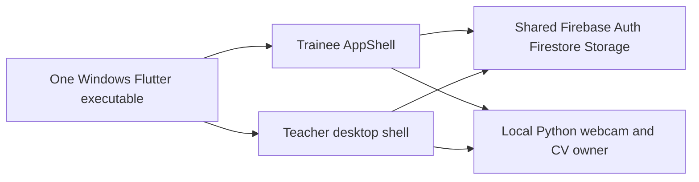
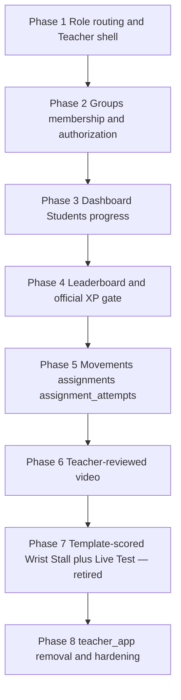

# ELIXR Teacher Windows Refactor — Master Plan

**Status:** Phases 1–8 executed on `main`. Android `teacher_app` removed in Phase 8.  
**Branch policy:** existing `main` only. Do not create another branch.  
**This directory is documentation / implementation planning only.** Do not treat these files as permission to implement multiple phases at once.

**Current implementation note (2026-08-26):** Phase 7 Template Scoring and
Teacher Movement Builder Live Test are retired. Existing `template_scored`,
`template_score`, and `AssessmentSpec` records remain readable as historical
data, but the current product only creates or runs official guided and
`teacher_reviewed` flows. The Phase 7 material below is retained as historical
context and is not a current feature specification.

Inspected against current `main` on 2026-08-19. Executable code, schemas, Firestore/Storage rules, tests, and current behavior are authoritative over [docs/phase1-teacher-rankings-plan.md](../phase1-teacher-rankings-plan.md), [docs/dynamic-movements-proposal.md](../dynamic-movements-proposal.md), and any stale README comments.

---

## Implementing-agent policy (all phases)

Every implementing agent must:

1. Re-read root [AGENTS.md](../../AGENTS.md), the nearest feature `AGENTS.md`, **current `main`**, and **this master plan** before editing.
2. Work only on the existing `main` branch. Do not create or suggest another branch.
3. Implement **only** the assigned phase document. Do not start a later phase “while you are in the files.”
4. If a prerequisite from the previous phase is missing, **STOP** and report it. Do not silently implement the missing previous phase.
5. Update that phase document’s Status and Completion report. Distinguish tests actually run from `Not verified`.
6. Do not restore a standalone Android `teacher_app`. Phase 8 removed it after the migration gates passed.
7. Not implement multiple phases simultaneously unless a later **human** decision changes this policy.

**Phase sequencing is mandatory:**

`01 → 02 → 03 → 04 → 05 → 06 → 07 → 08`

Do not suggest parallel phase implementation. Several phases touch shared auth, Firestore, practice/session, movement, Storage, and WebSocket contracts.

---

## 1. Approved final architecture

ELIXR becomes **one Windows Flutter executable** supporting Trainee and Teacher roles.

| Decision | Approved shape |
|---|---|
| Clients | One Windows app. The standalone Android `teacher_app` (`elixr_teacher`) was removed in Phase 8. |
| Identity | Shared Firebase Authentication. Role is `users/{uid}.role` = `Trainee` or `Teacher`, immutable after create. |
| Storage | Shared Cloud Firestore + Firebase Storage. Firestore holds metadata only; never video bytes or base64. |
| Camera / CV | One local Python FastAPI backend owns the webcam for current Trainee practice and Teacher-reviewed recording. The retired Phase 7 Live Test used the same backend historically. No Flutter webcam owner. No second Teacher CV process. |
| Routing | One sign-in. Role-based post-login routing to Trainee shell or Teacher shell. |
| Teacher destinations | Dashboard, Groups, Students, Leaderboard, Movements, Settings/Profile. |
| Classes | Real multi-group classes: invite codes, join requests, approval / rejection / removal. |
| Scoring domains | Official ELIXR practice outside an assignment → `sessions` only → eligible global XP. Official practice **launched from a classroom assignment** → `sessions` (XP once) **plus a required** `assignment_attempts` pointer (`awards_global_xp: false`, never a second XP award). Current Teacher-created / review work → `assignment_attempts` only → never global XP. Historical template classroom records remain readable and are not writable or runnable. |



Teacher → Python is **not** a second backend. It is the existing local WebSocket/HTTP CV service, used for Trainee practice and Teacher-reviewed recording. The historical Phase 7 Live Test used this same service and is now retired.

---

## 2. Dependency graph



| Phase | Why it cannot start early |
|---|---|
| 1 | Establishes Teacher vs Trainee shells, registration, email-verify, and “do not run trainee onboarding.” |
| 2 | Replaces one-roster with groups and names authorization layers. Later UI and rules depend on membership docs. |
| 3 | Dashboard/Students consume groups + consent; would otherwise keep the flat-roster mental model. |
| 4 | Hardens official-only global XP **before** custom movements exist, so Phase 5 cannot leak XP. |
| 5 | Introduces Teacher-created movements, assignments, and `assignment_attempts`. Video and AI scoring attach here. |
| 6 | Adds review video to `assignment_attempts`, not to `sessions`. Needs assignment IDs from Phase 5. |
| 7 | **Retired.** Historical template scoring and Live Test records remain readable; no new template writes or execution path exists. |
| 8 | Deletes `teacher_app` only after parity. |

---

## 3. Privacy and access terminology (canonical)

These five concepts **must not** be collapsed into one boolean. Use the exact names below in every phase file, rules comments, models, and UI copy.

### Public Profile Privacy

Social / player profile visibility.

- Persisted as `public_profiles/{userId}.visibility` = `public` \| `private`.
- Settings control: **Lock profile** (ON = `private`).
- Parser and rules fail closed to `private` for missing/unknown values.
- Root `public_profiles/{userId}` is signed-in readable (display name, visibility, optional photo).
- Protected details (`details/summary`, `sessions/*`) are **not** globally readable.
- **Does not** hide assigned classroom work from the assigning Teacher.
- **Does not** remove the trainee from the global leaderboard.

### Classroom Authorization

Teacher-owned group membership and assignment context.

- Granted by approved membership in a Teacher-owned group (Phase 2).
- Lets the assigning Teacher see **assignment-scoped** metadata and results for that group (assignment lists, completion state, classroom scores, including official-assignment `assignment_attempts` pointers).
- Lets the assigning Teacher write **coaching notes** for that member (Phase 3). Approved Classroom Authorization **or** an approved legacy `teacher_student_link` is sufficient. This does **not** grant Progress Access, General Evidence Access, or Assignment Submission Authorization.
- Unrelated Teachers have no Classroom Authorization for that trainee.

### Progress Access

Optional broader personal training-progress visibility.

- Today: `teacher_student_links.progress_access == granted` plus version `1` and `progress_access_granted_at` timestamp.
- Covers sanitized official practice projections under `public_profiles/{uid}/details/**`, not raw `sessions` / `feedbacks` (those remain owner-only).
- Does **not** follow from joining a group.
- Does **not** follow from submitting an assignment video.

### General Evidence Access

Optional broader access to retained **private practice evidence** (today: confirmed-hold JPEGs at `users/{uid}/session_evidence/{sessionId}.jpg`).

- Today: `evidence_access == granted` plus version `1` and timestamp, nested under effective Progress Access.
- Covers **non-assignment** private stills.
- Must **not** be required to view a video the trainee explicitly submitted for a Teacher-reviewed classroom assignment.

### Assignment Submission Authorization

Narrow access to **one** explicitly submitted Teacher-review artifact.

When an authenticated trainee submits a review video for a specific assignment, in a specific group, owned by the assigning Teacher, that submission authorizes **only that assigning Teacher** to read **that specific** Storage object and its `assignment_attempts` metadata.

It must **not** grant:

- unrelated confirmed practice images,
- other submissions (same or other trainees),
- unrelated practice evidence,
- the trainee’s broader private evidence.

Conceptual rule inputs (all required):

1. Authenticated viewer is the assignment’s Teacher owner.
2. Trainee is/was validly associated with that assignment/group per **U1 (frozen historical submission policy)**.
3. Submission `trainee_id` is that authenticated trainee (owner write) / the documented trainee (teacher read).
4. Submission references the exact `group_id`, `assignment_id`, and movement revision.
5. Submission `attempt_kind` (or equivalent) is a valid Teacher-review submission.

Other Teachers and other trainees must not read it. Locked Public Profile Privacy must not affect this access. The submit UI must state that the clip will be visible to the assigning Teacher.

### Unrelated Teacher

A signed-in Teacher who is not the owning Teacher of the relevant group/assignment. Sees only basic signed-in leaderboard identity. No student drill-down, no assignment queue, no evidence, no progress.

---

## 4. Persistence domains and global-vs-classroom scoring

### Official ELIXR activity

```
Trainee guided practice of an official catalog movement
  (not launched from a classroom assignment)
  → sessions/{sessionId}          (existing domain)
  → optional public_profiles projection
  → leaderboard_processed_sessions/{sessionId} + leaderboard/{uid}
  → eligible for global XP if the official-movement policy passes
  → no assignment_attempts row
```

```
Trainee guided practice of an official catalog movement
  launched/completed from a specific classroom assignment
  → sessions/{sessionId}          (official domain; XP exactly once)
  → assignment_attempts/{attemptId}  REQUIRED classroom pointer
       source_session_id = sessionId
       awards_global_xp = false
       frozen group_id, assignment_id, teacher_id, trainee_id,
       movement_id, revision_id
  → NEVER a second XP award
  → never attach an unrelated historical session to a new assignment
```

The assigning Teacher sees that classroom completion under Classroom Authorization even without Progress Access or a public profile. Keep using [sessions](../../lib/data/models/session.dart) for the official practice domain. Do not overload `sessions` with Teacher-created attempts.

**Official ELIXR movements** (product catalog, 12 names) are the enabled entries in [lib/core/constants/movements.dart](../../lib/core/constants/movements.dart), mirrored by [test/fixtures/enabled_scored_movements.json](../../test/fixtures/enabled_scored_movements.json) and [packages/elixr_core/lib/constants/coaching_movement_names.dart](../../packages/elixr_core/lib/constants/coaching_movement_names.dart):

Normal Grip, Bartender's Grip, Reverse Grip, Claw Grip, Hand Stall, One Finger Stall, Forearm Stall, Elbow Stall, Reverse Forearm Stall, Shoulder Stall, Double Hand Stall, Bottle in a tin.

Internal `Free Practice` and legacy aliases `Arm Stall` / `Upper Forearm Stall` are **not** official catalog identities for new XP.

### Classroom / Teacher-created activity

```
Teacher-created movement practice, group assignment completion,
template-scored classroom results, Teacher-reviewed submissions
  → assignment_attempts/{attemptId}   (new domain, Phase 5)
  → classroom / group performance only
  → NEVER global XP
  → NEVER leaderboard_processed_sessions
  → NEVER increment leaderboard.sessions_completed
```

**Chosen name:** `assignment_attempts` (top-level collection, snake_case, consistent with `teacher_student_links`, `training_plans`). Subcollections under `groups/{id}` are rejected for the first implementation because current indexes and repositories are top-level-collection oriented; revisit only with a human decision.

Ownership: authenticated trainee Firebase UID is authoritative (`trainee_id == request.auth.uid` on create).

Phase 4 hardens `sessions` → global XP.  
Phase 5 introduces `assignment_attempts` and **requires** the official-assignment pointer described above.  
Phases 6–7 attach video and template scores to `assignment_attempts` only. Trainees cannot self-approve Teacher-reviewed attempts (Phase 6 state machine).

Current-code constraint check: `recordCompletedSession` reads `sessions/{sessionId}` only. Keeping classroom work out of `sessions` is the smallest way to guarantee it cannot enter the award transaction. There is **no** compelling reason to put Teacher-created attempts in `sessions`.

Rules invariant to preserve for official XP: `total_xp == sessions_completed * 25 + quest_xp`.

---

## 5. Cross-phase invariants

1. **Main only.** No extra branches.
2. **One phase at a time.**
3. **Python owns the camera** for Trainee practice and Teacher-reviewed recording. The retired Teacher Live Test never introduced a second owner.
4. **No video/base64 on the realtime WebSocket.** Do not extend `evidence_jpeg_base64` into video.
5. **Firestore = metadata. Storage = bytes.**
6. **Do not weaken Auth / Firestore / Storage authorization.** UI checks are not security.
7. **Do not silently rename persisted snake_case fields.**
8. **Role is immutable** after create (already in [firestore.rules](../../firestore.rules) `users/{userId}` update).
9. **Teacher registration is explicit.** Role cannot be casually changed.
10. **Teacher onboarding must not trigger trainee practice onboarding.**
11. **Rubric stays 0..3 per criterion, 0..12 total** for Assessment V2. Do not mix legacy 0–100 with rubric totals.
12. **Official 12 rule modules stay intact.** The former Phase 7 template expansion is historical and retired.
13. **Leaderboard identity = Firebase UID.** Awards remain idempotent via `leaderboard_processed_sessions`.
14. **Do not claim the client-written leaderboard is tamper-proof.**
15. **The `assignment_attempts` domain never awards global XP.** Official catalog practice still awards XP via `sessions` (including assignment-context official practice, **exactly once**). Pointers and Teacher-created / review / template results must never produce a second award or any classroom XP on `leaderboard`.
16. **Locked profile never hides assigned classroom work from the assigning Teacher.**
17. **Unrelated Teachers get no privileged drill-down.**
18. **Assignment Submission Authorization ≠ General Evidence Access.**
19. **`teacher_app` was deleted only in Phase 8, after the migration gates passed. Do not restore it.**
20. **Resources have deterministic cleanup** (camera, WS, temp files, controllers).
21. **Do not implement multiple phases at once.**

---

## 6. Why `teacher_app` was retained until Phase 8

The standalone Android `teacher_app` (`elixr_teacher`, applicationId `com.codewithjenah.elixr_teacher`) was the live Teacher companion through Phases 1–7. It registered Teachers, rejected non-Teacher login, required email verification, managed legacy roster invites, and showed progress, evidence, coaching, and roster ranking.

It was retained until Windows Teacher parity and Gate 9 confirmation that Android Teacher installs were no longer required. Phase 8 deleted the tree. Existing Android installs will not receive updates from this repository. That is an accepted capstone cutoff.

Do not restore `teacher_app/`.

---

## 7. Reusable current `teacher_app` / `elixr_core` behavior

Reuse **logic and contracts**, not Material 3 widgets. Windows Teacher shell uses Fluent patterns (`AppShell`, `ElixSidebar`, existing theme).

| Reuse | Location |
|---|---|
| `User` role helpers | [packages/elixr_core/lib/models/user.dart](../../packages/elixr_core/lib/models/user.dart) |
| Auth repository | [packages/elixr_core/lib/repositories/auth_repository.dart](../../packages/elixr_core/lib/repositories/auth_repository.dart) |
| Email-verified token refresh | same, plus Windows `/verify-email` |
| `createMissingProfile: false` for Teacher sessions | Windows `AuthService` |
| Links, invites, CoachCode | `teacher_student_link.dart`, `teacher_roster_invite.dart`, `coach_code.dart` |
| Progress / evidence / coaching / roster ranking triads | `packages/elixr_core/lib/repositories/*` |
| Redirect/email-verify tests | `test/services/auth_teacher_flow_test.dart`, `test/core/router/app_redirect_test.dart` |
| Student progress states | Windows `waitingForAccess` in Teacher student detail |
| Trainee join + consent | [lib/features/teacher_access/](../../lib/features/teacher_access/) |

Do **not** copy Android QR-only UX as the Windows Groups design; QR may remain as an extra, not the only invite path.

---

## 8. Phase gates

A phase is complete only when:

1. Its acceptance criteria are met on `main`.
2. Its required tests were run and reported (or listed `Not verified` with reason).
3. Its phase document Status and Completion report are updated.
4. Its **Handoff requirements** for the next phase are true.
5. `teacher_app/` existed after Phases 1–7 and was removed only in Phase 8.
6. Cross-layer contracts touched by that phase (Dart models, rules, indexes, WS schemas, tests, docs) were updated together.

The next phase must refuse to start if those handoff checks fail.

---

## 9. Group migration policy (non-destructive)

Phase 2 must **inventory** the live relationship model. **U4 is locked:** there is **no** automatic production/default-group migration. A migrator, if any, requires an explicit later human decision. The “one default group per Teacher, attach approved links” idea remains a **candidate** only.

Non-negotiable:

- Do **not** delete `teacher_student_links` or `teacher_invites` during the initial compatibility migration.
- Do **not** silently grant Progress Access, General Evidence Access, or Assignment Submission Authorization.
- Migrator must be **idempotent**, retry-safe, and document rollback (stop writing new group docs; leave legacy docs in place).
- Specify fate of pending / rejected / cancelled / revoked links and whether legacy invite codes stay temporarily valid.
- Prevent duplicate memberships for the same `(group_id, trainee_id)`.

Details live in [02-groups-membership-and-authorization.md](02-groups-membership-and-authorization.md).

---

## 10. Video policy defaults (not validated truths)

Phase 6 may use these as **initial planning defaults**. They are **not** experimentally validated limits. They require product/engineering validation before being treated as final:

| Default | Initial planning value |
|---|---|
| Max clip duration | 20 seconds |
| Max file size | 15 MiB |
| Client reviewed-clip cleanup | ~14 days after `reviewed_at` |
| Client unreviewed-clip cleanup | ~30 days after `submitted_at` (planning default) |
| Server-side Storage lifecycle hard backstop | ~30 days from **object creation/upload** on `assignment_submissions/` only |

Firebase Storage does **not** automatically delete objects from a Firestore `reviewed_at` timestamp. Phase 6 requires **both**:

1. **Client reconciler** (primary reviewed_at / replace policy): delete reviewed clips ~14 days after `reviewed_at`; delete-on-replacement/retry; retry deletion failures; retain lightweight review metadata. Object-not-found (lifecycle already deleted the file) is **reconciled**, not fatal.
2. **Cloud Storage Object Lifecycle Management** on the `assignment_submissions/` prefix only: hard maximum object age ~30 days from upload. This is a storage bound, not the primary review policy. It must **not** delete profile images, session evidence JPEGs, movement assets, or unrelated Storage content. Test on development/test objects before production. Do **not** introduce Cloud Functions merely for this cleanup.

The 20s / 15 MiB / 14d / 30d values remain **initial product/engineering defaults**, not experimentally validated.

---

## 11. Locked architecture defaults (U1–U7)

These are **adopted**. Implementing agents must not invent alternatives.

| ID | Topic | Locked decision |
|---|---|---|
| U1 | Historical submission policy | **Frozen.** Identity fields on the attempt are immutable after create. Later group removal blocks **new** submissions but does **not** erase an already-submitted assignment artifact from the assigning Teacher’s authorized historical review. Live-membership-only (which would hide submitted work after removal) is **rejected**. |
| U2 | Video caps / retention numbers | Keep §10 values as **planning defaults requiring validation**. Do not describe them as experimentally validated. |
| U3 | Video cleanup | **Client reconciler** (14-day reviewed_at policy, delete-on-replace, retry failures) **plus** server-side **`assignment_submissions/` Object Lifecycle Management** (~30-day hard age from upload). No Cloud Functions for this cleanup. |
| U4 | Default-group backfill | **No automatic production/default-group migration.** Inventory first. Any migrator requires explicit human decision/action. |
| U5 | Invite compatibility | Windows Groups write `group_invites`. The Android Teacher-level `teacher_invites` writer was removed with `teacher_app` in Phase 8. Legacy `teacher_invites` and `teacher_student_links` remain readable for compatibility. Do **not** delete those production documents in Phase 8. |
| U6 | Teacher Live Test | **Retired historical behavior.** No current Live Test path is exposed; the historical design was ephemeral and created no `sessions` row or global XP. |
| U7 | Group leaderboard | Rank members using **official ELIXR global XP only**. Teacher-created / classroom assignments do **not** contribute. Assignment-specific views show rubric / completion / review status **separately**. Do **not** invent one cumulative classroom points formula. |

---

## 12. Historical documents (reference only)

- [docs/phase1-teacher-rankings-plan.md](../phase1-teacher-rankings-plan.md) — Android Rankings tab + elixr_core read triad. **Not implemented.** Do not execute it. Windows Teacher leaderboard is Phase 4.
- [docs/dynamic-movements-proposal.md](../dynamic-movements-proposal.md) — throw/catch **Basic Toss**. **Not** the Wrist Stall template slice. Phase 7 must not implement it.
- [docs/superpowers/specs/2026-08-11-public-profile-default-design.md](../superpowers/specs/2026-08-11-public-profile-default-design.md) — Lock profile / public default. Terminology source for Public Profile Privacy.

---

## 13. Phase index

| File | Phase |
|---|---|
| [01-unified-role-routing-and-teacher-shell.md](01-unified-role-routing-and-teacher-shell.md) | Role-aware routing, Teacher shell, Teacher registration |
| [02-groups-membership-and-authorization.md](02-groups-membership-and-authorization.md) | Groups, invites, membership, authorization layers |
| [03-teacher-dashboard-students-and-progress.md](03-teacher-dashboard-students-and-progress.md) | Dashboard, Students, progress, coaching notes |
| [04-leaderboard-refactor.md](04-leaderboard-refactor.md) | Global / My Students / Group boards; official XP gate |
| [05-movement-management-and-assignments.md](05-movement-management-and-assignments.md) | Official vs Teacher-created; assignments; `assignment_attempts` |
| [06-teacher-reviewed-video-submissions.md](06-teacher-reviewed-video-submissions.md) | Explicit review clips, Storage, deletion, review queue |
| [07-template-scored-dynamic-assessment.md](07-template-scored-dynamic-assessment.md) | **Historical / retired:** AssessmentSpec, Wrist Stall, Teacher Live Test via Python |
| [08-teacher-app-removal-and-hardening.md](08-teacher-app-removal-and-hardening.md) | Parity, delete `teacher_app`, hardening |

---

## 14. Documentation-only statement

Creating this directory does **not** change runtime behavior. Implementing agents change runtime code only when executing a **single** phase after this planning set exists on `main`.

## 15. Consistency review (planning set, 2026-08-19; architecture patch same day)

Checked across all nine files:

1. `teacher_app` was deleted only in Phase 8, and only after gates passed. Do not restore it.
2. `assignment_attempts` never awards global XP. Official catalog practice stays in `sessions` (XP at most once). Official **assignment-context** completion **also** writes a required `assignment_attempts` pointer (`awards_global_xp: false`, no second XP).
3. Locked Public Profile Privacy does not block assigned classroom work from the assigning Teacher. Public Profile Privacy remains separate from Classroom Authorization.
4. Unrelated Teachers get no privileged drill-down.
5. Explicitly submitted assignment video uses Assignment Submission Authorization, not General Evidence Access. Trainees cannot self-approve.
6. Python remains the only webcam owner; the historical Phase 7 Live Test used the same local backend. The first historical template_id was `balance_stall.wrist_v1` (Bottle + Wrist only).
7. Video cleanup is client reconciler (~14 days after review) **plus** `assignment_submissions/` Object Lifecycle ~30-day hard age. Values remain unvalidated planning defaults. No Cloud Functions for this cleanup.
8. No automatic default-group migration (U4). The Android `teacher_invites` writer is deprecated (U5); leftover invite and consent documents remain. Coaching notes: Classroom Authorization OR legacy approved link; no silent consent links.
