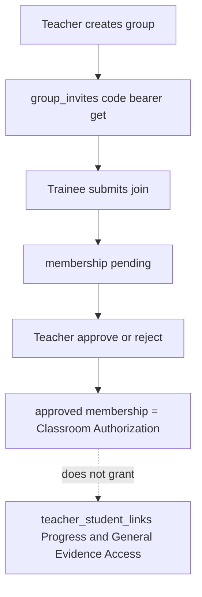

# Phase 2 — Groups, membership, and authorization

**Status:** Complete (2026-08-19); Phase 2 correction pass (2026-08-19); live-Firebase hotfix (2026-08-19); verified-Teacher decision rules (2026-08-19); Trainee-scoped membership preflight (2026-08-19); Teacher ID-token freshness (2026-08-19); Teacher membership listener authorization (2026-08-19)  
**Sequence:** `02` of `01 → 02 → 03 → 04 → 05 → 06 → 07 → 08`  
**Prerequisite:** Phase 1 complete per its handoff section. If Phase 1 is missing, **STOP**.

## Implementing agent instructions

- Re-read current `main`, [AGENTS.md](../../AGENTS.md), [00-master-plan.md](00-master-plan.md), Phase 1 completion report, and this file before editing.
- Work only on existing `main`. Do not create another branch.
- Implement **only this phase**. Do not build Dashboard analytics, leaderboards, assignments, video, or template scoring.
- Do not delete [teacher_app/](../../teacher_app/).
- Do not delete legacy `teacher_student_links` or `teacher_invites` documents.
- Update this document’s Status and Completion report when done.
- Report tests actually run versus `Not verified`.

---

## 1. Status

Complete (2026-08-19); Phase 2 correction pass applied 2026-08-19; live-Firebase hotfix applied 2026-08-19; verified-Teacher decision rules applied 2026-08-19; Trainee-scoped membership preflight applied 2026-08-19; Teacher ID-token freshness applied 2026-08-19

## 2. Goal

Replace the one-roster mental model with real Teacher-owned groups (classes): multiple groups per Teacher, per-group invite codes, join requests, approval / rejection / removal — and establish the five authorization layers from the master plan, including **Classroom Authorization** and the **name** of Assignment Submission Authorization (enforced on documents in Phases 5–6).

## 3. User-visible outcome

- Teacher Groups destination is a real list: create / rename / archive-or-deactivate (if implemented) / copy invite code.
- Trainees join a **group** via code (Windows Trainee join UI updated from “one Teacher roster code” to “group invite code”).
- Teacher sees pending join requests per group and can approve, reject, or remove members.
- Progress Access and General Evidence Access remain **separate** Trainee-controlled consents (still on `teacher_student_links` unless inventory proves a better compatible home — see §14).
- No silent grants. Locked Public Profile Privacy does not change membership.
- `teacher_app` continues to operate on the legacy roster until Phase 8 (compatibility window).

## 4. Verified current repo behavior

- **No groups collection.** [FirestoreCollections](../../packages/elixr_core/lib/database/firestore_collections.dart) has `teacher_invites`, `teacher_student_links`, `teacher_coaching_notes`.
- **One invite per Teacher:** `users.teacher_roster_invite_code` + `teacher_invites/{12-char code}` (Crockford alphabet in `CoachCode`). List of invites is denied; get is bearer-token (`allow get: if isSignedIn()`, `allow list: if false`).
- **One link document per Teacher↔Trainee pair:** `teacher_student_links/{teacherId}_{traineeId}`. Status: `pending | approved | rejected | cancelled | revoked`. `request_version` current = 2.
- Progress Access / General Evidence Access live **on the link**, Trainee-granted, versioned + timestamped. Evidence grant requires progress grant in rules.
- Relationship authorization is **independent of `users.role`** for some paths, but invite **create** requires `role == Teacher` + verified email.
- Link create requires `role == Trainee`.
- A Trainee may hold **multiple** Teacher links (no single-coach constraint).
- Coaching notes require approved link, **not** progress access. **Do not extend coaching-note rules in this phase** (Phase 3 adds Classroom Authorization **OR** approved legacy link). Do **not** silently create `teacher_student_links` so a group member can be coached.
- teacher_app roster is the flat list of that Teacher’s links. Windows Trainee join: [lib/features/teacher_access/](../../lib/features/teacher_access/).
- [docs/phase1-teacher-rankings-plan.md](../phase1-teacher-rankings-plan.md) is not implemented and is not this phase.

## 5. Dependencies / prerequisites

- Phase 1 Teacher shell + Groups placeholder route + Teacher email verification (invite create already needs verified email).
- Existing `CoachCode`, relationship repository tests as behavioral oracles.

## 6. In scope

- Inventory current persisted relationship model (code + rules + a written mapping table in this file’s completion report).
- New `groups` and membership (+ per-group invites) schema, Dart models, repositories, Fluent Groups UI, Trainee join-group UI.
- Firestore rules and indexes for the new collections.
- Compatibility with `teacher_student_links` / `teacher_invites` **without deleting them**.
- Formal comments/helpers in rules for Classroom Authorization vs Progress Access vs General Evidence Access vs Assignment Submission Authorization (the last may be a documented function stub used in Phase 5/6). Coaching-note **create** authorization stays approved-link-only until Phase 3.
- Tests for membership lifecycle and “no silent permission grants.”
- Candidate migrator **behind an explicit, idempotent path** — not a silent production rewrite — see §14.

## 7. Explicit non-goals

- Dashboard widgets, student search UX polish beyond what Groups needs (Phase 3).
- Leaderboard scopes (Phase 4).
- Assignments, `assignment_attempts`, movement definitions (Phase 5).
- Video / Storage paths (Phase 6).
- Deleting `teacher_app` or removing Android roster UI.
- Deleting legacy relationship documents.
- Granting Teachers raw `sessions` reads.
- Collapsing the five authorization terms into one flag.
- Implementing video read rules (Phase 6) beyond naming the helper.
- Extending `teacher_coaching_notes` authorization to group membership (Phase 3).
- Silently creating `teacher_student_links` for coaching or consent.

## 8. Architecture / runtime flow



Recommended collections (snake_case, top-level, matching repo style):

| Collection | Doc ID | Role |
|---|---|---|
| `groups` | auto or `groupId` | Teacher-owned class |
| `group_invites` | 12-char `CoachCode` | Bearer invite like `teacher_invites` |
| `group_memberships` | `{groupId}_{traineeId}` | Join lifecycle |

Keep `teacher_student_links` as the **consent** document for Progress Access and General Evidence Access (teacher↔trainee, not per-group). Classroom Authorization is membership. Assignment Submission Authorization is **not** membership; it is created later on a specific `assignment_attempts` row.

## 9. Data models and persisted schema affected

### `groups/{groupId}` (new)

Suggested fields: `teacher_id`, `name`, `created_at`, `updated_at`, `status` (`active` \| `archived`), `schema_version`. Owner = `teacher_id == auth.uid` and `users.role == Teacher`.

### `group_invites/{code}` (new)

`group_id`, `teacher_id`, `teacher_display_name`, `created_at`. Get: signed-in. List: false. Create: group owner + verified email. Delete: owner (rotate).

### `group_memberships/{groupId}_{traineeId}` (new)

`group_id`, `teacher_id`, `trainee_id`, display-name snapshots, `status`, `invite_id`, `created_at`, `updated_at`, `request_version`. Status set analogous to links: `pending | approved | rejected | cancelled | removed` (use `removed` for Teacher removal to avoid colliding with link `revoked` if both coexist).

**Do not** put `progress_access` or `evidence_access` on memberships in v1. That would duplicate consents and invite silent grants during migration.

### Legacy (retain)

- `teacher_invites`, `users.teacher_roster_invite_code`
- `teacher_student_links` including consent fields

## 10. Authentication / authorization / privacy rules

Use master-plan names in rules comments.

- **Public Profile Privacy:** unchanged.
- **Classroom Authorization:** `group_memberships.status == approved` for `(group, trainee)` and viewer is `teacher_id` **or** the trainee reading their own membership.
- **Progress Access / General Evidence Access:** still `teacher_student_links` helpers `hasApprovedProgressAccess` / `hasApprovedEvidenceAccess`. Joining a group must not write those fields.
- **Assignment Submission Authorization:** document a rules function name now (e.g. `hasAssignmentSubmissionAuthorization`) that returns false until Phase 5/6 documents exist. Do not point it at General Evidence Access.
- **Coaching notes:** leave `approvedCoachingLink` unchanged in this phase. Phase 3 is the only phase that adds Classroom Authorization as an alternate author path.
- Locked profile: membership reads do not consult `public_profiles.visibility`.
- Unrelated Teachers: cannot list another Teacher’s groups or memberships.
- Invite codes remain exact-get bearer tokens.

## 11. Cross-layer contracts affected

- Firestore rules + indexes (membership queries by `teacher_id`, `group_id`, `trainee_id`, `status`).
- `FirestoreCollections` in elixr_core.
- Windows Trainee join controller/section.
- teacher_app roster: **compatibility** — it should still see legacy links. Do not break Android in this phase. **U5 locked:** teacher_app continues creating Teacher-level `teacher_invites`; Windows Groups creates `group_invites`. Deprecate Teacher-level invites in Phase 8 after parity.

## 12. Existing files that must be inspected

- [firestore.rules](../../firestore.rules) teacher roster section (~`teacher_invites`, `teacher_student_links`)
- [firestore.indexes.json](../../firestore.indexes.json)
- [packages/elixr_core/lib/models/teacher_student_link.dart](../../packages/elixr_core/lib/models/teacher_student_link.dart)
- [packages/elixr_core/lib/models/teacher_roster_invite.dart](../../packages/elixr_core/lib/models/teacher_roster_invite.dart)
- [packages/elixr_core/lib/models/coach_code.dart](../../packages/elixr_core/lib/models/coach_code.dart)
- Firebase + in-memory + abstract `teacher_relationship_repository.dart`
- [lib/features/teacher_access/teacher_access_controller.dart](../../lib/features/teacher_access/teacher_access_controller.dart)
- [lib/services/join_link_service.dart](../../lib/services/join_link_service.dart)
- teacher_app roster controller/screen/add_student_sheet
- `packages/elixr_core/test/repositories/teacher_relationship_repository_test.dart`

## 13. Likely files to modify / create / delete

**Create:** group models, membership models, group invite models, group repository triad (abstract / Firebase / in-memory), Groups Fluent screens, rules matches, indexes, unit tests.

**Modify:** `FirestoreCollections`, Trainee join UI copy (“Join a group”), Teacher shell Groups placeholder → real UI, maybe `JoinLinkService` to carry `group` vs legacy teacher codes.

**Delete:** nothing of legacy collections or `teacher_app`.

## 14. Backward compatibility / migration strategy

### Step A — Inventory (required before any backfill)

Record in the completion report:

- Count of Teachers with `teacher_roster_invite_code` (if a project is available; else `Not verified` + code paths only).
- Link statuses actually written by clients: pending, approved, rejected, cancelled, revoked.
- Whether any Trainee has multiple approved Teachers.
- Fields on links used by progress/evidence/coaching.

### Step B — Compatibility (always)

- Dual-read: Windows Teacher Groups UI uses `groups` + `group_memberships`. If no groups exist yet, show empty state + CTA to create a group — **do not** pretend the flat roster is a group until a migrator runs.
- teacher_app continues to read/write `teacher_student_links` / `teacher_invites`.
- Trainee join: **New Windows Groups use `group_invites`.** Legacy `teacher_invites` remain valid **while `teacher_app` compatibility is required (U5)** and still create/update `teacher_student_links` as today. Group membership is added when the code is a `group_invites` id. Do not auto-map a legacy Teacher code onto a default group (U4: no automatic default-group migration).

### Step C — Candidate migrator (not automatic)

**Candidate:** for each Teacher, create one default group; attach **approved** links as `group_memberships.status == approved`; point a **new** group invite at that group; **keep** the legacy invite document.

Must specify before enabling:

| Topic | Required behavior |
|---|---|
| Idempotency | Stable default-group marker on `groups` (e.g. `legacy_source: teacher_roster_v1`, `legacy_teacher_id`). Re-running does not duplicate groups or memberships. |
| Pending links | Do **not** auto-approve into the group. Optionally create `pending` memberships **only** if product confirms; recommended default: leave pending **only** on `teacher_student_links` until the Trainee joins the new group code. |
| Rejected / cancelled / revoked | Do **not** create memberships. |
| Duplicate memberships | Doc ID `{groupId}_{traineeId}` prevents duplicates. |
| Invite codes | Do not delete `teacher_invites` in Phase 2. New groups use **new** `group_invites` codes. Do not reuse the Teacher-level 12-char code as a group invite id. |
| Permissions | Migrator writes membership only. Never sets `progress_access` or `evidence_access`. Never implies Assignment Submission Authorization. |
| Rollback | Stop calling migrator. Leave created groups in place (orphans are OK) or archive them; **never delete legacy links** to “roll back.” |
| Retry | Safe because of idempotency keys. |

**U4 locked:** do **not** run this migrator in production or on Teacher login. Inventory in Step A is required. Enabling the candidate requires an **explicit later human decision**. Do not run a production migrator as a side effect of first Teacher login.

## 15. Step-by-step implementation order

1. Inventory code/rules; write the mapping table into a short comment in the group repository.
2. TDD: in-memory group repository — create group, unique membership, approve/reject/remove, no consent fields.
3. Rules tests / documented rule functions (emulator if available; else unit-test helper logic + careful rules review). List emulator as `Not verified` if unused.
4. Firebase repository + indexes.
5. Groups UI in Teacher shell.
6. Trainee join-group path.
7. Compatibility: teacher_app still green; legacy join still works.
8. Do **not** ship or auto-run a default-group migrator (U4). Leave the candidate spec in this file only.
9. Update this file.

## 16. Acceptance criteria

1. A Teacher can own multiple groups with distinct invite codes.
2. Join / approve / reject / remove work for group memberships.
3. Classroom Authorization is approved membership; it does not grant Progress Access, General Evidence Access, or Assignment Submission Authorization.
4. Legacy `teacher_student_links` and `teacher_invites` still exist and are not deleted by migration code.
5. Locked Public Profile Privacy is not consulted for membership.
6. Unrelated Teachers cannot read another Teacher’s groups.
7. `teacher_app` still functions on legacy collections.
8. No `assignment_attempts` yet.

## 17. Required tests

- Models: parse/status/doc IDs.
- In-memory + Firebase fake: lifecycle, idempotent membership create, removal does not touch link consents.
- Rules-oriented tests: Trainee cannot approve themselves; Teacher cannot join as trainee using Teacher role; invite list denied.
- Widget: Groups empty/loading/error; pending list; copy code.
- Trainee join: group code vs invalid code.
- Regression: existing relationship repository tests still pass.
- Do **not** ship or test-enable a production migrator (U4). Candidate-spec unit tests, if written, must stay off any login/production path.

## 18. Verification commands

```powershell
dart format --output=none --set-exit-if-changed lib test
flutter analyze
flutter test
cd packages\elixr_core; flutter test
cd ..\..\teacher_app; flutter test
```

If rules changed, review [firestore.rules](../../firestore.rules) and [firestore.indexes.json](../../firestore.indexes.json). Deploy only if a human requests it (`Not verified` by default).

```powershell
backend\.venv\Scripts\python.exe -m pytest -q backend\tests
```

Only if Python was touched (should not be).

## 19. Manual verification checklist

- [ ] Teacher creates two groups, two codes.
- [ ] Trainee joins group A, not group B.
- [ ] Teacher approves A; Trainee still has Progress Access = none.
- [ ] teacher_app still shows legacy roster for the same Teacher.
- [ ] Legacy pending link still approvable on Android.
- [ ] Locked profile trainee can still be a member.

## 20. Performance / storage / privacy risks

- Listing all memberships without indexes will fail at scale — add composites up front.
- Bearer invite get is world-readable-to-signed-in-users (same as today); do not add `list`.
- Dual models increase confusion; UI copy must say “group” vs “progress sharing” separately.

## 21. Explicit “Do not” list

- Do not delete `teacher_app`.
- Do not delete `teacher_student_links` / `teacher_invites`.
- Do not auto-grant Progress Access, General Evidence Access, or Assignment Submission Authorization.
- Do not copy progress/evidence fields onto memberships in v1.
- Do not implement assignment video rules as General Evidence Access.
- Do not run an unbounded production backfill on login (U4: no automatic default-group migration).
- Do not silently create `teacher_student_links` for coaching.
- Do not start Phase 3–7 features.
- Do not weaken invite `list: if false`.

## 22. Completion report template

```
Phase 2 completion (2026-08-19)

- Inventory findings:
  - Legacy `teacher_invites/{12-char code}`: one active Teacher-level roster code per Teacher (`users.teacher_roster_invite_code`). List denied; exact GET for signed-in users.
  - Legacy `teacher_student_links/{teacherId}_{traineeId}` statuses: pending, approved, rejected, cancelled, revoked. `request_version` current = 2.
  - Consent fields on links: `progress_access`, `progress_access_version`, `progress_access_granted_at`, `evidence_access`, `evidence_access_version`, `evidence_access_granted_at`. Evidence requires progress.
  - Trainees may hold multiple approved Teacher links (no single-coach constraint).
  - Coaching notes still require approved legacy link only (unchanged this phase).
  - Production Firebase document counts: Not verified.

- Collections added:
  - `groups/{groupId}` — `teacher_id`, `name`, `status` (`active`|`archived`), `invite_code`, `schema_version`, `created_at`, `updated_at`
  - `group_invites/{code}` — `group_id`, `teacher_id`, `teacher_display_name`, `created_at`
  - `group_memberships/{groupId}_{traineeId}` — membership lifecycle; no consent fields

- Migrator shipped? **not shipped** (U4: no automatic production/default-group migration)

- Legacy documents retained: yes (`teacher_invites`, `teacher_student_links`, `teacher_app/`)

- Authorization functions named in rules:
  - `hasClassroomAuthorization(groupId, traineeId)`
  - `hasApprovedProgressAccess(traineeId)` (unchanged, on `teacher_student_links`)
  - `hasApprovedEvidenceAccess(traineeId)` (unchanged)
  - `hasAssignmentSubmissionAuthorization(...)` — fail-closed stub returning `false`
  - `approvedCoachingLink` — unchanged (approved legacy link only)

- Behavior implemented:
  - Teacher Groups Fluent UI: create/rename/archive groups, per-group invite code display/copy/rotate, pending approve/reject, approved member remove.
  - Trainee join distinguishes `group_invites` vs legacy `teacher_invites` via typed `JoinCodeResolver`.
  - Approved `group_memberships` = Classroom Authorization only; no automatic `teacher_student_links` writes.
  - Dual legacy + group flows coexist; deep links (`elixr://join?code=`) unchanged.

- Files created:
  - `packages/elixr_core/lib/models/elixr_group.dart`
  - `packages/elixr_core/lib/models/group_invite.dart`
  - `packages/elixr_core/lib/models/group_membership.dart`
  - `packages/elixr_core/lib/models/group_exception.dart`
  - `packages/elixr_core/lib/repositories/group_repository.dart`
  - `packages/elixr_core/lib/repositories/in_memory_group_repository.dart`
  - `packages/elixr_core/lib/repositories/firebase_group_repository.dart`
  - `packages/elixr_core/test/repositories/group_repository_test.dart`
  - `lib/services/join_code_resolver.dart`
  - `lib/features/teacher/groups/teacher_groups_controller.dart`
  - `lib/features/teacher/groups/teacher_groups_screen.dart`
  - `test/features/teacher/teacher_groups_controller_test.dart`
  - `test/services/join_code_resolver_test.dart`

- Files modified:
  - `packages/elixr_core/lib/database/firestore_collections.dart`
  - `packages/elixr_core/lib/elixr_core.dart`
  - `firestore.rules`
  - `firestore.indexes.json`
  - `lib/app.dart`
  - `lib/core/router/app_router.dart`
  - `lib/features/teacher_access/teacher_access_controller.dart`
  - `lib/features/teacher_access/teacher_access_section.dart`
  - `lib/features/teacher_access/join_teacher_screen.dart`
  - `test/features/teacher_access/teacher_access_controller_test.dart`
  - `test/features/teacher_access/teacher_access_section_test.dart`
  - This phase document

- Commands run and results:
  - `dart format` — applied to changed Dart files
  - `flutter analyze lib test` — 4 pre-existing info lints only
  - `flutter test` — **1132 passed**, 0 failed
  - `cd packages\elixr_core; flutter test` — **53 passed**, 0 failed
  - `cd teacher_app; flutter test` — **95 passed**, 0 failed
  - `flutter build windows` — succeeded (`elixr_application.exe`)

- Manual checks: Not performed (no interactive Firebase session in this run)

- Assumptions:
  - Firestore rules/indexes are reviewed in-repo but not deployed unless a human requests deployment.
  - Group invite rotation deletes the previous `group_invites` document; legacy `teacher_invites` are untouched.

- Not verified:
  - Firebase rules emulator tests
  - Firestore rules/indexes deployment to production
  - Manual Teacher/Trainee join on Windows against live Firebase
  - Locked-profile Trainee membership with live `public_profiles.visibility = private`

- Known risks:
  - Rules/indexes must be deployed before production use of new collections.
  - `group_invites` and `teacher_invites` codes share the same alphabet/format; resolver checks group first, then legacy roster.

- Phase 3 not started: confirmed
- `teacher_app` still present: confirmed
- No production migrator ran: confirmed
```

## 24. Phase 2 correction pass (2026-08-19)

GitHub review findings addressed on `main` without starting Phase 3.

### Root causes fixed

1. **Invite pointer rules gap** — `validGroupTeacherUpdate()` had no active→active transition for `invite_code` set/rotate, so repository batch writes were denied by rules.
2. **Split invite namespace** — `group_invites` and `teacher_invites` collision-checked only their own collection, allowing cross-collection code shadowing during legacy compatibility.
3. **Account-erasure regression** — `_purgeUserData()` did not delete Phase 2 `groups`, `group_invites`, or `group_memberships`.
4. **Classroom Authorization viewer binding** — `hasClassroomAuthorization()` did not require `request.auth.uid` to match the group/membership Teacher.

### Corrections implemented

- **Invite pointer rules** — Added `validGroupInvitePointerUpdate(groupId)` and `validGroupTeacherUpdate(groupId)` so an owning verified Teacher may set/rotate `invite_code` only when the group stays active with unchanged identity fields, `updated_at == request.time`, and a matching `group_invites/{code}` exists in the same atomic write (`getAfter`). Rename and archive transitions preserved.
- **Global invite-code uniqueness** — Firebase repositories check both collections before commit; rules deny `group_invites` create when `teacher_invites/{code}` exists and vice versa.
- **createGroup rollback** — `FirebaseGroupRepository.createGroup()` and `InMemoryGroupRepository.createGroup()` roll back the new group when initial invite provisioning fails (no silent swallow).
- **Account erasure** — `purgePhase2GroupDataForAccountErasure()` deletes trainee memberships, teacher-owned memberships, teacher-owned groups, and active group invites derived from each owned group's `invite_code` pointer (no `group_invites` list). Fail-closed Auth deletion preserved.
- **Classroom Authorization** — `hasClassroomAuthorization(groupId, traineeId)` now requires `request.auth.uid == group.teacher_id == membership.teacher_id` plus approved membership for the trainee in that group. No Progress/Evidence consent attached.
- **Firestore emulator coverage** — Added `firestore-tests/groups_v1.test.mjs` and wired it into `npm test`.

### Files created

- `firestore-tests/groups_v1.test.mjs`
- `packages/elixr_core/test/repositories/auth_account_erasure_groups_test.dart`

### Files modified

- `firestore.rules`
- `firestore-tests/package.json`
- `packages/elixr_core/pubspec.yaml` (dev: `fake_cloud_firestore`)
- `packages/elixr_core/lib/repositories/auth_repository.dart`
- `packages/elixr_core/lib/repositories/firebase_group_repository.dart`
- `packages/elixr_core/lib/repositories/firebase_teacher_relationship_repository.dart`
- `packages/elixr_core/lib/repositories/in_memory_group_repository.dart`
- `packages/elixr_core/lib/repositories/in_memory_teacher_relationship_repository.dart`
- `packages/elixr_core/test/repositories/group_repository_test.dart`
- `packages/elixr_core/test/repositories/teacher_relationship_repository_test.dart`
- `test/services/join_code_resolver_test.dart`
- This phase document

### Commands run and results

- `dart format` — applied to changed Dart files
- `flutter analyze lib test` — 4 pre-existing info lints only (`curly_braces_in_flow_control_structures`)
- `flutter test` — **1133 passed**, 0 failed
- `cd packages\elixr_core; flutter test` — **59 passed**, 0 failed
- `cd teacher_app; flutter test` — **95 passed**, 0 failed
- `cd firestore-tests; npm test` (with `JAVA_HOME` = Android Studio JBR 21) — **163 passed**, 0 failed (includes new `groups_v1` suite)
- `flutter build windows` — succeeded (`elixr_application.exe`)

### Not verified

- Firestore rules/indexes deployment to production
- Manual Teacher/Trainee join on Windows against live Firebase
- Emulator run with system default Java 17 PATH (requires JDK 21 on `PATH` or `JAVA_HOME`)

### Explicit confirmations

- Group invite create/rotate accepted by rules when paired with matching `group_invites` batch write
- Ambiguous legacy/group code creation denied by rules and avoided by repositories
- Deleting a Trainee removes their `group_memberships`
- Deleting a Teacher removes owned groups, derived active `group_invites`, and related memberships
- Classroom Authorization binds to authenticated Teacher viewer
- No Progress/Evidence consent silently granted via membership or Classroom helper
- No production migrator ran
- `teacher_app/` remains intact
- Phase 3 not started

## 23. Handoff requirements for Phase 3

1. Groups + memberships exist with rules.
2. Classroom Authorization is queryable (approved members per Teacher/group).
3. Consent still lives on `teacher_student_links`.
4. Teacher Students placeholder can be filled from memberships.
5. `teacher_app/` still present.
6. This completion report includes the inventory.
7. Coaching-note rules still approved-link-only (Phase 3 extends them). No silent consent links.

## 25. Phase 2 live-Firebase hotfix (2026-08-19)

After deploying Phase 2 rules/indexes to `elixr-app-2026`, normal Windows Trainees could resolve a group invite code and reach the confirmation UI, but `Send Request` failed with Firestore permission denied. Firebase logs showed `validPendingMembershipCreate()` required `hasVerifiedEmail()` while Trainee registration/login on Windows does not gate on email verification (only Teacher registration requests verification).

### Fix

- **`validPendingMembershipCreate()`** — Replaced `hasVerifiedEmail()` with `isSignedIn()`; existing Trainee role, `trainee_id == request.auth.uid`, invite, and schema checks remain.
- **`validPendingLinkCreate()`** — Same correction for legacy roster join (`teacher_student_links` pending create).
- **Teacher verification unchanged** — `validInviteCreate()`, `validGroupCreate()`, `validGroupInviteCreate()`, and `isVerifiedTeacher()` still require `hasVerifiedEmail()`.
- **Debug diagnostics** — `TeacherAccessController.confirmJoin()` logs the underlying error in debug builds only; production UI remains a safe generic message.
- **Emulator coverage** — `groups_v1.test.mjs` and `roster_v2.test.mjs` helpers accept `emailVerified: false`; new tests cover unverified Trainee pending join (group + legacy roster), self-approval denial, unverified Trainee group/invite denial, verified Teacher approval, and unverified Teacher invite/group denial.

### Tests run (hotfix)

- `flutter test` — **1133 passed**, 0 failed
- `cd packages\elixr_core; flutter test` — **59 passed**, 0 failed
- `cd teacher_app; flutter test` — **95 passed**, 0 failed
- `cd firestore-tests; npm test` (Android Studio JBR 21 on `JAVA_HOME` and `PATH`) — **172 passed**, 0 failed (includes unverified Trainee/Teacher parity tests)

### Not verified

- Redeploy of `firestore.rules` to production after this hotfix
- Manual Trainee group join on live Firebase after redeploy

## 26. Phase 2 verified-Teacher decision rules (2026-08-19)

GitHub review found that Teacher membership approval/rejection/removal and legacy roster approve/reject were not enforcing verified-Teacher status in Firestore rules (Windows UI routing is not a security boundary per Phase 1).

### Fix

- **`validTeacherMembershipDecision()`** — Now requires `isVerifiedTeacher()` in addition to owning `teacher_id`, pending status, valid transition, and identity immutability.
- **`validTeacherMembershipRemoval()`** — Same `isVerifiedTeacher()` requirement for approved→removed transitions.
- **`validTeacherDecisionTransition()`** — Legacy `teacher_student_links` approve/reject now requires `isVerifiedTeacher()` plus existing participant, transition, and consent protections.
- **Trainee pending creates unchanged** — `validPendingMembershipCreate()` and `validPendingLinkCreate()` still use `isSignedIn()` only (unverified Trainees may submit join requests).
- **Teacher invite/group create unchanged** — `validInviteCreate()`, `validGroupCreate()`, `validGroupInviteCreate()` still require verified email via `isVerifiedTeacher()` / `hasVerifiedEmail()`.

### Emulator coverage

- `groups_v1.test.mjs` — unverified owning Teacher cannot approve, reject, or remove; unrelated verified Teacher still denied; unverified Trainee pending create still allowed.
- `roster_v2.test.mjs` — verified owning Teacher can approve/reject unverified Trainee link; unverified owning Teacher cannot approve or reject.

### Tests run (verified-Teacher decision rules)

- `dart format --output=none --set-exit-if-changed lib test` — 0 changed
- `flutter analyze lib test` — 4 pre-existing info lints only (`curly_braces_in_flow_control_structures`)
- `flutter test` — **1133 passed**, 0 failed
- `cd packages\elixr_core; flutter test` — **59 passed**, 0 failed
- `cd teacher_app; flutter test` — **95 passed**, 0 failed
- `cd firestore-tests; npm test` (Android Studio JBR 21 on `JAVA_HOME` and `PATH`) — **180 passed**, 0 failed (8 new verified-Teacher decision tests)

### Not verified

- Firestore rules deployment to production after this correction
- Manual unverified-Teacher decision attempt on live Firebase

### Explicit confirmations

- Unverified Trainee can still request group membership and legacy Teacher relationship
- Unverified Teacher cannot approve/reject/remove group membership or approve/reject legacy link
- Verified owning Teacher can still decide pending requests
- Progress Access / General Evidence Access rules untouched
- `teacher_app/` untouched
- Phase 3 not started

## 27. Phase 2 live-Firebase membership preflight (2026-08-19)

Trainee email-verification was already fixed (`validPendingMembershipCreate()` uses `isSignedIn()`). The next live failure happened earlier in `FirebaseGroupRepository.requestGroupJoin`: first-time join performed an exact GET of `group_memberships/{groupId}_{traineeId}` before create. That document does not exist yet, and `allow get: if isMembershipParticipant()` depends on `resource.data`, so the GET was denied before pending-create rules ran.

### Fix

- **Repository preflight** — Replaced `_memberships.doc(id).get()` with a Trainee-scoped query (`trainee_id == authenticated traineeId`), then locate the deterministic `{groupId}_{traineeId}` document if present.
- **Membership exact-read privacy was not loosened** — `allow get: if isMembershipParticipant()` is unchanged. Missing exact-document GET remains denied so clients cannot probe arbitrary missing membership IDs.
- **Duplicate / re-request semantics preserved** — approved → alreadyMember; pending → alreadyPending; rejected / cancelled / removed → pending update with immutable `created_at`.
- **Post-write `ref.get()` retained** — after create/update the membership exists and is readable by its Trainee participant.

### Tests run

- `dart format --output=none --set-exit-if-changed lib test` — 0 changed
- `flutter analyze lib test` — 4 pre-existing info lints only (`curly_braces_in_flow_control_structures`)
- `flutter test` — **1133 passed**, 0 failed
- `cd packages\elixr_core; flutter test` — **66 passed**, 0 failed (7 new FirebaseGroupRepository tests)
- `cd teacher_app; flutter test` — **95 passed**, 0 failed
- `cd firestore-tests; npm test` (Android Studio JBR 21 on `JAVA_HOME` and `PATH`) — **186 passed**, 0 failed (6 new Trainee-scoped membership lookup tests)

### Not verified

- Firestore rules/indexes deployment to production after this correction
- Manual Trainee group join on live Firebase after this repository change

### Explicit confirmations

- First-time Trainee Group join no longer performs an exact GET on a missing membership
- Own-membership query is Trainee-scoped
- Broad membership listing remains denied
- Unrelated membership reads remain denied
- Duplicate / re-request semantics preserved
- Verified Teacher decision rules preserved
- Progress/Evidence untouched
- `teacher_app/` intact
- Phase 3 not started

## 28. Phase 2 Teacher ID-token freshness (2026-08-19)

Live Windows Teacher flow could see a pending Group membership but Approve failed until the Teacher logged out and logged back in. After a fresh login, the same pending request succeeded.

### Live evidence of stale authorization

```
Teacher account already open
        ↓
new verified-Teacher Firestore rule active
        ↓
Teacher sees pending membership
        ↓
Approve denied
        ↓
Teacher logs out
        ↓
Teacher logs back in
        ↓
Approve succeeds
```

That pattern is stale Firebase ID-token authorization state:

- Firebase `User.emailVerified == true`
- cached Firestore ID-token claim may still be `email_verified == false`

Firestore evaluates `request.auth.token.email_verified`, not `User.emailVerified`. A fresh login mints a fresh token, which is why logout/login unblocked Approve.

### Fix

Firestore security was **correct** and was **not** weakened. `validTeacherMembershipDecision()`, `validTeacherMembershipRemoval()`, and legacy `validTeacherDecisionTransition()` still require `isVerifiedTeacher()`.

The client now refreshes Teacher authorization automatically before privileged Group writes, reusing existing `AuthRepository.isCurrentEmailVerified()` / `refreshStaleEmailVerifiedIdToken()` (User reload + stale-claim `getIdToken(true)`). No second token-refresh subsystem was added.

`AuthService.ensureTeacherAuthorizationFresh()`:

1. Fails closed for missing user, Trainee, or non-Teacher.
2. Calls `_repository.isCurrentEmailVerified()` (owns reload + stale-token force refresh; does not force-refresh when the cached claim is already verified).
3. Updates Teacher verification state; refreshes the authoritative profile; fails closed if the profile is missing or no longer Teacher.
4. Transient repository errors fail closed without signing the Teacher out.

`TeacherGroupsController` runs that callback immediately before:

- `createGroup`
- `renameGroup`
- `archiveGroup`
- `rotateInvite`
- `approveMembership`
- `rejectMembership`
- `removeMembership`

It does **not** refresh from `build()`, stream listeners, membership snapshots, or timers.

If refresh returns false or throws, the repository mutation is skipped and the UI shows a safe message (`Teacher verification needs to be refreshed. Verify your email and try again.`). Debug builds log `[TeacherGroups] <operation> failed:` with the real exception; production UI does not show token, UID, stack traces, or `cloud_firestore/permission-denied`.

Expected live flow after this fix:

```
Teacher remains logged in
        ↓
Approve
        ↓
automatic authorization refresh
        ↓
Approve succeeds
```

No logout/login workaround.

### Files modified

- `lib/services/auth_service.dart` — `ensureTeacherAuthorizationFresh()`
- `lib/core/auth/teacher_auth_messages.dart` — safe Teacher verification-refresh copy
- `lib/features/teacher/groups/teacher_groups_controller.dart` — authorization preflight + debug action runner
- `lib/features/teacher/groups/teacher_groups_screen.dart` — injects AuthService callback
- `test/services/auth_teacher_flow_test.dart` — AuthService freshness tests
- `test/features/teacher/teacher_groups_controller_test.dart` — privileged-action preflight tests
- This phase document

`firestore.rules` unchanged. `FirebaseGroupRepository` Teacher decision GET/update path unchanged. Trainee-scoped first-time join lookup unchanged.

### Tests run

- `dart format --output=none --set-exit-if-changed lib test` — 0 changed
- `flutter analyze lib test` — 4 pre-existing info lints only (`curly_braces_in_flow_control_structures`)
- `flutter test` — **1152 passed**, 0 failed
- `cd packages\elixr_core; flutter test` — **66 passed**, 0 failed
- `cd teacher_app; flutter test` — **95 passed**, 0 failed (`teacher_app` unmodified)
- `cd firestore-tests; npm test` (Android Studio JBR 21 on `JAVA_HOME` and `PATH`) — **186 passed**, 0 failed (rules unchanged; verified/unverified Teacher decision and Trainee join coverage still green)
- `flutter build windows` — not run (Dart-only AuthService/Groups preflight; no native/startup/asset change)

### Not verified

- Manual Windows Teacher Approve against live Firebase after this client change (no interactive Teacher session in this run)
- Firestore rules/indexes deployment (not requested; rules unchanged)

### Explicit confirmations

- Teacher no longer needs logout/login after verification/token staleness (client now refreshes the ID-token claim before privileged writes)
- Verified Teacher can approve/reject/remove after successful authorization refresh
- Unverified Teacher remains denied by Firestore and by the client preflight
- Trainee can still request membership without email verification
- Firestore security was not weakened
- Trainee membership privacy unchanged
- Progress Access untouched
- General Evidence Access untouched
- `teacher_app/` intact
- Phase 3 not started

## 29. Phase 2 Teacher membership listener authorization (2026-08-19)

Live Windows Teacher Groups screen showed approved Trainees but also displayed **"Could not load members."** when the approved-membership Firestore listener failed.

### Observed live bug flow

```
Teacher opens Groups
        ↓
BSHM 4A selected
        ↓
Approved member visible (stale/cached or partial state)
        ↓
server membership listener fails (permission-denied)
        ↓
"Could not load members."
```

### Root cause

Firestore security rules are **not** result filters. A query must be provably constrained so every possible returned document satisfies the list rule.

`group_memberships` list authorization for Teachers requires:

```
resource.data.teacher_id == request.auth.uid
```

The repository listener queried only:

```
group_id == selectedGroupId
status == approved | pending   (optional)
orderBy created_at DESC
```

That query shape does **not** prove `teacher_id == authenticated Teacher`, so Firestore correctly denied the listener even though individual GET paths or cached UI state could still show a member.

### Fix

1. **Repository contract** — `watchGroupMemberships` now requires explicit `teacherId` (authenticated Teacher session), not inferred from returned documents.
2. **Firebase query** — Teacher membership listeners now query:
   - `teacher_id == teacherId`
   - `group_id == groupId`
   - `status == pending | approved` (when filtered)
   - `orderBy created_at DESC`
3. **Controller** — `TeacherGroupsController` passes its authoritative `teacherId` to both pending and approved listeners.
4. **In-memory parity** — `InMemoryGroupRepository` filters by `teacherId` + `groupId` (+ optional status).
5. **Indexes** — Added composite indexes including `teacher_id` for the new query shapes.
6. **Diagnostics** — Debug builds log `[TeacherGroups] pending memberships stream failed:` / `[TeacherGroups] approved memberships stream failed:`; production UI keeps safe messages only.

`firestore.rules` were **not** weakened. Broad membership listing remains denied.

### Corrected flow

```
Teacher opens Groups
        ↓
query:
  teacher_id == current Teacher
  group_id == selected Group
  status == approved | pending
        ↓
Firestore can prove every result is owned by current Teacher
        ↓
listener succeeds
```

### Files modified

- `packages/elixr_core/lib/repositories/group_repository.dart` — `teacherId` on `watchGroupMemberships`
- `packages/elixr_core/lib/repositories/firebase_group_repository.dart` — owner-scoped query
- `packages/elixr_core/lib/repositories/in_memory_group_repository.dart` — owner-scoped stream parity
- `lib/features/teacher/groups/teacher_groups_controller.dart` — pass `teacherId`; stream debug logging
- `firestore.indexes.json` — `teacher_id` composite indexes
- `firestore-tests/groups_v1.test.mjs` — emulator tests for exact Teacher listener query shape
- `packages/elixr_core/test/repositories/group_repository_test.dart` — in-memory watch scoping tests
- `packages/elixr_core/test/repositories/firebase_group_repository_test.dart` — repository query scoping tests
- `test/features/teacher/teacher_groups_controller_test.dart` — listener subscription + error-state tests
- This phase document

`firestore.rules` unchanged. Phase 3 not started.

### Old vs new Teacher membership query

| Aspect | Before | After |
|---|---|---|
| `teacher_id` | not in query | `teacher_id == authenticatedTeacherId` |
| `group_id` | `group_id == selectedGroupId` | unchanged |
| `status` | optional `pending` / `approved` | unchanged |
| `orderBy` | `created_at DESC` | unchanged |
| Rules provability | denied (not owner-provable) | allowed (every result owned by caller) |

### Tests run

- `dart format --output=none --set-exit-if-changed lib test packages/elixr_core/lib packages/elixr_core/test` — 0 changed
- `flutter analyze lib test` — 4 pre-existing info lints only (`curly_braces_in_flow_control_structures`)
- `flutter test` — **1156 passed**, 0 failed
- `cd packages\elixr_core; flutter test` — **69 passed**, 0 failed
- `cd teacher_app; flutter test` — **95 passed**, 0 failed (`teacher_app` unmodified)
- `cd firestore-tests; npm test` (Android Studio JBR 21) — **194 passed**, 0 failed (8 new Teacher listener query tests)
- `flutter build windows` — not run (Dart-only repository/controller/index change)

### Not verified

- Manual Windows Teacher Groups screen against live Firebase after this change

### Explicit confirmations

- Teacher membership query is `teacher_id` scoped
- Pending and approved listeners both use authenticated Teacher ID
- Unrelated Teachers remain denied
- Broad membership listing remains denied
- Trainee own-membership reads remain intact
- Teacher token-refresh fix preserved
- Trainee join fix preserved
- Progress Access untouched
- General Evidence Access untouched
- `teacher_app/` intact
- Phase 3 not started
