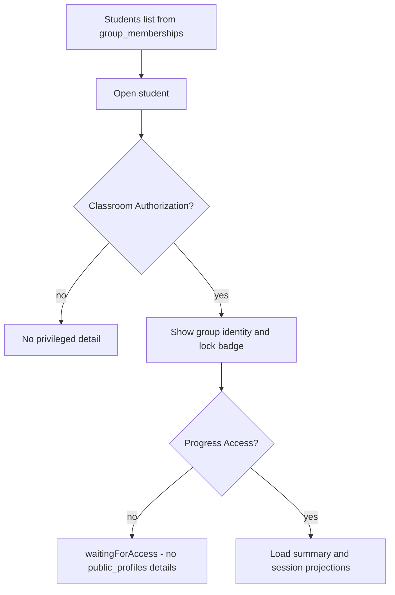

# Phase 3 — Teacher Dashboard, Students, and progress

**Status:** Planned  
**Sequence:** `03` of `01 → 02 → 03 → 04 → 05 → 06 → 07 → 08`  
**Prerequisite:** Phase 2 complete. If groups/memberships are missing, **STOP**.

## Implementing agent instructions

- Re-read current `main`, [AGENTS.md](../../AGENTS.md), [00-master-plan.md](00-master-plan.md), Phase 2 handoff, and this file before editing.
- Work only on existing `main`. Do not create another branch.
- Implement **only this phase**. Do not implement leaderboard tabs, assignments, video, or template scoring.
- Do not delete [teacher_app/](../../teacher_app/).
- Reuse `elixr_core` progress/coaching repositories; do not copy teacher_app Material widgets.
- Update this document’s Status and Completion report when done.

---

## 1. Status

Planned

## 2. Goal

Give Teachers a Fluent Dashboard, a Students list with filter/search, a student detail surface that respects the five authorization layers, and coaching notes — including explicit empty states when Progress Access is absent and when Public Profile Privacy is locked.

## 3. User-visible outcome

- **Dashboard:** counts and queues that can be known from Classroom Authorization (groups, pending joins, member counts). No fake assignment/video stats until Phases 5–6; those tiles stay “Coming soon” or omit numbers.
- **Students:** list members across the Teacher’s groups (filter by group, status, search by display name).
- **Student detail:** identity allowed without Progress Access; personal training history only with Progress Access; coaching notes when the Teacher has **approved Classroom Authorization** (or an approved legacy `teacher_student_link` during compatibility); lock badge does **not** hide classroom membership.
- Students who have not granted Progress Access see a waiting/consent state, not an error that looks like “profile locked hiding classwork.”
- Unrelated Teacher cannot open a student detail by guessing a UID.

## 4. Verified current repo behavior

- teacher_app [student_progress_controller.dart](../../teacher_app/lib/features/student_progress/student_progress_controller.dart) states include `waitingForAccess`, `ready`, `empty`, `accessWithdrawn`, `relationshipRevoked`, `connectionRequired`.
- Progress reads **sanitized** `public_profiles/{id}/details/summary` and `.../sessions/{id}` via `TeacherProgressRepository` — not raw `sessions`.
- Rules: those details are readable if owner **or** (`isOrdinaryPlayer` && public) **or** `hasApprovedProgressAccess`. Teachers are **not** ordinary players, so they **cannot** read public details without Progress Access even if the profile is public.
- `public_profiles/{uid}/achievements/*` has **no** teacher Progress Access bypass.
- Root `public_profiles/{uid}` is signed-in readable (name, visibility, photo).
- Coaching notes: today approved **link** only (`approvedCoachingLink` in [firestore.rules](../../firestore.rules)); optional `movement_name` in official 12; max 1000 chars. Phase 3 **changes** create/list authorization to Classroom Authorization **OR** that legacy approved link.
- Windows Trainee receives notes at `/coaching`.
- teacher_app has no Dashboard. Windows trainee Dashboard is unrelated.

## 5. Dependencies / prerequisites

- Phase 1 Teacher shell destinations.
- Phase 2 `groups` + `group_memberships` + retained `teacher_student_links`.

## 6. In scope

- Fluent Dashboard (Classroom Authorization metrics only).
- Students list/filter/search across groups.
- Student detail with state machine covering: not a member; pending; approved without Progress Access; approved with Progress Access; removed; consent withdrawn; connection/error.
- Locked Public Profile Privacy badge + copy that classroom membership remains visible to the assigning Teacher.
- Coaching notes section (reuse core repo; Fluent UI).
- Pagination of progress sessions (existing page size 1..50).
- Tests for authorization states.
- Placeholder slots for assignment results (Phase 5) that do **not** call missing collections.

## 7. Explicit non-goals

- Global/My Students/Group leaderboard UX (Phase 4) — a small rank number on student detail **may** reuse existing `computeRankForUser` only if it does not pull protected details; prefer deferring rank to Phase 4 if it causes drill-down confusion.
- Opening raw `sessions` / `feedbacks` to Teachers.
- Widening achievement subcollection reads to Teachers.
- Video review queue (Phase 6).
- Assignment CRUD (Phase 5).
- Copying teacher_app widgets.
- Deleting `teacher_app`.
- Granting Progress Access, General Evidence Access, or Assignment Submission Authorization from the Teacher UI.
- Silently creating `teacher_student_links` solely so coaching notes can be written.

## 8. Architecture / runtime flow



Dashboard sources: group repository counts + pending memberships. Do not query `public_profiles/details` in bulk (rules and privacy).

## 9. Data models and persisted schema affected

- Read: `groups`, `group_memberships`, `teacher_student_links`, `public_profiles` root, `public_profiles/details/**` (only with Progress Access), `teacher_coaching_notes`.
- Write: coaching notes (existing schema). No new collections required.
- Do not add a “teacher override lock” field.

## 10. Authentication / authorization / privacy rules

| Surface | Required |
|---|---|
| Students list row | Classroom Authorization (approved membership in a group owned by viewer) |
| Display name / photo / lock badge | Signed-in readable root profile **or** membership snapshots stored on `group_memberships` (prefer snapshots so a lock does not blank the roster name) |
| Official practice summary/history | Progress Access |
| Claimed achievements gallery | **Do not** use Progress Access to widen achievements; omit or show “not available” unless rules are explicitly changed in a later human-approved phase |
| Coaching notes | **Approved Classroom Authorization** (authenticated Teacher owns the approved `group_memberships` row for that trainee) **OR** an approved legacy `teacher_student_link` during the `teacher_app` compatibility period. Does **not** grant Progress Access, General Evidence Access, or Assignment Submission Authorization. Do **not** silently create a link to unlock notes. Preserve legacy approved-link reads/writes until Phase 8. Rules must prove `teacher_id` owns the group that contains the trainee. |
| Assignment video | N/A (Phase 6). Do not use General Evidence Access. |
| Locked profile | Must not hide membership or future assignment-scoped panels |

Unrelated Teachers: student route with a random UID shows connection-required / not-authorized, not waitingForAccess.

## 11. Cross-layer contracts affected

- [firestore.rules](../../firestore.rules) `teacher_coaching_notes` `approvedCoachingLink` / `validCoachingCreate` / `isCoachingAuthor`: extend to Classroom Authorization **OR** approved link. Keep trainee receive-list. Do not widen note content to include session/evidence payloads.
- No Storage, Python, or leaderboard writes.
- Public profile read contract unchanged.

## 12. Existing files that must be inspected

- teacher_app `student_progress_*`, `coaching_notes_*`, `roster_*`
- [packages/elixr_core/lib/repositories/teacher_progress_repository.dart](../../packages/elixr_core/lib/repositories/teacher_progress_repository.dart)
- [packages/elixr_core/lib/repositories/coaching_note_repository.dart](../../packages/elixr_core/lib/repositories/coaching_note_repository.dart)
- [lib/features/coaching/coaching_notes_screen.dart](../../lib/features/coaching/coaching_notes_screen.dart)
- [lib/data/models/public_profile.dart](../../lib/data/models/public_profile.dart)
- [lib/features/settings/sections/privacy_section.dart](../../lib/features/settings/sections/privacy_section.dart)
- [firestore.rules](../../firestore.rules) `public_profiles`, coaching, links
- Phase 2 group repositories

## 13. Likely files to modify / create / delete

**Create:** `lib/features/teacher_dashboard/`, `lib/features/teacher_students/` (Fluent), controllers with explicit states, widget tests.

**Modify:** Teacher shell routes from placeholders to these screens; maybe extract shared formatters from teacher_app **into elixr_core** if they are logic-only (dates, rank labels) — do not move Material widgets.

**Delete:** nothing in `teacher_app` except if a tiny shared formatter is moved to core (optional, avoid unless duplication hurts tests).

## 14. Backward compatibility / migration strategy

- teacher_app student progress remains the Android path (still uses approved links).
- Progress Access still Trainee-granted on links.
- New group-only members can receive coaching notes without a link and **without** consent fields appearing.
- Membership snapshots (`trainee_display_name`) should be updated when names change if a path already exists for links; do not read private user docs.

## 15. Step-by-step implementation order

1. Port student-progress **state machine tests** to Windows Fluent controllers (behavior, not UI clone).
2. Students list from memberships + search/filter tests.
3. Detail: Classroom Authorization gate first, then Progress Access.
4. Dashboard counts from group repo; empty/error.
5. Coaching notes Fluent section + **rules tests**: group member without a link can be coached by the owning Teacher; Teacher who does not own that group cannot; creating a note does not write `progress_access` / `evidence_access`; no silent link create.
6. Copy review: lock vs waitingForAccess must be distinguishable.
7. Verify teacher_app tests still pass (legacy link coaching still works).
8. Update this file.

## 16. Acceptance criteria

1. Dashboard shows only Classroom Authorization-safe metrics.
2. Students list/search/filter works.
3. Without Progress Access, no `details/summary` or `details/sessions` load.
4. Locked profile still shows as a class member to the assigning Teacher.
5. Unrelated Teacher cannot drill down.
6. Coaching notes: Classroom Authorization **OR** approved legacy link. Group-only members work. No silent `teacher_student_links`. No Progress/Evidence grant as a side effect.
7. No global XP / assignment_attempts writes.
8. `teacher_app` intact.

## 17. Required tests

- Controller: each `StudentProgressState` analog for membership + link combinations.
- Widget: waitingForAccess copy; locked badge; unauthorized UID.
- List: filter by group; empty; error/retry.
- Coaching: create/update/delete; group-only member authorized; unrelated Teacher denied; no link document created; consent fields unchanged.
- Regression: `packages/elixr_core/test/repositories/teacher_progress_repository_test.dart`; existing coaching-note tests plus new membership-author path.

## 18. Verification commands

```powershell
dart format --output=none --set-exit-if-changed lib test
flutter analyze
flutter test
cd packages\elixr_core; flutter test
cd ..\..\teacher_app; flutter test
```

## 19. Manual verification checklist

- [ ] Member without Progress Access: identity + wait state, no history.
- [ ] Same member grants Progress Access: history appears.
- [ ] Locked public profile member still listed.
- [ ] Public-profile Trainee who is **not** in any of this Teacher’s groups: no detail.
- [ ] Coaching note appears on Trainee `/coaching` for a **group-only** member (no `teacher_student_links`).
- [ ] Same note path still works for a legacy approved-link trainee.
- [ ] Writing a coaching note does not grant Progress Access or General Evidence Access.

## 20. Performance / storage / privacy risks

- N+1 progress fetches on the list view — do not load details for the list.
- Accidental `isOrdinaryPlayer` bypass for Teachers would leak public profiles of strangers — do not change that helper to include Teachers.

## 21. Explicit “Do not” list

- Do not delete `teacher_app`.
- Do not read raw `sessions` as a Teacher.
- Do not treat lock as “hide from assigning Teacher.”
- Do not treat Classroom Authorization as Progress Access.
- Do not silently create `teacher_student_links` for coaching.
- Do not use General Evidence Access for anything except existing stills (and only if the student detail already had stills in teacher_app — keep that gated on General Evidence Access, **not** on assignment video).
- Do not implement Phase 4–7.
- Do not widen achievements rules “for convenience.”

## 22. Completion report template

```
Phase 3 completion
- States implemented:
- Files changed:
- Commands run:
- Coaching rules changed to Classroom Authorization OR approved link: yes
- Silent link creation: no
- Not verified:
```

## 23. Handoff requirements for Phase 4

1. Teachers can list members with Classroom Authorization.
2. Progress vs wait vs unauthorized states exist.
3. Student detail navigation is ready for leaderboard “My Students” drill-down **only** when Classroom Authorization holds.
4. Coaching notes work for group-only members without silent consent links.
5. `teacher_app/` still present.
