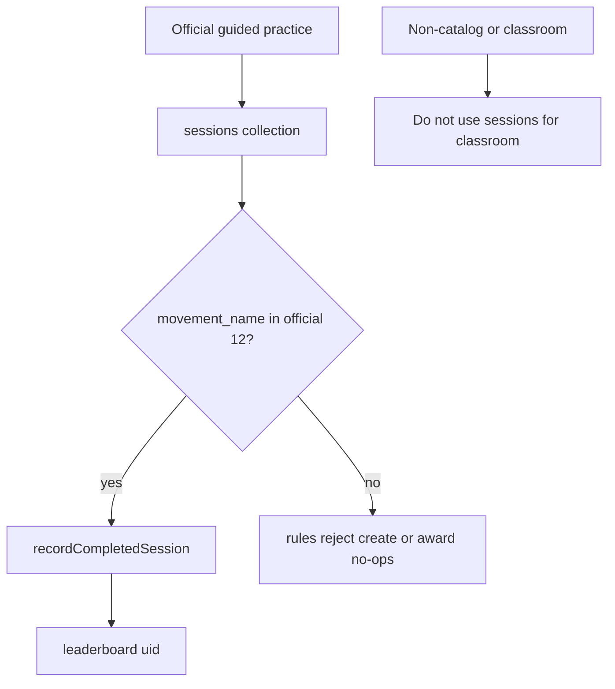

# Phase 4 — Leaderboard refactor (Global / My Students / Group) and official XP gate

**Status:** Phase 4 — CLOSED as of 2026-08-20.  
**Sequence:** `04` of `01 → 02 → 03 → 04 → 05 → 06 → 07 → 08`  
**Prerequisite:** Phase 3 complete. If membership + student-detail gates are missing, **STOP**.

## Implementing agent instructions

Phase 4 is **CLOSED**. Do not reopen implementation from this file. Do not start Phase 5 from this document’s historical implementation list; use [05-custom-movements-and-assignment-creation.md](05-custom-movements-and-assignment-creation.md) when Phase 5 begins.

Historical constraints that remain true:

- Work only on existing `main`. Do not create another branch.
- Do not add Teacher-created movements, `assignment_attempts`, or video from this phase file.
- Do not delete [teacher_app/](../../teacher_app/).
- Do not execute [docs/phase1-teacher-rankings-plan.md](../phase1-teacher-rankings-plan.md) (Android Material Rankings).

---

## 1. Status

**Phase 4 — CLOSED (2026-08-20).** Official-only global XP is enforced in Dart session persistence, Dart award/sync, and production Firestore rules (session create, session identity immutability on update, processed-session marker create, and leaderboard session awards). Teacher My Students / Group period rankings resolve Asia/Manila `daily_key` / `monthly_key` the same way the global board does. Scoped fetch errors no longer block a healthy Global board. After atomic session persistence succeeds, leaderboard award and public-profile projection run independently and cannot hold Session Complete indefinitely. Production `firestore.rules` were deployed successfully. No new Phase 4 Firestore indexes were required. Phase 5 was not started. `assignment_attempts` still does not exist. `teacher_app` remains intact.

Current Phase 4 implementation on `main` includes:

| Commit | Role |
|---|---|
| `9a2663b3f7086079270758ef3a7f89c0528921dd` | Phase 4 implementation |
| `b58d03a0ffe3a624292176f7b8f9f0ca12ddfbb4` | Closure correction |
| `93d64567b2cefd54d91630d07d8e0b9b31e55d03` | Session Complete post-save fix |

## 2. Goal

Provide Global, My Students, and Group leaderboard views for Teachers (and keep Trainee global board), keep global ranking as official ELIXR competition, prevent unrelated-Teacher drill-down, keep locked profiles visible on the basic board, and **close the persistence/award gap** so only official catalog sessions can produce global XP.

## 3. User-visible outcome

- Teacher Leaderboard destination: tabs or filters for **Global**, **My Students**, **Group** (group picker).
- Trainee `/leaderboard` remains the global official board (Fluent). Optional later Trainee group board is out of scope unless it reuses the same read models without extra writes.
- Global rows: basic signed-in ranking (`leaderboard/{uid}`). Lock does not remove the row.
- Tapping a Global row that is **not** a Classroom-authorized student does nothing privileged (no student-progress page). Rows that **are** the Teacher’s members may navigate to Phase 3 student detail.
- My Students / Group lists are membership-filtered views of the **same official `leaderboard` XP**, not assignment scores (**U7 locked**). Assignment-specific rubric / completion / review views belong to Phases 5–6 and must not feed `leaderboard.total_xp`. Do **not** invent a cumulative classroom points formula.
- Completing Free Practice still awards no XP (already unsaved). Completing an official catalog movement still can. After this phase, a client **cannot** award global XP for a non-catalog `movement_name` on `sessions`.

## 4. Verified current repo behavior

After Phase 4:

- Dart predicate: `isOfficialElixrMovementName` / `officialElixrMovementNames` in [packages/elixr_core/lib/constants/coaching_movement_names.dart](../../packages/elixr_core/lib/constants/coaching_movement_names.dart), aliased to the existing `coachingMovementNames` set. Flutter `movementCatalog` remains the product catalog authority via parity tests.
- [lib/services/session_service.dart](../../lib/services/session_service.dart) authoritatively saves only after official-movement validation, optional evidence upload, and atomic session + feedback persistence. Leaderboard award and public-profile projection start after that commit as independent best-effort idempotent work; they do not block Session Complete. Later reconciliation can repair missed projections.
- [lib/data/repositories/leaderboard_repository.dart](../../lib/data/repositories/leaderboard_repository.dart) `recordCompletedSession` requires an official `movement_name` before creating a processed marker or awarding +25 XP.
- `LeaderboardSyncPlanner.sessionsEligibleForGlobalXp` skips historical non-official sessions without creating fake markers and without counting them as `newlyProcessed`.
- [firestore.rules](../../firestore.rules) reuses `coachingMovementNames()` as `officialElixrMovementNames()` / `isOfficialElixrMovementName()` for new V2 session creates, processed-session marker creates, and session-award create/update. Session **update** also freezes `movement_name` (and the other completed-session identity fields `difficulty`, `prop_type`, `duration_seconds`, `assessment_version`) so a historical non-official session cannot be renamed into an official identity and then awarded.
- Teacher Windows Leaderboard: [lib/features/teacher/leaderboard/](../../lib/features/teacher/leaderboard/) Global / My Students / Group, using official `leaderboard/{uid}` XP. Approved members without a leaderboard doc appear as 0 XP. Unrelated Global rows are inert; approved members navigate to `/teacher/students/:traineeId`. My Students / Group Today and This month rankings resolve the current Asia/Manila `daily_key` / `monthly_key` client-side; stale period blocks are treated as 0 XP without a new composite index. Global queries are unchanged. Scoped My Students / Group fetch errors stay on the scoped board and do not block a healthy Global list.
- Trainee `/leaderboard` is unchanged. `teacher_app` roster ranking is unchanged.
- Identity: document ID + `user_id` = Firebase UID. Marker immutability and `total_xp == sessions_completed * 25 + quest_xp` are preserved.

## 5. Dependencies / prerequisites

- Phase 1 Teacher Leaderboard route.
- Phase 2 membership for My Students / Group filters.
- Phase 3 student detail for authorized drill-down.

## 6. In scope

- Teacher Fluent leaderboard with Global / My Students / Group.
- Drill-down policy: Classroom Authorization required for student detail; Progress Access still required for history inside that detail (Phase 3).
- Official-movement allowlist on **session create rules** and **award path** (`recordCompletedSession` + any sync helper).
- Tests proving non-catalog `movement_name` cannot create an awarding session / cannot increment `total_xp`.
- Keep quest XP path unchanged (not movement-based).
- Keep idempotent markers.

## 7. Explicit non-goals

- Writing Teacher-created results to `leaderboard`.
- Creating `assignment_attempts` (Phase 5).
- Classroom assignment-score ranking or a cumulative classroom points formula (assignment views in later phases stay separate; never global XP).
- Moving write APIs into teacher_app.
- Claiming the board is tamper-proof (rules comment stays).
- Deleting `teacher_app`.
- Implementing the Android Rankings tab plan.

## 8. Architecture / runtime flow



Teacher UI:

- Global: existing `fetchPlayersPage` / streams.
- My Students: fetch or filter leaderboard docs for UIDs in the Teacher’s approved memberships (any group).
- Group: same for one `group_id`.

Authoritative `SessionService.saveCompletedSession` boundary:

1. Official movement validation (`isOfficialElixrMovementName`).
2. Evidence upload when enabled.
3. Atomic session + feedback persistence.

After persistence succeeds:

- Leaderboard award starts as an independent best-effort idempotent projection (`recordCompletedSession` / processed-session marker).
- Public-profile projection starts independently.
- Neither can block the Session Complete UI indefinitely.
- Later reconciliation can repair missed projections (`syncCurrentUserLeaderboard`, `ensurePublicProfile`).

Do not compute My Students XP from `assignment_attempts` (does not exist yet; **U7** forbids mixing classroom scores into this board later).

## 9. Data models and persisted schema affected

- `sessions.movement_name` — rules allowlist of the 12 official names (plus decide whether legacy aliases `Arm Stall` / `Upper Forearm Stall` may still be **created**; recommended: **reject new creates**, keep historical reads).
- `leaderboard` fields unchanged.
- Optional session field `awards_global_xp` is **not required** if rules + award code both whitelist names; adding it is extra surface. Prefer whitelist of names aligned with [test/fixtures/enabled_scored_movements.json](../../test/fixtures/enabled_scored_movements.json).
- Do not add classroom fields to `leaderboard`.

## 10. Authentication / authorization / privacy rules

- Global board: signed-in read of `leaderboard` (unchanged).
- Drill-down: Classroom Authorization (Phase 2/3). Unrelated Teacher rows are inert.
- Locked profile: still listed.
- Progress Access: not required to **see the row**; required to see protected history after navigation.
- General Evidence Access / Assignment Submission Authorization: unused here.
- Award writes: still owner-only session + own leaderboard doc + marker create. Tightening `movement_name` is a **narrowing**, not a weakening.

## 11. Cross-layer contracts affected

- `firestore.rules` `validRubricSession` / session create.
- `LeaderboardRepository.recordCompletedSession`.
- Possibly `SessionService.saveCompletedSession` guard (defense in depth).
- Tests: award plan, session_service_leaderboard, rules comments.
- Python `validate_movement_name` already rejects unknown WS names; Firestore must catch persistence anyway.
- Indexes: existing leaderboard composites suffice; no new Phase 4 Firestore indexes were required. Membership-filtered client-side filter is OK for capstone scale. UID `whereIn` batching uses chunk size **30** (`LeaderboardRepository.userIdQueryChunkSize`).

## 12. Existing files that must be inspected

- [lib/data/repositories/leaderboard_repository.dart](../../lib/data/repositories/leaderboard_repository.dart)
- [lib/data/models/leaderboard_award_plan.dart](../../lib/data/models/leaderboard_award_plan.dart)
- [lib/core/constants/gamification_rules.dart](../../lib/core/constants/gamification_rules.dart)
- [lib/core/constants/movements.dart](../../lib/core/constants/movements.dart)
- [lib/services/session_service.dart](../../lib/services/session_service.dart)
- [lib/features/leaderboard/leaderboard_screen.dart](../../lib/features/leaderboard/leaderboard_screen.dart)
- [packages/elixr_core/lib/constants/coaching_movement_names.dart](../../packages/elixr_core/lib/constants/coaching_movement_names.dart)
- [packages/elixr_core/lib/repositories/roster_leaderboard_repository.dart](../../packages/elixr_core/lib/repositories/roster_leaderboard_repository.dart)
- [firestore.rules](../../firestore.rules) sessions + leaderboard + processed markers
- [test/fixtures/enabled_scored_movements.json](../../test/fixtures/enabled_scored_movements.json)
- teacher_app roster ranking (leave working)

## 13. Likely files to modify / create / delete

**Modify:** session rules; `recordCompletedSession`; maybe a shared `isOfficialElixrMovementName` in elixr_core (single allowlist); Teacher leaderboard screens; Trainee board only if shared widgets.

**Create:** Teacher leaderboard widgets/tests; unit tests for rejected movement names; optional core constant used by Dart + documented for rules duplication (rules cannot import Dart — **duplicate the 12 names in rules** and add a test that the Dart list matches, similar to cross-layer movement tests).

**Delete:** nothing.

## 14. Backward compatibility / migration strategy

- Existing `sessions` with official names keep awarding if not yet marked.
- Existing non-catalog session docs (if any) should **not** gain new awards; award path no-ops / rejects. Do not rewrite history.
- Legacy alias names: reject **new** creates; old docs remain readable.
- teacher_app roster ranking still reads `leaderboard` totals (official XP only, once gate is live).

## 15. Step-by-step implementation order

1. Add `isOfficialElixrMovementName` + fixture parity test (Dart vs JSON vs coaching names).
2. Failing test: `recordCompletedSession` does not award for `movement_name: 'Wrist Stall'` or `'Not A Real Move'`.
3. Implement award guard.
4. Failing rules review / emulator test: session create with non-catalog name denied.
5. Update `validRubricSession` allowlist.
6. Teacher UI: Global / My Students / Group + inert unrelated rows.
7. Widget tests for drill-down gates.
8. Confirm `total_xp == sessions_completed * 25 + quest_xp` still holds.
9. Update this file.

## 16. Acceptance criteria

1. Three Teacher views: Global, My Students, Group.
2. Global is official competition identity + XP.
3. Unrelated trainees: no Teacher student drill-down.
4. Locked profiles remain on the board.
5. My Students / Group use Classroom Authorization for inclusion; Progress Access for history after open.
6. Non-official `sessions.movement_name` cannot be created (rules) and cannot award XP (client).
7. Quest XP unchanged.
8. No `assignment_attempts` yet; no Teacher-created XP.
9. `teacher_app` intact.

## 17. Required tests

- Award: official name awards once; duplicate marker; owner mismatch; non-official name no XP.
- Session mapping: official 12 accepted.
- Widget: inert global row; authorized row navigates; group picker empty.
- Roster ranking core tests still pass.
- Cross-layer: Dart allowlist equals `enabled_scored_movements.json` and `coachingMovementNames`.

## 18. Verification commands

```powershell
dart format --output=none --set-exit-if-changed lib test
flutter analyze
flutter test
cd packages\elixr_core; flutter test
cd ..\..\teacher_app; flutter test
```

Rules: human review of `firestore.rules`. Emulator if available; else `Not verified` for live rules engine.

## 19. Manual verification checklist

Recorded PASS on 2026-08-20 against the closed Phase 4 implementation (including the Session Complete post-save fix).

- [x] Complete Hand Stall → +25 XP. **PASS** — one official completed session awards +25 XP exactly once; refresh/reopen does not duplicate the same session XP.
- [x] Teacher Global shows that Trainee; lock toggle does not remove the row. **PASS** — Teacher Global works; locked/private profiles remain visible on the leaderboard.
- [x] Teacher cannot open a stranger’s student page from the board. **PASS** — unrelated Global rows remain non-privileged/inert; authorized classroom student drill-down works.
- [x] My Students shows only members, including 0-XP approved trainees. **PASS** — Teacher My Students works and includes approved 0-XP students.
- [x] Group picker shows classroom names and recovers if a group is archived. **PASS** — Teacher Group works, shows correct approved members, and group names are human-readable.
- [x] teacher_app roster ranking still loads. **PASS** — `teacher_app` remains intact.
- [x] Deployed production rules for the official XP gate. **PASS** — production `firestore.rules` were deployed successfully. No new Phase 4 Firestore indexes were required.

Additional live checks from the same close-out:

- Session Complete modal no longer hangs after successful atomic session persistence. **PASS**
- Official Hand Stall appears in History immediately without restart. **PASS**
- Today / This month no longer display stale previous-period XP. **PASS**
- All Time remains correct. **PASS**
- Global / My Students / Group use the same official leaderboard XP source. **PASS**

## 20. Performance / storage / privacy risks

- Client-side filter of global page vs membership may be slow; capstone-acceptable if documented. Do not download the entire leaderboard unbounded — page as today, or query by UID list in chunks of **30** (`whereIn` / `LeaderboardRepository.userIdQueryChunkSize`).
- Teachers seeing global XP of strangers is **already** true (`allow read: if isSignedIn()`). Do not add extra PII to `leaderboard` rows.

## 21. Explicit “Do not” list

- Do not delete `teacher_app`.
- Do not put classroom attempts in `sessions`.
- Do not award XP from Teacher-created names.
- Do not implement assignment collections.
- Do not make Teachers `isOrdinaryPlayer`.
- Do not treat lock as leaderboard exclusion.
- Do not copy the Android rankings plan into teacher_app.
- Do not claim tamper-proof ranking.

## 22. Completion report

```
Phase 4 — CLOSED (2026-08-20)
- Implementation commits:
  - 9a2663b3f7086079270758ef3a7f89c0528921dd (Phase 4 implementation)
  - b58d03a0ffe3a624292176f7b8f9f0ca12ddfbb4 (closure correction)
  - 93d64567b2cefd54d91630d07d8e0b9b31e55d03 (Session Complete post-save fix)
- XP gate location (rules + Dart):
  - Dart: isOfficialElixrMovementName (elixr_core coaching/official identity set)
  - SessionService.saveCompletedSession authoritative boundary:
    official validation → evidence upload when enabled →
    atomic session + feedback persistence
  - After persist: independent best-effort idempotent leaderboard award
    and public-profile projection; neither blocks Session Complete
  - LeaderboardRepository.recordCompletedSession
  - LeaderboardSyncPlanner.sessionsEligibleForGlobalXp
  - firestore.rules: session create, session update identity freeze
    (`sessionIdentityUnchanged`), leaderboard_processed_sessions create,
    validSessionAwardCreate, validSessionAwardUpdate
- Allowlist source of truth: enabled movementCatalog, mirrored by
  coachingMovementNames / officialElixrMovementNames and
  test/fixtures/enabled_scored_movements.json. Rules reuse coachingMovementNames().
- Teacher views shipped: Global, My Students, Group (Windows Fluent)
- Commands run: see sections 24–26
- Rules deployed? yes (production firestore.rules deployed successfully)
- Indexes changed? no (no new Phase 4 Firestore indexes required)
- UID whereIn batching: 30
- Phase 5 not started; assignment_attempts still does not exist;
  teacher_app intact
- Ranking is not claimed tamper-proof
```

## 23. Handoff requirements for Phase 5

Phase 5 is now **unblocked**. Phase 5 was not started in this phase. `assignment_attempts` still does not exist.

1. Official-only global XP is enforced on `sessions` create + award. Historical non-official sessions cannot be renamed on update to become newly XP eligible.
2. Teacher can list members for scoping assignments later.
3. Implementers understand classroom work must use `assignment_attempts`, not `sessions`.
4. `teacher_app/` still present.
5. Session Complete must remain independent of leaderboard/public-profile projection latency.

## 24. Verification commands (executed)

Phase 4 initial implementation. Recorded 2026-08-20 from repository root unless noted. At this pass, production Firebase was not yet deployed.

| Command | Result |
|---|---|
| `dart format --output=none --set-exit-if-changed lib test packages/elixr_core/lib packages/elixr_core/test` | Passed (0 files needed formatting) |
| `flutter analyze` | Exit 1; **0 errors**. 15 pre-existing infos/warnings outside Phase 4 (same class as Phase 3). Phase 4 unused-import / `@visibleForTesting` warnings were fixed. |
| `flutter test` | Passed **1243** tests |
| `cd packages\elixr_core; flutter test` | Passed **82** tests |
| `cd teacher_app; flutter test` | Passed **95** tests |
| `cd firestore-tests; npm test` with Temurin JRE 21 (`JAVA_HOME=C:\Program Files\Eclipse Adoptium\jre-21.0.12.8-hotspot`) | Passed **216** tests, **0** failed. Default PATH Java 17 is insufficient for current firebase-tools. |
| Backend pytest from `backend/` with `PYTHONPATH` set to that directory | Passed **1094** tests in 22.22s |
| `flutter build windows` | Passed; built `build\windows\x64\runner\Release\elixr_application.exe` |
| `firebase deploy` | **Not run** |

This pass’s automated totals: Flutter **1243**, elixr_core **82**, teacher_app **95**, Firestore **216/0**, backend **1094**, Windows build passed. Live Teacher UI and production deploy were still open at this pass; they were closed in later 2026-08-20 passes (sections 25–26).

## 25. Closure correction pass (2026-08-20)

Worked on `main` at HEAD `9a2663b3f7086079270758ef3a7f89c0528921dd`. Did **not** start Phase 5, deploy Firebase, or claim Phase 4 live-closed.

### Rename-bypass (Blocker 1)

`sessions/{sessionId}` update now requires `sessionIdentityUnchanged()`. `movement_name` cannot change after create, closing the historical Arm Stall → Hand Stall → +25 XP attack. Evidence-removal updates still succeed. Historical documents were not rewritten. Python legacy aliases were not removed. Arm Stall / Upper Forearm Stall remain non-official.

### Scoped period keys (Blocker 2)

Teacher My Students / Group no longer trust leftover `daily_xp` / `monthly_xp` when `daily_key` / `monthly_key` is not the currently resolved Asia/Manila period. Normalization is client-side on already-fetched UID rows. Global `fetchPlayersPage` queries are unchanged. No new aggregate fields or indexes.

### Error-state isolation (Medium)

Scoped fetch failures now set `scopedErrorMessage` instead of the bootstrap `errorMessage`. Switching back to Global still renders a healthy `globalList`. Retry on the scoped board calls `refresh()` (scoped reload); bootstrap failures still use `retry()` → `start()`.

### Verification (this pass)

Recorded 2026-08-20 from repository root unless noted. Production Firebase was **not** deployed.

| Command | Result |
|---|---|
| `dart format --output=none --set-exit-if-changed lib test packages/elixr_core/lib packages/elixr_core/test` | Passed (0 files needed formatting) |
| `flutter analyze` | Exit 1; **0 errors**. 15 pre-existing infos/warnings outside this pass (same class as Phase 4). None in the files changed here. |
| `flutter test` | Passed **1258** tests (was 1243) |
| `cd packages\elixr_core; flutter test` | Passed **82** tests |
| `cd teacher_app; flutter test` | Passed **95** tests |
| `cd firestore-tests; npm test` with Temurin JRE 21 (`JAVA_HOME=C:\Program Files\Eclipse Adoptium\jre-21.0.12.8-hotspot`) | Passed **221** tests, **0** failed (was 216). Default PATH Java 17 is insufficient for current firebase-tools. |
| Backend pytest | Not run — official movement allowlist / Python aliases unchanged |
| `firebase deploy` | **Not run** |

This pass’s automated totals: Flutter **1258**, elixr_core **82**, teacher_app **95**, Firestore **221/0**. Production deploy and the section 19 live checklist were still open at this pass; they were closed in the Session Complete / live-verification pass (section 26).

## 26. Session Complete post-save fix and live close-out (2026-08-20)

Commit `93d64567b2cefd54d91630d07d8e0b9b31e55d03` on `main`. Authoritative save returns after atomic session + feedback persistence. Leaderboard award and public-profile projection continue independently as best-effort idempotent work. Phase 5 was not started. `assignment_attempts` was not created.

### Automated verification (this pass)

| Command | Result |
|---|---|
| `flutter test` | Passed **1265** tests |
| `cd packages\elixr_core; flutter test` | Passed **82** tests |
| `cd teacher_app; flutter test` | Passed **95** tests |
| Firestore rules / emulator | Unchanged in this pass (still **221/0** from the closure correction) |

### Production deploy

- Production `firestore.rules` were deployed successfully.
- No new Phase 4 Firestore indexes were required.

### Live checklist

Section 19 is **PASS**. Session Complete no longer hangs after successful atomic persistence. Official Hand Stall appears in History immediately without restart. One official completed session awards +25 XP exactly once; refresh/reopen does not duplicate that session XP. Teacher Global, My Students (including approved 0-XP students), and Group (correct approved members, human-readable names) work and share the same official leaderboard XP source. Authorized classroom drill-down works; unrelated Global rows stay inert. Locked/private profiles remain visible. Today / This month no longer show stale previous-period XP; All Time remains correct. `teacher_app` remains intact.

**Final status: Phase 4 — CLOSED. Phase 5 may start.**
