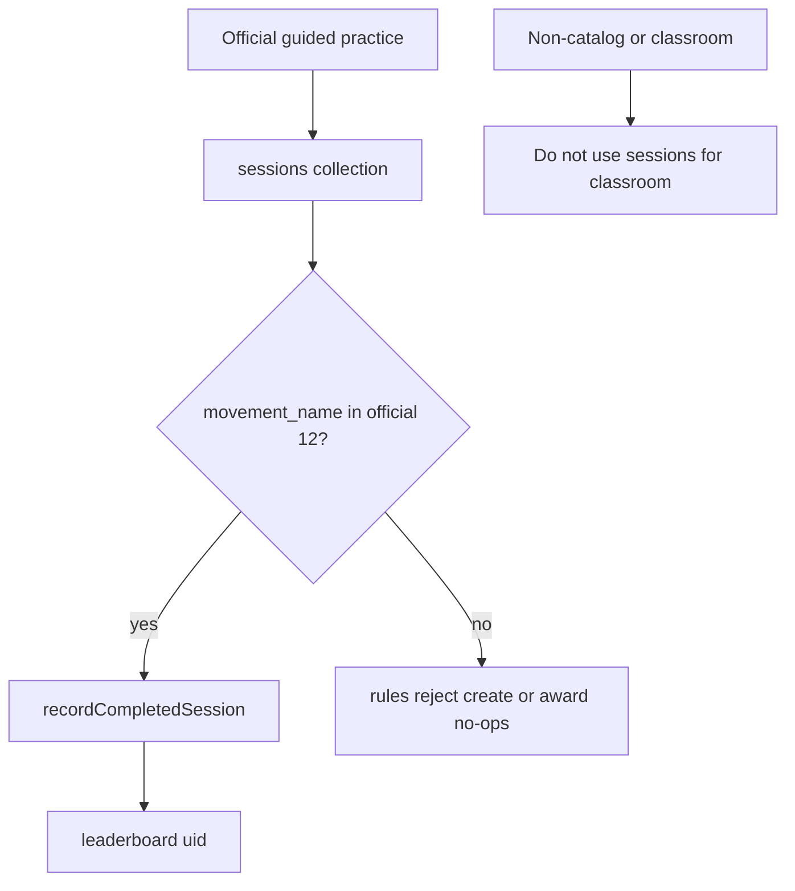

# Phase 4 — Leaderboard refactor (Global / My Students / Group) and official XP gate

**Status:** Planned  
**Sequence:** `04` of `01 → 02 → 03 → 04 → 05 → 06 → 07 → 08`  
**Prerequisite:** Phase 3 complete. If membership + student-detail gates are missing, **STOP**.

## Implementing agent instructions

- Re-read current `main`, [AGENTS.md](../../AGENTS.md), [00-master-plan.md](00-master-plan.md), Phase 3 handoff, and this file before editing.
- Work only on existing `main`. Do not create another branch.
- Implement **only this phase**. Do not add Teacher-created movements, `assignment_attempts`, or video.
- **Do** harden official-movement global XP now, before custom movements exist.
- Do not delete [teacher_app/](../../teacher_app/).
- Do not execute [docs/phase1-teacher-rankings-plan.md](../phase1-teacher-rankings-plan.md) (Android Material Rankings). This phase is Windows Fluent Teacher + Trainee global boards.
- Update this document’s Status and Completion report when done.

---

## 1. Status

Planned

## 2. Goal

Provide Global, My Students, and Group leaderboard views for Teachers (and keep Trainee global board), keep global ranking as official ELIXR competition, prevent unrelated-Teacher drill-down, keep locked profiles visible on the basic board, and **close the persistence/award gap** so only official catalog sessions can produce global XP.

## 3. User-visible outcome

- Teacher Leaderboard destination: tabs or filters for **Global**, **My Students**, **Group** (group picker).
- Trainee `/leaderboard` remains the global official board (Fluent). Optional later Trainee group board is out of scope unless it reuses the same read models without extra writes.
- Global rows: basic signed-in ranking (`leaderboard/{uid}`). Lock does not remove the row.
- Tapping a Global row that is **not** a Classroom-authorized student does nothing privileged (no student-progress page). Rows that **are** the Teacher’s members may navigate to Phase 3 student detail.
- My Students / Group lists are membership-filtered views of the **same official `leaderboard` XP**, not assignment scores (**U7 locked**). Assignment-specific rubric / completion / review views belong to Phases 5–6 and must not feed `leaderboard.total_xp`. Do **not** invent a cumulative classroom points formula.
- Completing Free Practice still awards no XP (already unsaved). Completing an official catalog movement still can. After this phase, a client **cannot** award global XP for a non-catalog `movement_name` on `sessions`.

## 4. Verified current repo behavior

- [lib/data/repositories/leaderboard_repository.dart](../../lib/data/repositories/leaderboard_repository.dart) `recordCompletedSession` awards +25 XP for **any** owned `sessions` doc with valid V1/V2 assessment. **No movement whitelist.**
- [firestore.rules](../../firestore.rules) `sessions` create: `movement_name` is a string, **not** limited to `coachingMovementNames()`. Training plans and coaching notes **are** limited to the official 12.
- Rules invariant: `total_xp == sessions_completed * 25 + quest_xp`.
- `leaderboard/{userId}` **read: any signed-in user**.
- Marker: `leaderboard_processed_sessions/{sessionId}`, `xp_awarded == 25`, update false.
- teacher_app [RosterRankingScreen](../../teacher_app/lib/features/ranking/roster_ranking_screen.dart) ranks **approved links** only; not the platform board. Old rankings plan is unimplemented.
- Public Profile Privacy does not hide `leaderboard` reads.
- Identity: document ID + `user_id` = Firebase UID.

## 5. Dependencies / prerequisites

- Phase 1 Teacher Leaderboard route.
- Phase 2 membership for My Students / Group filters.
- Phase 3 student detail for authorized drill-down.

## 6. In scope

- Teacher Fluent leaderboard with Global / My Students / Group.
- Drill-down policy: Classroom Authorization required for student detail; Progress Access still required for history inside that detail (Phase 3).
- Official-movement allowlist on **session create rules** and **award path** (`recordCompletedSession` + any sync helper).
- Tests proving non-catalog `movement_name` cannot create an awarding session / cannot increment `total_xp`.
- Keep quest XP path unchanged (not movement-based).
- Keep idempotent markers.

## 7. Explicit non-goals

- Writing Teacher-created results to `leaderboard`.
- Creating `assignment_attempts` (Phase 5).
- Classroom assignment-score ranking or a cumulative classroom points formula (assignment views in later phases stay separate; never global XP).
- Moving write APIs into teacher_app.
- Claiming the board is tamper-proof (rules comment stays).
- Deleting `teacher_app`.
- Implementing the Android Rankings tab plan.

## 8. Architecture / runtime flow



Teacher UI:

- Global: existing `fetchPlayersPage` / streams.
- My Students: fetch or filter leaderboard docs for UIDs in the Teacher’s approved memberships (any group).
- Group: same for one `group_id`.

Do not compute My Students XP from `assignment_attempts` (does not exist yet; **U7** forbids mixing classroom scores into this board later).

## 9. Data models and persisted schema affected

- `sessions.movement_name` — rules allowlist of the 12 official names (plus decide whether legacy aliases `Arm Stall` / `Upper Forearm Stall` may still be **created**; recommended: **reject new creates**, keep historical reads).
- `leaderboard` fields unchanged.
- Optional session field `awards_global_xp` is **not required** if rules + award code both whitelist names; adding it is extra surface. Prefer whitelist of names aligned with [test/fixtures/enabled_scored_movements.json](../../test/fixtures/enabled_scored_movements.json).
- Do not add classroom fields to `leaderboard`.

## 10. Authentication / authorization / privacy rules

- Global board: signed-in read of `leaderboard` (unchanged).
- Drill-down: Classroom Authorization (Phase 2/3). Unrelated Teacher rows are inert.
- Locked profile: still listed.
- Progress Access: not required to **see the row**; required to see protected history after navigation.
- General Evidence Access / Assignment Submission Authorization: unused here.
- Award writes: still owner-only session + own leaderboard doc + marker create. Tightening `movement_name` is a **narrowing**, not a weakening.

## 11. Cross-layer contracts affected

- `firestore.rules` `validRubricSession` / session create.
- `LeaderboardRepository.recordCompletedSession`.
- Possibly `SessionService.saveCompletedSession` guard (defense in depth).
- Tests: award plan, session_service_leaderboard, rules comments.
- Python `validate_movement_name` already rejects unknown WS names; Firestore must catch persistence anyway.
- Indexes: existing leaderboard composites should suffice; membership-filtered client-side filter is OK for capstone scale. If querying `leaderboard` by UID `in` chunks, document the chunk size.

## 12. Existing files that must be inspected

- [lib/data/repositories/leaderboard_repository.dart](../../lib/data/repositories/leaderboard_repository.dart)
- [lib/data/models/leaderboard_award_plan.dart](../../lib/data/models/leaderboard_award_plan.dart)
- [lib/core/constants/gamification_rules.dart](../../lib/core/constants/gamification_rules.dart)
- [lib/core/constants/movements.dart](../../lib/core/constants/movements.dart)
- [lib/services/session_service.dart](../../lib/services/session_service.dart)
- [lib/features/leaderboard/leaderboard_screen.dart](../../lib/features/leaderboard/leaderboard_screen.dart)
- [packages/elixr_core/lib/constants/coaching_movement_names.dart](../../packages/elixr_core/lib/constants/coaching_movement_names.dart)
- [packages/elixr_core/lib/repositories/roster_leaderboard_repository.dart](../../packages/elixr_core/lib/repositories/roster_leaderboard_repository.dart)
- [firestore.rules](../../firestore.rules) sessions + leaderboard + processed markers
- [test/fixtures/enabled_scored_movements.json](../../test/fixtures/enabled_scored_movements.json)
- teacher_app roster ranking (leave working)

## 13. Likely files to modify / create / delete

**Modify:** session rules; `recordCompletedSession`; maybe a shared `isOfficialElixrMovementName` in elixr_core (single allowlist); Teacher leaderboard screens; Trainee board only if shared widgets.

**Create:** Teacher leaderboard widgets/tests; unit tests for rejected movement names; optional core constant used by Dart + documented for rules duplication (rules cannot import Dart — **duplicate the 12 names in rules** and add a test that the Dart list matches, similar to cross-layer movement tests).

**Delete:** nothing.

## 14. Backward compatibility / migration strategy

- Existing `sessions` with official names keep awarding if not yet marked.
- Existing non-catalog session docs (if any) should **not** gain new awards; award path no-ops / rejects. Do not rewrite history.
- Legacy alias names: reject **new** creates; old docs remain readable.
- teacher_app roster ranking still reads `leaderboard` totals (official XP only, once gate is live).

## 15. Step-by-step implementation order

1. Add `isOfficialElixrMovementName` + fixture parity test (Dart vs JSON vs coaching names).
2. Failing test: `recordCompletedSession` does not award for `movement_name: 'Wrist Stall'` or `'Not A Real Move'`.
3. Implement award guard.
4. Failing rules review / emulator test: session create with non-catalog name denied.
5. Update `validRubricSession` allowlist.
6. Teacher UI: Global / My Students / Group + inert unrelated rows.
7. Widget tests for drill-down gates.
8. Confirm `total_xp == sessions_completed * 25 + quest_xp` still holds.
9. Update this file.

## 16. Acceptance criteria

1. Three Teacher views: Global, My Students, Group.
2. Global is official competition identity + XP.
3. Unrelated trainees: no Teacher student drill-down.
4. Locked profiles remain on the board.
5. My Students / Group use Classroom Authorization for inclusion; Progress Access for history after open.
6. Non-official `sessions.movement_name` cannot be created (rules) and cannot award XP (client).
7. Quest XP unchanged.
8. No `assignment_attempts` yet; no Teacher-created XP.
9. `teacher_app` intact.

## 17. Required tests

- Award: official name awards once; duplicate marker; owner mismatch; non-official name no XP.
- Session mapping: official 12 accepted.
- Widget: inert global row; authorized row navigates; group picker empty.
- Roster ranking core tests still pass.
- Cross-layer: Dart allowlist equals `enabled_scored_movements.json` and `coachingMovementNames`.

## 18. Verification commands

```powershell
dart format --output=none --set-exit-if-changed lib test
flutter analyze
flutter test
cd packages\elixr_core; flutter test
cd ..\..\teacher_app; flutter test
```

Rules: human review of `firestore.rules`. Emulator if available; else `Not verified` for live rules engine.

## 19. Manual verification checklist

- [ ] Complete Hand Stall → +25 XP.
- [ ] Teacher Global shows that Trainee; lock toggle does not remove the row.
- [ ] Teacher cannot open a stranger’s student page from the board.
- [ ] My Students shows only members.
- [ ] teacher_app roster ranking still loads.

## 20. Performance / storage / privacy risks

- Client-side filter of global page vs membership may be slow; capstone-acceptable if documented. Do not download the entire leaderboard unbounded — page as today, or query by UID list in chunks of 10 (`in` query limit).
- Teachers seeing global XP of strangers is **already** true (`allow read: if isSignedIn()`). Do not add extra PII to `leaderboard` rows.

## 21. Explicit “Do not” list

- Do not delete `teacher_app`.
- Do not put classroom attempts in `sessions`.
- Do not award XP from Teacher-created names.
- Do not implement assignment collections.
- Do not make Teachers `isOrdinaryPlayer`.
- Do not treat lock as leaderboard exclusion.
- Do not copy the Android rankings plan into teacher_app.
- Do not claim tamper-proof ranking.

## 22. Completion report template

```
Phase 4 completion
- XP gate location (rules + Dart):
- Allowlist source of truth:
- Teacher views shipped:
- Commands run:
- Rules deployed? (should be no unless human asked):
- Not verified:
```

## 23. Handoff requirements for Phase 5

1. Official-only global XP is enforced on `sessions` create + award.
2. Teacher can list members for scoping assignments later.
3. Implementers understand classroom work must use `assignment_attempts`, not `sessions`.
4. `teacher_app/` still present.
