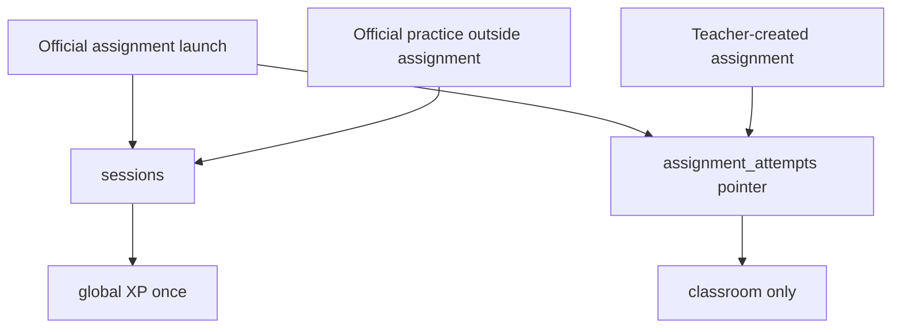

# Phase 5 — Movement management, assignments, and `assignment_attempts`

**Status:** Phase 5 code complete on `main` (not production-closed). Implementation commit `280cbfff3e7b9f9ef6748583bb1923aad7a5e84e`. First Firestore integrity correction: `94ddee1ff6a5598eb756ad38722d2522e18f88b0`. Final revision-publication correction: `abd00be13ac5d648995450848b67d40e49f53e64`. Live-fix 1: Teacher-created start uses create-first (no missing-document `get`); public-profile summary writes replace the document with the current allowed schema. Live-fix 2 (this change, not committed): Teacher-created Start is single-flight through WebSocket prepare; connection badge is WebSocket connectivity, not camera readiness. Production Firestore rules/indexes must not be redeployed unless a later diagnosis requires it. Phase 5 is **not CLOSED**. Phase 6 and Phase 7 were not started.  
**Sequence:** `05` of `01 → 02 → 03 → 04 → 05 → 06 → 07 → 08`  
**Prerequisite:** Phase 4 official XP gate is on `main`. If non-catalog sessions can still award global XP, **STOP**.

## Implementing agent instructions

- Re-read current `main`, [AGENTS.md](../../AGENTS.md), [00-master-plan.md](00-master-plan.md), Phase 4 handoff, and this file before editing.
- Work only on existing `main`. Do not create another branch.
- Implement **only this phase**. Schema for `teacher_reviewed` / `template_scored` may exist; **do not** implement generic template AI scoring (Phase 7) or review video upload (Phase 6).
- Persist classroom work in **`assignment_attempts`**. Teacher-created attempts never use `sessions`. Official **assignment-context** completions still create `sessions` **and** a required pointer attempt.
- Teacher-created activity must **never** call `recordCompletedSession` or write `leaderboard_processed_sessions`. Official assignment XP is awarded **only** from the `sessions` save, exactly once.
- Official assignment pointer is **required**, not optional. Do not attach arbitrary historical sessions to new assignments.
- Do not delete [teacher_app/](../../teacher_app/).
- Update this document’s Status and Completion report when done.

---

## 1. Status

Phase 5 code complete on existing `main`. Implementation commit `280cbfff3e7b9f9ef6748583bb1923aad7a5e84e`. First integrity correction `94ddee1ff6a5598eb756ad38722d2522e18f88b0`. Final revision-publication correction `abd00be13ac5d648995450848b67d40e49f53e64`. Production live verification then found: (1) Teacher-created start pre-read of a missing attempt, (2) public-profile summary merge of unknown legacy keys, (3) after those Firestore fixes, Start still failed during WebSocket prepare with a generic camera-preparation error, overlapping Start, and a badge that said "Camera Connected" for a connected socket. Those client issues are fixed in this working tree and **must be retested live** before Phase 5 can close. Phase 6/7 not started.

## 2. Goal

Let Teachers manage Official vs Teacher-created movements, version definitions, assign them to groups, give Trainees an Assigned Movements experience, and persist classroom attempts in a domain that cannot enter global gamification.

## 3. User-visible outcome

- Teacher Movements destination: Official ELIXR catalog (read-only) vs Teacher-created list (create/edit/archive).
- Teacher can assign a movement revision to a group (due date optional).
- Trainee shell gains Assigned Movements (not Teacher-only): list of assignments for groups they belong to.
- Official assignment launch uses existing guided practice: a successful run **creates `sessions/{sessionId}`**, remains eligible for official global XP **exactly once**, and **must also** create an `assignment_attempts` pointer with `source_session_id` and `awards_global_xp: false` (never a second XP award). Historical/non-assignment sessions must **not** auto-complete a newly created assignment.
- Teacher-created assignments write `assignment_attempts` only (never `sessions`, never global XP).
- Results ownership: authenticated trainee UID + `group_id` + `assignment_id` + pinned movement revision.
- Assessment mode: Dart/parser may recognize `template_scored` for forward compatibility. Phase 5 writes Teacher-created movement, revision, assignment, and attempt state as `teacher_reviewed` only. Writable `template_scored` classroom state belongs to Phase 7.

## 4. Verified current repo behavior

- Official 12: [lib/core/constants/movements.dart](../../lib/core/constants/movements.dart), [backend/config.py](../../backend/config.py) `MOVEMENT_CONFIG`, [backend/assessment/rule_engine.py](../../backend/assessment/rule_engine.py), [test/fixtures/enabled_scored_movements.json](../../test/fixtures/enabled_scored_movements.json).
- No custom movement collections. No Wrist Stall. No `assessment_family`.
- Guided practice saves `sessions` via `SessionService` then awards XP.
- WS `validate_movement_name` rejects unknown names for the **official** protocol catalog. Teacher-created names must **not** be smuggled through as official `prepare.movement` until Phase 7 registers a validated spec — Phase 5 classroom practice for Teacher-created `teacher_reviewed` movements is **practice without automatic assessment** (preview allowed; no rubric award to `sessions`).
- Python owns camera; Flutter shows JPEGs.

## 5. Dependencies / prerequisites

- Phase 1 Teacher Movements route; Trainee shell still exists.
- Phase 2 groups + Classroom Authorization.
- Phase 4 official XP gate.

## 6. In scope

- Collections: Teacher-created movement definitions + immutable revisions; group assignments; `assignment_attempts`.
- Rules: trainee creates own attempts; Teacher reads attempts for groups they own (Classroom Authorization for **metadata/results**; **not** video — video is Phase 6 Assignment Submission Authorization).
- Trainee Assigned Movements UI.
- Teacher assignment UI.
- Identity: stable `movement_id` + `revision_id` (immutable snapshot of definition).
- `awards_global_xp: false` persisted on every `assignment_attempts` doc (defense in depth).
- Official assignment-context completion: **required** `assignment_attempts` pointer + single `sessions` XP path.
- Tests: cannot route teacher-created save into `LeaderboardRepository.recordCompletedSession`; cannot double-award; cannot attach historical sessions.
- Official catalog remains the 12 names; do not add Wrist Stall to official 12 here (Phase 7 creates it as Teacher-created).

## 7. Explicit non-goals

- Video record/upload/review queue (Phase 6) — may store `attempt_kind` and empty `storage_path`.
- AssessmentSpec evaluator / Live Test (Phase 7).
- Adding Teacher-created names to `movementCatalog` official list or `coachingMovementNames()`.
- Global XP from `assignment_attempts` or Teacher-created work (official catalog XP still comes only from `sessions`).
- Deleting `teacher_app`.
- Implementing throw/catch Basic Toss.

## 8. Architecture / runtime flow



**Official practice outside an assignment:** unchanged. `sessions` only. No `assignment_attempts`.

**Official assignment of an official movement (required pointer):** Trainee launches guided practice **from that assignment**. On success:

1. Create `sessions/{sessionId}` as today (official domain).
2. Award global XP at most once via `recordCompletedSession` / marker (Phase 4 allowlist).
3. **Also** create `assignment_attempts/{attemptId}` with `source_session_id`, `attempt_kind: practice_pointer` (or equivalent), `awards_global_xp: false`, and frozen `group_id`, `assignment_id`, `teacher_id`, `trainee_id`, `movement_id`, `revision_id`.
4. The pointer must **never** produce a second XP award or increment `sessions_completed` again.
5. The assigning Teacher reads classroom completion from the attempt under Classroom Authorization — **not** from raw `sessions`, and **not** requiring Progress Access or a public profile.

Do **not** auto-complete a newly created assignment by scanning unrelated historical `sessions`. The attempt must prove the trainee performed **this** session in **this** assignment context.

**Teacher-created assignment:** never `sessions`. Phase 5 minimum: create attempt docs as `draft` / `in_progress` so Phase 6 can attach video. Trainees must not write Teacher review fields (Phase 6 state machine; lock the field split in this phase so rules can be tested early).

## 9. Data models and persisted schema affected

### `teacher_movements/{movementId}`

`teacher_id`, `title`, `status` (`active` \| `archived`), `created_at`, `updated_at`, `current_revision_id`.

### `teacher_movement_revisions/{revisionId}` (or subcollection `teacher_movements/{id}/revisions/{rev}`)

Prefer **subcollection** for locality: `teacher_movements/{movementId}/revisions/{revisionId}`.

Fields: `movement_id`, `teacher_id`, `schema_version`, `assessment_mode` (Dart may parse `teacher_reviewed` \| `template_scored`; Phase 5 Firestore writes are `teacher_reviewed` only), `spec` (JSON map; Phase 5 stores a teacher-review stub), `immutable` once published, `created_at`.

Published revisions are immutable. Edits create a new revision; assignments pin `revision_id`.

### `group_assignments/{assignmentId}`

`group_id`, `teacher_id`, `movement_id`, `revision_id`, `assessment_mode`, `origin` (`official_elixr` \| `teacher_created`), `official_movement_name` (nullable), `created_at`, `due_at` (optional).

Official origin: `official_movement_name` must be one of the 12. Teacher-created origin: `official_movement_name` must be absent; `awards_global_xp` conceptually false.

### `assignment_attempts/{attemptId}`

**This is the classroom domain.** Suggested fields:

- `trainee_id` (auth owner)
- `teacher_id` (assignment owner, denormalized)
- `group_id`, `assignment_id`
- `movement_id`, `revision_id`
- `origin` (`official_elixr` \| `teacher_created`)
- `assessment_mode`
- `attempt_kind` (`practice_pointer` \| `template_score` \| `teacher_review_submission` — last used in Phase 6)
- `awards_global_xp` always `false` (immutable after create)
- `source_session_id` **required** when `origin == official_elixr` and the attempt is an assignment-context completion pointer; **forbidden** as a way to attach a session that was not launched from this assignment
- `status` (`draft` \| `in_progress` \| `submitted`; Phase 6 extends with Teacher-only `approved` \| `needs_retry` — trainees must never write those values)
- rubric fields optional (Phase 7)

### Trainee-owned immutable identity fields (after create)

Trainees create the document. After create, these fields are **frozen** (rules deny trainee and Teacher mutation):

- `trainee_id`
- `teacher_id`
- `group_id`
- `assignment_id`
- `movement_id`
- `revision_id`
- `origin`
- `assessment_mode`
- `awards_global_xp`

Trainees must **never** be able to:
- set `review_verdict` to `approved` / `needs_retry`
- set Teacher `review_feedback`
- set `reviewed_at`
- set `status` to `approved` / `needs_retry`
- impersonate another trainee
- modify another trainee’s attempt

Phase 5 should already reject those writes even if the review UI ships in Phase 6. Frozen identity fields cannot be rewritten after create (trainee or Teacher).

**Never** include video bytes. Optional `video_storage_path` added in Phase 6.

## 10. Authentication / authorization / privacy rules

- Trainee create of own `assignment_attempts` where `trainee_id == auth.uid` and they have Classroom Authorization (approved membership) **at create time**. Freeze identity fields (U1). Official pointers must include a `source_session_id` whose `sessions` doc is owned by that trainee and was produced in this assignment launch (client carries assignment ids into the practice run; do not bind leftover history).
- Teacher read of attempt **metadata/results**: viewer `== teacher_id` on the attempt (frozen). **Public Profile Privacy ignored.** Progress Access not required for the pointer.
- Teacher must **not** change trainee identity, assignment ids, or movement revision.
- Teacher must **not** set `awards_global_xp` to true. Attempts with `awards_global_xp != false` fail rules.
- Unrelated Teachers: deny. Other trainees: deny.
- `sessions` rules stay owner-only. Classroom completion for Teachers is the pointer, not a new `sessions` read.
- Trainees cannot write `review_verdict` / `review_feedback` / `reviewed_at` (self-approve impossible).

## 11. Cross-layer contracts affected

- New Firestore collections + indexes (`teacher_id+status`, `group_id+assignment_id`, `trainee_id+created_at`).
- `FirestoreCollections`.
- Trainee routing: Assigned Movements screen (new), must not be confused with `/movements` catalog.
- Python: **no** new official catalog names. If Phase 5 allows camera preview for custom titles, use an internal unscored mode (existing `Free Practice` / prop-detection-only) **without** saving `sessions`. Do not send unknown names through `validate_movement_name` until Phase 7.

## 12. Existing files that must be inspected

- [lib/core/constants/movements.dart](../../lib/core/constants/movements.dart)
- [lib/features/movements/movements_screen.dart](../../lib/features/movements/movements_screen.dart)
- [lib/services/session_service.dart](../../lib/services/session_service.dart)
- [lib/data/repositories/leaderboard_repository.dart](../../lib/data/repositories/leaderboard_repository.dart)
- [backend/assessment/rule_engine.py](../../backend/assessment/rule_engine.py) `validate_movement_name`
- [backend/config.py](../../backend/config.py)
- Phase 2 group models; Phase 4 allowlist
- [firestore.rules](../../firestore.rules)

## 13. Likely files to modify / create / delete

**Create:** movement definition/assignment/attempt models + repositories + Teacher Movements UI + Trainee Assigned Movements UI + rules + tests.

**Modify:** Teacher shell Movements placeholder; Trainee sidebar (new item); `FirestoreCollections`.

**Delete:** nothing in `teacher_app`.

## 14. Backward compatibility / migration strategy

- Official 12 unchanged.
- No backfill of old `sessions` into `assignment_attempts`. New assignments start empty until the trainee completes **from that assignment**.
- Coaching `movement_name` allowlist stays official 12.

## 15. Step-by-step implementation order

1. Tests: saving a teacher-created attempt does not call XP award.
2. Models + in-memory repos.
3. Rules: `awards_global_xp == false` immutable; owner trainee create; frozen identity; trainee cannot write review fields; teacher metadata read; stranger deny.
4. Teacher CRUD movements (revisions immutable).
5. Group assignment UI.
6. Trainee Assigned Movements list.
7. Official assignment launch carries assignment context into PracticeScreen; on success **required** pointer + single XP award. Tests: no historical-session attach; no double XP.
8. Dart may parse `template_scored` for forward compatibility, but Phase 5 does **not** write `template_scored` movement/revision/assignment/attempt state. Classroom writes stay `teacher_reviewed`. Writable `template_scored` belongs to Phase 7.
9. Update this file.

## 16. Acceptance criteria

1. Official vs Teacher-created are visually and persistently separate.
2. Assignments pin revision IDs.
3. Every official **assignment-context** completion creates `sessions` plus a required `assignment_attempts` pointer (`source_session_id`, `awards_global_xp: false`). No second XP. No historical-session auto-complete.
4. Teacher-created practice cannot increment `leaderboard.total_xp`.
5. Frozen identity fields cannot be rewritten; trainee cannot self-approve or write Teacher feedback.
6. Locked profile does not hide assignment completion from assigning Teacher (pointer readable under Classroom Authorization).
7. Unrelated Teacher cannot read attempts.
8. No video pipeline yet; no generic template engine yet.
9. `teacher_app` intact.

## 17. Required tests

- Repository: revision immutability; assignment pin; attempt owner.
- XP isolation: no `recordCompletedSession` on teacher-created save; official assignment awards XP once from `sessions` only.
- Official pointer: created on assignment-context complete; missing pointer fails the assignment-complete path; attaching a session from a different assignment/group rejected.
- Rules: `awards_global_xp` true rejected; cannot flip to true later; trainee cannot set `review_verdict` / `review_feedback` / `reviewed_at`; trainee cannot rewrite frozen identity; unrelated Teacher cannot read; assigning Teacher cannot change `trainee_id` or `revision_id`.
- Widget: Assigned Movements empty/error; Teacher create movement.
- Official catalog tests still 12 names.

## 18. Verification commands

```powershell
dart format --output=none --set-exit-if-changed lib test
flutter analyze
flutter test
cd packages\elixr_core; flutter test
cd ..\..\teacher_app; flutter test
backend\.venv\Scripts\python.exe -m pytest -q backend\tests
```

Python tests required if preview mode / WS movement validation was touched; otherwise still run once for safety.

## 19. Manual verification checklist

- [ ] Assign official Hand Stall; complete **from the assignment**; global XP +25 once; Teacher sees pointer without Progress Access.
- [ ] Same trainee’s older non-assignment Hand Stall session does **not** complete a newly created assignment.
- [ ] Create Teacher movement; assign; Trainee completion does **not** change global XP.
- [ ] Trainee cannot set `review_verdict` or `status` to approved.
- [ ] Second Teacher cannot open those attempts.
- [ ] Locked trainee still visible on assignment roster.

## 20. Performance / storage / privacy risks

- Denormalized teacher_id on attempts enables simple rules; keep snapshots in sync with assignment owner (assignments should be immutable about teacher_id).
- Do not store spec JSON so large it blows document size; keep Phase 5 specs small.

## 21. Explicit “Do not” list

- Do not write Teacher-created results to `sessions`.
- Do not call `recordCompletedSession` for `assignment_attempts`.
- Do not skip the official-assignment pointer.
- Do not auto-complete assignments from historical `sessions`.
- Do not add custom names to official catalog / coaching names / `enabled_scored_movements.json`.
- Do not implement video upload.
- Do not implement AssessmentSpec execution.
- Do not use General Evidence Access for attempt metadata.
- Do not delete `teacher_app`.
- Do not start Phase 6–7 beyond schema flags.

## 22. Completion report

Phase 5 is **code complete** on existing `main`. It is **not CLOSED**.

### What shipped

- Official ELIXR catalog (exactly 12 stable `movement_id` / `revision_id` pairs) is separate from Teacher-created movements.
- Teacher Movements UI: Official ELIXR / My Movements / Assignments.
- Teacher-created movements use immutable revisions; edits create a new revision and leave old assignments pinned.
- Group assignments for official or Teacher-created revisions. Teacher-created display snapshots must match the movement title and the **current** immutable revision spec at create, then remain frozen.
- Trainee Assigned Movements (`/assigned-movements`) and dedicated `/assigned-practice/:assignmentId` loader (no identity in query params except the assignment id, which is revalidated from Firestore).
- Official assigned practice reuses `PracticeScreen` + existing CV/rubric. Tutorial round-trip keeps `assignmentId` and returns to assigned-practice (no open redirect).
- Official assignment completion is one atomic batch: `sessions/{sessionId}` + feedbacks + required `assignment_attempts/official_ptr_{sessionId}`. Phase 4 XP/public-profile projections run only after that commit, best-effort (Session Complete hang fix preserved).
- Teacher-created assigned practice reuses Free Practice camera mode with `prepare.movement = "Free Practice"`. No `sessions`, no XP, no `recordCompletedSession`. Draft/in_progress attempt starts when practice actually begins.
- Public profile projections omit `assignment_context` and classroom IDs.
- Phase 6 video and Phase 7 template scoring remain unimplemented. `teacher_app/` is untouched.

### Firestore schema added

Collections (IDs in `packages/elixr_core/lib/database/firestore_collections.dart`):

- `teacher_movements/{movementId}` — `teacher_id`, `title`, `status` (`active`|`archived`), `current_revision_id`, `schema_version`, `created_at`, `updated_at`
- `teacher_movements/{movementId}/revisions/{revisionId}` — `movement_id`, `teacher_id`, `schema_version`, `assessment_mode`, `spec` (`instructions`, `required_prop`, `capability=teacher_review_only`, optional `safety_guidance`), `created_at`. Immutable after create.
- `group_assignments/{assignmentId}` — frozen identity: `teacher_id`, `group_id`, `movement_id`, `revision_id`, `origin` (`official_elixr`|`teacher_created`), `assessment_mode`. Frozen display snapshot: `display_title`, `teacher_display_name`, `group_name`, `official_movement_name`, `allowed_prop`, `display_instructions`, `display_safety_guidance`. Lifecycle after create: `status`, `updated_at`, optional `due_at` only. Official requires `official_movement_name`. Teacher-created create must snapshot the movement’s **current** revision (`display_title` = movement title, `display_instructions` / `allowed_prop` / optional `display_safety_guidance` = revision spec).
- `assignment_attempts/{attemptId}` — frozen identity including `awards_global_xp: false`. Official pointer: `attempt_kind=practice_pointer`, `status=submitted`, `source_session_id`, copied V2 rubric fields, document ID `official_ptr_{sessionId}`. Teacher-created Phase 5: `attempt_kind=teacher_review_draft`, `status` `draft`|`in_progress`, no session/rubric/video/review fields, canonical first-attempt ID `tc_draft_{assignmentId}_{traineeId}`.

`sessions` gained optional `assignment_context: { assignment_id, group_id, teacher_id, movement_id, revision_id }` — present only for official assigned guided sessions; immutable after create.

Official pointer ID helper: `assignmentAttemptIdForOfficialSession(sessionId)` → `official_ptr_{sessionId}`. Teacher-created first draft helper: `assignmentAttemptIdForTeacherCreatedDraft` → `tc_draft_{assignmentId}_{traineeId}` (also enforced in Firestore rules).

### Post-commit Firestore integrity corrections

Discovered after `280cbfff3e7b9f9ef6748583bb1923aad7a5e84e` and committed on `main` as `94ddee1ff6a5598eb756ad38722d2522e18f88b0`. Rules now enforce what the Flutter repositories already intended:

- Teacher movement **edits** must publish a new immutable revision in the same atomic write. Same-revision title changes are denied. Archive is one-way `active` → `archived` and may change only `status` + `updated_at`.
- New Teacher-created assignments must reference the movement’s **current** revision and copy that revision’s spec exactly (`display_instructions`, `allowed_prop`, optional `display_safety_guidance`). Archived movements remain unassignable.
- Assignment identity and display snapshot fields are immutable after create. Teachers may update only `status`, `due_at`, and `updated_at`.
- `template_scored` remains parse/read compatible in Dart (`AssessmentMode`). Phase 5 Firestore writes for Teacher movement revisions, Teacher-created assignments, and Teacher-created draft attempts require `teacher_reviewed`. Phase 7 owns writable `template_scored` classroom state.
- Canonical Phase 5 Teacher draft attempt IDs are required. Phase 6 replacement attempts / `supersedes_attempt_id` are **not** implemented.

Firebase remains **not deployed** after this correction.

A later revision-publication hole remained after `94ddee1f`: `validTeacherMovementPublishRevisionUpdate` required `current_revision_id` to change and inspected `getAfter(targetRevision)`, but an already-existing historical revision satisfies `getAfter`. A modified client could therefore set `current_revision_id` back to `rev1` while `rev2` was current, without creating a new revision. The final correction, committed on `main` as `abd00be13ac5d648995450848b67d40e49f53e64`, requires `!exists(revisionPath) && existsAfter(revisionPath)` so the target revision is newly created in that same atomic request; `validTeacherMovementRevisionCreate` still independently requires `teacher_reviewed` and `created_at == request.time`.

Firebase remains **not deployed** after this follow-up.

### Official assignment atomic contract

1. Client writes session + feedbacks + pointer in one batch (`FirestoreHelper.saveSessionWithFeedbacks`).
2. Rules: session create with `assignment_context` requires `getAfter()` of that deterministic pointer; pointer create requires `getAfter()` of the matching session. Historical sessions without context cannot attach. Assignment A cannot satisfy assignment B. `awards_global_xp` must be false.
3. After commit succeeds, existing Phase 4 `recordCompletedSession` + public-profile projection run in the background exactly once per session id (idempotent marker `leaderboard_processed_sessions/{sessionId}`).

Canonical mapping is enforced at **assignment create**. Session create trusts the assignment document + membership + pointer identity (keeps the batch under Firestore’s 1000-expression budget). Pointer create copies rubric fields from the source session via `getAfter()`.

### Indexes added

Only one new composite index, for a query the implementation actually uses:

- `assignment_attempts`: `teacher_id` ASC, `assignment_id` ASC — `watchAttemptsForAssignment`.

Single-field equality queries (automatic indexes): `group_assignments.teacher_id`, `group_assignments.group_id`, `assignment_attempts.teacher_id`, `assignment_attempts.trainee_id`, `teacher_movements.teacher_id`. Local sort for due-date/recency.

### Account erasure

Safe Phase 5 extension implemented in `elixr_core` `auth_repository.dart`:

- Before users-doc delete: purge owned `teacher_movements` (+ revisions) and `group_assignments`.
- After users-doc delete: purge `assignment_attempts` where `trainee_id` or `teacher_id` == uid (erasure-only; ordinary Teachers still cannot delete trainee attempts).

Remaining decision/risk: if a Teacher account is erased first, classroom attempts with that `teacher_id` are purged even if trainees still exist. Do not broaden ordinary Teacher delete on trainee records. Client-only erasure is not a server-side guarantee against a hostile leftover client.

### Commands actually run (this implementation)

| Command | Result |
|---|---|
| `dart format --output=none --set-exit-if-changed lib test packages/elixr_core/lib packages/elixr_core/test` | Clean after format |
| `flutter analyze` | **0 errors**. 15 infos/warnings, all pre-existing (none in Phase 5 files) |
| `flutter test` | **1293 passed**, 0 failed (baseline 1265) |
| `packages/elixr_core` `flutter test` | **85 passed**, 0 failed (baseline 82) |
| `teacher_app` `flutter test` | **95 passed**, 0 failed (baseline 95; package untouched) |
| `cd firestore-tests; npm test` with Temurin JRE 21 | **241 passed**, 0 failed (baseline 221; includes 20 new `assignments_v1` cases) |
| `cd backend; .\.venv\Scripts\python.exe -m pytest -q tests` | **1094 passed** |
| `flutter build windows` | **Succeeded** (`build\windows\x64\runner\Release\elixr_application.exe`) |
| `firebase deploy` | **Not run** |

### Commands actually run (post-commit integrity correction)

| Command | Result |
|---|---|
| `dart format --output=none --set-exit-if-changed lib test packages/elixr_core/lib packages/elixr_core/test` | Clean (0 files changed) |
| `flutter analyze` | **0 errors**. 15 infos/warnings, all pre-existing |
| `flutter test` | **1293 passed**, 0 failed |
| `packages/elixr_core` `flutter test` | **85 passed**, 0 failed |
| `teacher_app` `flutter test` | **95 passed**, 0 failed (package untouched) |
| `cd firestore-tests; npm test` with Temurin JRE 21 | **263 passed**, 0 failed (was 241; +22 integrity cases) |
| `cd backend; .\.venv\Scripts\python.exe -m pytest -q tests` | **1094 passed** |
| `flutter build windows` | **Not run** (Dart production files unchanged) |
| `firebase deploy` | **Not run** |

### Commands actually run (final revision-publication correction)

| Command | Result |
|---|---|
| `dart format --output=none --set-exit-if-changed lib test packages/elixr_core/lib packages/elixr_core/test` | Clean (0 files changed) |
| `flutter analyze` | **0 errors**. 15 infos/warnings, all pre-existing |
| `flutter test` | **1293 passed**, 0 failed |
| `packages/elixr_core` `flutter test` | **85 passed**, 0 failed |
| `teacher_app` `flutter test` | **95 passed**, 0 failed (package untouched) |
| `cd firestore-tests; npm test` with Temurin JRE 21 | **266 passed**, 0 failed (was 263; +3 historical-repoint cases) |
| `backend\.venv\Scripts\python.exe -m pytest -q backend\tests` from repo root | Collection **failed** (`ModuleNotFoundError`); known module-path issue |
| `cd backend; .\.venv\Scripts\python.exe -m pytest -q tests` | **1094 passed** |
| `flutter build windows` | **Not run** (Dart production files unchanged) |
| `firebase deploy` | **Not run** |

### Not verified / remaining human checklist

- [ ] Deploy Firestore rules and indexes (human-authorized only).
- [ ] Assign official Hand Stall; complete **from the assignment**; global XP +25 once; Teacher sees pointer without Progress Access or Public Profile visibility.
- [ ] Older non-assignment Hand Stall session does **not** complete a newly created assignment.
- [ ] Create Teacher movement; assign; Trainee practice does **not** change global XP or write `sessions`.
- [ ] Incomplete official lesson returns to `/assigned-practice/:id` after Start guided practice.
- [ ] Session Complete Finish returns to Assigned Movements; Try Again retries the same assignment; no next-catalog CTA.
- [ ] Trainee cannot set `review_verdict` or `status=approved`.
- [ ] Second Teacher cannot open those attempts.
- [ ] Locked public profile still shows the assignment on Assigned Movements and the pointer to the assigning Teacher.
- [ ] Teacher Movements / Assigned Movements at existing desktop sizes and collapsed Trainee sidebar.
- [ ] Camera + backend live path for both official assigned practice and Teacher-created Free Practice mode.

### Production live verification (2026-08-20)

PASSED:

- Official Hand Stall assignment appears in Teacher Assignments
- Teacher sees "1 completed"
- official result visible as 12/12 Mastered
- first Teacher-created Firestore start bug (pre-read of a missing `assignment_attempts` document) was fixed; production retest progressed beyond assignment-attempt persistence

FAILED / discovered after that retest:

- Trainee reached Teacher-created `LivePracticeScreen` for **Basic Bottle Balances**
- Start ended with **"Camera preparation failed. Check the backend and try again."**
- The UI could show a camera-like image / connected badge at the same time
- `TrainingConnectionBadge`'s old **"Camera Connected"** label meant `WebSocketConnectionState.connected` only, **not** a successful camera `prepare`
- `_startSession()` checked `_commandInFlight` before Teacher-created attempt persistence and camera-settings load, but did not set that flag until after those awaits, so a second Start could enter the same flow and hit `WebSocketService`'s overlapping-prepare `StateError`, which the screen mapped to the generic prepare-failure copy

Client fix (this change, not committed): the entire Start/Retry operation is single-flight from the first click (`_startInFlight`); prepare failures are mapped without hiding timeout/disconnect/ack-mismatch/backend rejection messages; the badge now reads **Backend Connected**. Automated tests reproduce the duplicate-Start race and assert Teacher-created prepare uses `movement=Free Practice` with the assignment prop only. Backend tests confirm `Free Practice` + Easy + bottle/shaker/bottle_and_shaker prepare is accepted when camera startup is mocked, and `"Basic Bottle Balances"` is still `invalid_movement`.

Phase 5 remains **not CLOSED**. Camera/backend live success is **not** claimed until a human retests Teacher-created Start after this client ships. Automated tests are not a substitute for that live retest.

Separate technical debt (not this fix): the `audioplayers` Windows native-thread warning is a plugin/platform-channel issue. It is not the cause of the assignment permission denial or this prepare-start race. Do not mix a player upgrade into this correction.

### Commands actually run (Teacher-created Start WebSocket prepare race live fix)

| Command | Result |
|---|---|
| `dart format --output=none --set-exit-if-changed lib test packages/elixr_core/lib packages/elixr_core/test` | Clean (0 files changed) after format |
| `flutter analyze` | **0 errors**. 15 infos/warnings, all pre-existing |
| `flutter test` | **1313 passed**, 0 failed (was 1309; +2 Start single-flight widget tests, +1 Teacher-created prepare payload, +1 prepare-failure mapping) |
| `packages/elixr_core` `flutter test` | **85 passed**, 0 failed |
| `teacher_app` `flutter test` | **95 passed**, 0 failed (package untouched) |
| `cd firestore-tests; npm test` with Temurin JRE 21 | **271 passed**, 0 failed (rules unchanged) |
| `cd backend; .\.venv\Scripts\python.exe -m pytest -q tests` | **1098 passed** (was 1094; +3 Free Practice prepare props, +1 Teacher title rejection) |
| `flutter build windows` | **Succeeded** (`build\windows\x64\runner\Release\elixr_application.exe`) |
| `firebase deploy` | **Not run** |

Phase 6 NOT started. Phase 7 NOT started. `teacher_app/` intact. Firebase not deployed. Firestore rules/indexes were not modified.

The original Phase 5 implementation is on `main` as `280cbfff3e7b9f9ef6748583bb1923aad7a5e84e`. The first integrity correction is `94ddee1ff6a5598eb756ad38722d2522e18f88b0`. The final revision-publication correction is `abd00be13ac5d648995450848b67d40e49f53e64`. Do not deploy Firestore until a human authorizes it.

## 23. Handoff requirements for Phase 6

1. `assignment_attempts` exists with frozen identity fields listed above.
2. Official assignment-context completion always writes a pointer with `source_session_id`.
3. `assessment_mode` includes `teacher_reviewed`.
4. Trainees cannot write Teacher review fields.
5. Global XP gate from Phase 4 still holds; pointers never award XP.
6. `teacher_app/` still present.
