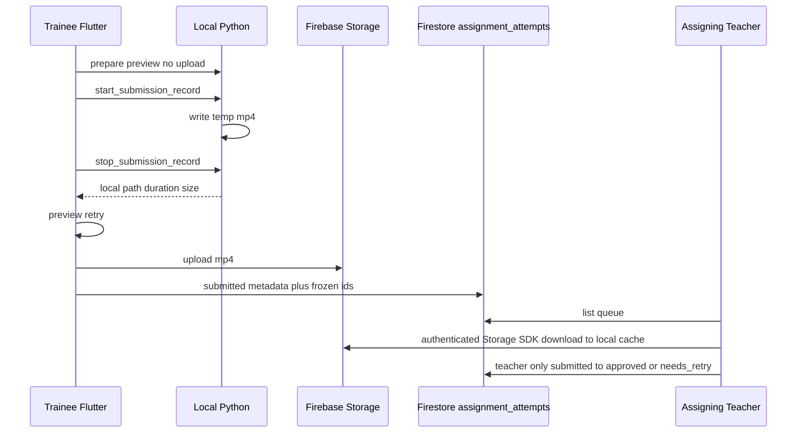

# Phase 6 — Teacher-reviewed video submissions

**Status:** Phase 6 behavior complete; lifecycle operational close pending. Functional production verification passed on 2026-08-22. Cleaned Storage rules are live. Temporary live diagnostics were removed from the app and from live Storage rules. The leftover production diagnostic object was deleted. Storage lifecycle hard backstop is **not** applied because `gcloud` / `gsutil` are not available locally. Phase 6 is **not** marked production-closed. Phase 7 was **not** started.
**Sequence:** `06` of `01 → 02 → 03 → 04 → 05 → 06 → 07 → 08`
**Prerequisite:** Phase 5 `assignment_attempts` + Teacher-reviewed mode. If those collections are missing, **STOP**. Do not invent attempts inside `sessions`.

## Implementing agent instructions

- Re-read current `main`, [AGENTS.md](../../AGENTS.md), [lib/AGENTS.md](../../lib/AGENTS.md), [backend/AGENTS.md](../../backend/AGENTS.md), [00-master-plan.md](00-master-plan.md), Phase 5 handoff, and this file before editing.
- Work only on existing `main`. Do not create another branch.
- Implement **only this phase**. Do not implement AssessmentSpec / Wrist Stall scoring (Phase 7).
- Python remains the sole webcam owner. Do not add a Flutter camera plugin.
- Do not put video bytes or base64 on the realtime WebSocket. Do not extend `evidence_jpeg_base64` to video.
- Assignment video reads use **Assignment Submission Authorization**, not **General Evidence Access**.
- Do not delete [teacher_app/](../../teacher_app/).
- Update this document’s Status and Completion report when done.

---

## 1. Status

Phase 6 behavior complete; lifecycle operational close pending. **Not production-closed.**

| Gate | State |
|---|---|
| Code complete | Phase 6 assignment-submission contract is implemented and production-exercised. |
| Automated verification | Local suites were run after diagnostic cleanup; see Completion report. |
| Firestore rules production deployed | **Yes** — already live. Not redeployed in this cleanup. |
| Storage rules production deployed | **Yes** — cleaned `assignment_submissions/` rules are live (ruleset `25e031f3-f7ec-470d-a939-e7ac5aa5fe48`, release updateTime `2026-08-22T05:49:09.308158Z`). Temporary diagnostic matches are gone from live rules. |
| Storage lifecycle production applied | **No** — bucket currently has no lifecycle rules. `storage.lifecycle.json` is still documentation only. Blocker: no local `gcloud` / `gsutil`. |
| Live camera / record / upload / review | **Human-verified in production** on 2026-08-22. See Production Verification. |
| Temporary live diagnostics | **Removed** from the app, local/live Storage rules, and the known leftover production object. |
| Phase 7 | **Not started** |

### Production Verification (2026-08-22)

Human production lifecycle on Firebase project `elixr-app-2026` passed:

| Step | Result |
|---|---|
| Trainee initial submission | PASS |
| Teacher authenticated private playback (`getData`, not `getDownloadURL`) | PASS |
| Windows metadata-free CREATE + one-time metadata bootstrap | PASS |
| `submitted` → `needs_retry` | PASS |
| Retry feedback visible to Trainee | PASS |
| Replacement submission | PASS |
| `supersedes_attempt_id` linkage | PASS |
| Old superseded MP4 cleanup | PASS |
| Replacement Teacher authenticated playback | PASS |
| `submitted` → `approved` | PASS |
| Global XP / sessions / leaderboard markers | Unchanged (`total_xp` 110, `sessions_completed` 4). Review/submission operations awarded no global XP. |

Phase 6 is **not** marked production-closed. Remaining blocker: apply the `assignment_submissions/` 30-day lifecycle hard backstop after installing/authenticating `gcloud` or `gsutil`, then read the live bucket configuration back. Do not overwrite any unexpected pre-existing lifecycle rules if they appear later.

### Authorization-anchor / orphan-object correction

A `teacher_review_submission` draft is the Storage authorization anchor for `assignment_submissions/{teacherId}/{groupId}/{assignmentId}/{traineeId}/{attemptId}.mp4`. Ordinary signed-in Trainees **must not** DELETE that Firestore document. Doing so after an MP4 upload would leave an object whose matching attempt is gone, so Storage read/delete could no longer be authorized until bucket lifecycle (which is **not** applied).

Failed trainee uploads now mark the draft with `abandoned_at` (status stays `draft`). The document remains until account erasure. Storage CREATE requires the matching draft is not abandoned. Teacher reads remain `submitted` / `approved` / `needs_retry` only. Trainee owner and the frozen assigning Teacher may DELETE an abandoned leftover object. Reconciliation on Teacher Reviews / Assigned Movements load derives the canonical path even when `video_storage_path` was never written. Account erasure does the same before deleting attempt documents.

### Post-commit audit correction (this change)

Findings after `88b7af1 feat: implement teacher-reviewed video submission functionality`, plus the later authorization-anchor correction:

1. **OpenCV `VideoWriter.write` return value.** Historical Python OpenCV bindings return `None` on success. OpenCV 5 returns `bool` (`True` on success). The recorder treats **only an explicit boolean `False`** as `record_failed`. `None` and `True` are success. Do **not** use `if not writer.write(...)` because `None` is a valid success result. Failures also include exceptions, a writer that is not opened, or a missing/empty/oversized file after `release()`. Final size is checked again after `release()`.
2. **Authenticated private playback.** Teacher review no longer uses `getDownloadURL()`. Playback downloads through the authenticated Firebase Storage SDK (`getData(maxSize)`), writes an ELIXR review cache file, and plays `Uri.file`. Cache is deleted when the selected review changes, the detail closes, the controller disposes, or download fails after a partial write.
3. **Draft-attempt failure cleanup.** A failed upload **does not delete** the Firestore draft. The trainee owner marks it abandoned (`abandoned_at`). If Storage upload succeeded but submit metadata failed, the object is deleted first (object-not-found counts as gone); then the draft is marked abandoned. If object delete fails, the draft is still marked abandoned / cleanup-pending and remains the authorization anchor. Do not report submitted. A later submission uses a new `review_sub_*` ID.
4. **Review queue draft filtering.** Teacher Reviews list only `submitted` / `approved` / `needs_retry`. Draft and abandoned upload attempts are not reviews.
5. **Record command single-flight.** `SubmissionRecordingController` acquires a record-command guard before the first await of start/stop/retake/submit. Duplicate Start or Stop issues one WebSocket command. Auto-stop racing manual Stop yields one clip. Retake cannot race Stop finalization.
6. **Stricter `AssignmentAttempt` parser.** `teacher_review_submission` fails closed for draft vs abandoned vs submitted vs reviewed video/review metadata and deletion consistency. `practice_pointer` and `teacher_review_draft` are unchanged.

## 2. Goal

Let Trainees explicitly record and submit one short review clip for a Teacher-reviewed assignment; store the file in Firebase Storage and metadata on `assignment_attempts`; let the assigning Teacher review (Approve / Needs Retry + feedback) under submission-scoped authorization; bound duration/size; delete heavy video on a designed retention path while keeping a lightweight historical record.

## 3. User-visible outcome

- Teacher-reviewed assignment: Trainee can **practice** with live preview **without** upload.
- A distinct **Record Submission** action starts a bounded recording. UI states clearly: the clip will be visible to the **assigning Teacher**.
- Preview / retry locally before upload where practical.
- After upload: attempt status `submitted`; Teacher Review queue shows it.
- Teacher: play clip (if not expired), Approve or Needs Retry, written feedback.
- Needs Retry: Trainee may submit a replacement; superseded Storage objects are deleted.
- After retention expiry: video gone; verdict/feedback/thumbnail metadata remain.
- Locked profile does not block the assigning Teacher from this submission.
- Unrelated Teachers cannot open the clip.
- Global XP unchanged.

## 4. Verified current repo behavior (after this change)

- Ordinary practice preview remains JPEG (`preview_frame`). Optional **still** `evidence_jpeg_base64` on first `hold_confirmed` → Storage `users/{uid}/session_evidence/{sessionId}.jpg` (1–256 KiB). JPEG authorization is unchanged.
- Bounded Teacher-reviewed clips are recorded by `SubmissionRecorder` from the **existing** Python camera/session frames (no second `VideoCapture`). WS ack carries local path/metadata only.
- [storage.rules](../../storage.rules): profile images; session evidence JPEGs; dedicated `assignment_submissions/` match; **default deny**. Submission reads use Assignment Submission Authorization, not `hasTeacherEvidenceGrant`.
- Windows legal copy distinguishes ordinary local practice from explicit Record Submission + Submit. `RegistrationPrivacyConsent.policyVersion` is `v4`.
- Video bytes are not stored in Firestore; `assignment_attempts` holds metadata only.

## 5. Dependencies / prerequisites

- Phase 5 `assignment_attempts` with frozen identity fields and `teacher_reviewed` mode.
- Phase 2 Classroom Authorization for who may submit (membership at create time).
- Local Python camera lifecycle (prepare/preview/stop) already exists.

## 6. In scope

- New WS/HTTP commands for **bounded local file recording** (start/stop/cancel) producing a temp file on disk; ack with path, duration_ms, size_bytes, sha256 optional — **not** the bytes.
- Flutter upload via Firebase Storage SDK.
- Storage rules for submission objects using Assignment Submission Authorization.
- Review queue UI; Teacher-only Approve / Needs Retry; feedback field; **constrained review state machine** (below).
- Firestore/rules tests: trainee cannot self-approve or write Teacher feedback.
- Retention timestamps + deletion mechanism (§9–10, §20).
- Deterministic local temp cleanup (success, failure, cancel, dispose, navigation).
- Legal/consent copy update.
- Tests for authz, caps, cleanup, replace-deletes-old.

## 7. Explicit non-goals

- Continuous upload of practice.
- Template AI scoring (Phase 7).
- Cloud Functions / Cloud Scheduler. Cleanup is the **client reconciler plus Storage Object Lifecycle Management** on `assignment_submissions/` (U3). Do not add Cloud Functions merely for video TTL.
- Granting General Evidence Access by submitting a video.
- Storing video in Firestore or WS.
- Deleting `teacher_app`.
- Changing session evidence JPEG rules except not reusing them for mp4.

## 8. Architecture / runtime flow



Recording must use the **same** camera owner as practice (`backend/vision/camera.py`, `backend/api/websocket.py`). After stop, release camera per existing debounce rules.

Do **not** stream the mp4 over WS. Optional localhost HTTP GET `GET /submission_clip/{token}` bound to loopback + one-time token is acceptable if WS cannot pass a filesystem path to Flutter on Windows; document the choice. Token must expire and the file must be unreadable without it.

## 9. Data models and persisted schema affected

Extend `assignment_attempts` (no new XP tables):

| Field | Purpose |
|---|---|
| `attempt_kind` | `teacher_review_submission` |
| `video_storage_path` | Storage object path or null after delete |
| `video_content_type` | e.g. `video/mp4` |
| `video_size_bytes` | |
| `video_duration_ms` | |
| `submitted_at` | Starts **unreviewed** retention clock |
| `video_expires_at` | Computed client-side at submit/review from planning defaults; stored for reconcile |
| `video_deleted_at` | Set when Storage delete succeeds |
| `deletion_failed` | True if last delete threw; sweeper retries |
| `review_verdict` | Teacher-only: `approved` \| `needs_retry` \| null; must match Teacher `status` after review |
| `review_feedback` | Teacher-only string, bounded |
| `reviewed_at` | Teacher-only; set on Approve / Needs Retry; starts **reviewed** client retention clock (replaces unreviewed clock) |
| `supersedes_attempt_id` | optional; retry creates a **new** attempt rather than overwriting historical Teacher review |

### Review state machine (required)

Canonical field: `status`. Teacher decision is also stored on Teacher-only `review_verdict` (must match `status` after review).

Trainee transitions only:

- `draft` / `in_progress` → `submitted`
- `draft` → abandoned (`abandoned_at == request.time`; status stays `draft`)

Trainee **cannot** set `status` to `approved` or `needs_retry`.
Trainee **cannot** DELETE a `teacher_review_submission` draft. Abandoned drafts cannot be submitted, rewritten into an active draft, reused for another assignment, or shown in Teacher Reviews.

Teacher transitions only (assigning Teacher = frozen `teacher_id`):

- `submitted` → `approved` (sets `review_verdict: approved`, `reviewed_at`)
- `submitted` → `needs_retry` (sets `review_verdict: needs_retry`, `reviewed_at`)

A later trainee retry **creates a replacement/new attempt** (link with `supersedes_attempt_id`). Do **not** overwrite the historical attempt’s `review_verdict`, `review_feedback`, or `reviewed_at`.

Trainees must never:

- set `review_verdict` to approved / needs_retry
- set `status` to approved / needs_retry
- set `review_feedback`
- set `reviewed_at`
- change frozen identity fields (Phase 5 list)
- impersonate another trainee
- modify another trainee’s attempt

Teachers must never:

- change `trainee_id`, `movement_id`, or `revision_id`
- set `awards_global_xp` to true
- review attempts they do not own
- submit on behalf of a trainee

Unrelated Teachers cannot review.

**Storage path (recommended):**

`assignment_submissions/{teacherId}/{groupId}/{assignmentId}/{traineeId}/{attemptId}.mp4`

Do not put videos under `session_evidence`.

### Planning defaults (not validated truths)

These are **initial engineering/product defaults**. They require validation. Do not describe them as measured camera/storage limits.

| Default | Initial planning value | Configurable? |
|---|---|---|
| Max duration | 20 seconds | Yes — named constant + rules `request.resource.size` cannot encode duration; enforce duration in Python + Flutter, size in Storage rules |
| Max size | 15 MiB | Yes — Storage rules |
| Unreviewed client cleanup | ~30 days from `submitted_at` | Planning default |
| Reviewed client cleanup | ~14 days from `reviewed_at` | Planning default; primary review policy |
| Storage lifecycle hard backstop | ~30 days from **object upload** | Planning default; `assignment_submissions/` only |

## 10. Authentication / authorization / privacy rules

### Assignment Submission Authorization (required for video read)

All of:

1. Viewer is authenticated and `request.auth.uid == resource.metadata.teacher_id` (custom metadata on Storage) **and** Firestore attempt `teacher_id` matches.
2. Attempt `trainee_id` matches the path.
3. Attempt references the same `group_id`, `assignment_id`, `revision_id` as frozen on the doc.
4. `attempt_kind == teacher_review_submission`.
5. Historical policy (**U1 frozen**): frozen `teacher_id` on the attempt is sufficient for **read**; live membership is required for **new create**. Later group removal does not erase an already-submitted artifact from the assigning Teacher’s authorized historical review.

Trainee owner: read/delete own object; create only if size/type OK and they are `traineeId` in the path.

Other Teachers/trainees: deny.

**Must not** require `hasTeacherEvidenceGrant` / General Evidence Access.

**Must not** consult `public_profiles.visibility`.

General Evidence Access remains for `session_evidence` JPEGs only.

### Teacher review writes

Only `request.auth.uid == teacher_id` may set `review_verdict`, `review_feedback`, `reviewed_at`, and only from `submitted` as defined above. Trainee updates cannot touch those keys. `awards_global_xp` remains `false`.

### Submit UI consent

Copy must state the assigning Teacher will see this clip. Update legal documents accordingly. Reuse privacy-consent patterns; do not bury this in trainee practice onboarding.

## 11. Cross-layer contracts affected

- WebSocket/HTTP: new record commands + acks + error codes (`submission_too_long`, `record_failed`, …). Update Pydantic schemas, Dart `ws_protocol.dart`, tests, README protocol section.
- Storage rules + Firestore attempt fields + **lifecycle config for `assignment_submissions/` only**.
- Legal documents + tests in elixr_core.
- Camera cleanup contract: recording session is still one camera owner.

## 12. Existing files that must be inspected

- [backend/api/websocket.py](../../backend/api/websocket.py)
- [backend/schemas/commands.py](../../backend/schemas/commands.py)
- [backend/vision/camera.py](../../backend/vision/camera.py)
- [lib/services/websocket_service.dart](../../lib/services/websocket_service.dart)
- [lib/data/models/ws_protocol.dart](../../lib/data/models/ws_protocol.dart)
- [lib/data/repositories/session_evidence_repository.dart](../../lib/data/repositories/session_evidence_repository.dart) (do not reuse blindly)
- [storage.rules](../../storage.rules)
- [firestore.rules](../../firestore.rules)
- [packages/elixr_core/lib/legal/legal_documents.dart](../../packages/elixr_core/lib/legal/legal_documents.dart)
- Phase 5 attempt models

## 13. Likely files to modify / create / delete

**Create:** submission recorder (Python), upload repository, review queue screens, Storage rule match, retention reconciler, tests.

**Modify:** WS schemas/clients, legal docs, `assignment_attempts` model, Teacher shell (queue under Dashboard or Movements).

**Delete:** temp files at runtime, not `teacher_app`.

## 14. Backward compatibility / migration strategy

- Existing JPEG evidence unchanged.
- Old legal version: bump `privacy_policy_version` if the policy text changes; follow existing consent patterns.
- Attempts without video remain valid.

## 15. Step-by-step implementation order

1. Protocol tests for record start/stop/cancel without payload bytes.
2. Python temp-file recorder + duration cap + cleanup tests (no real webcam: fake writer).
3. Flutter: Record Submission UX + consent copy + local preview.
4. Storage rules + upload repository + size cap.
5. Firestore submit metadata; freeze IDs.
6. Teacher queue + playback + verdict (**Teacher-only** transitions).
7. Replacement submit creates a **new** attempt; deletes previous object; sets `deletion_failed` on error; does not overwrite old review fields.
8. Client retention reconciler + document/apply `assignment_submissions/` Object Lifecycle (~30 day age).
9. Legal update + tests.
10. Update this file.

### Deletion mechanism (required design)

Firebase Storage does **not** read Firestore `reviewed_at` by itself.

| Question | Phase 6 answer |
|---|---|
| What timestamp starts **client** reviewed retention? | `reviewed_at`. Delete video ~14 days later (planning default). |
| What timestamp starts **client** unreviewed retention? | `submitted_at`. Planning default ~30 days. |
| What component performs **early** delete? | **Client-owned reconciler** on Teacher review-queue load and Trainee Assigned Movements load: `video_storage_path != null` and `video_expires_at < now` → `Storage.delete` → set `video_deleted_at`, clear path. Also delete immediately on replacement/retry of a newer clip. |
| Hard server-side backstop? | **Cloud Storage Object Lifecycle Management** on prefix `assignment_submissions/` only. Maximum object age ~30 days from **creation/upload**. This is a hard storage bound, **not** the primary `reviewed_at` policy. Reviewed clips should usually be removed earlier by the client. If clients never reopen, lifecycle still prevents indefinite accumulation. |
| Lifecycle must not delete | Profile images (`users/{uid}/profile/`), session evidence JPEGs (`users/{uid}/session_evidence/`), movement assets, or any prefix other than assignment submissions. |
| Lifecycle testing | Configure and verify against **development/test** objects before production. 30-day value is an initial default, not experimentally validated. |
| If client delete fails? | `deletion_failed: true`, keep path, retry next reconcile with backoff. Do not crash the queue. |
| If lifecycle already deleted the object? | `Storage.delete` / download **object-not-found is reconciled**: set `video_storage_path` null, `video_deleted_at` (or `video_lifecycle_deleted: true`), `deletion_failed` false. **Not fatal.** |
| Firestore after delete | Lightweight fields remain: `review_verdict`, `review_feedback`, timestamps, assignment/revision ids, optional thumbnail. Metadata may **outlive** the video. |
| Superseded video | New attempt upload → delete old path; if old delete fails, mark old attempt `deletion_failed`. |
| Cloud Functions? | **Do not** introduce Cloud Functions merely for this cleanup. |

**Account erasure:** extend existing auth purge to submission prefixes (inspect `AuthRepository` purge paths).

## 16. Acceptance criteria

1. No upload except after explicit Record Submission + confirm.
2. Python owns camera; WS carries metadata only.
3. Assigning Teacher can read **that** video via Assignment Submission Authorization without General Evidence Access.
4. Cannot read other stills/submissions via that grant.
5. Locked profile does not block that Teacher.
6. Caps enforced (duration in recorder; size in rules).
7. Temp files cleaned on all exit paths.
8. Client reconciler + `assignment_submissions/` lifecycle backstop implemented; object-not-found is reconciled; defaults labeled unvalidated.
9. Legal text updated.
10. Trainee cannot self-approve; Teacher-only review transitions; retry is a new attempt.
11. No global XP.
12. `teacher_app` intact.

## 17. Required tests

- WS: record commands ack; oversized duration rejected; stop without start rejected.
- Cleanup: dispose/cancel deletes temp file.
- Storage rules tests (emulator if available): assigning Teacher allowed; other Teacher denied; evidence grant **not** sufficient for this path; lock irrelevant.
- Firestore rules: trainee cannot self-approve; cannot write `review_feedback` / `reviewed_at`; cannot rewrite frozen identity; unrelated Teacher cannot review; assigning Teacher can review only their assignment; Teacher cannot change `trainee_id` or `revision_id`; `awards_global_xp` stays false.
- Repository: replace is a new attempt; expiry reconcile; deletion_failed retry; **object-not-found treated as reconciled**.
- Widget: consent copy present; practice preview does not upload.
- Legal document tests updated.
- Leaderboard tests still prove classroom submit does not award XP.

## 18. Verification commands

```powershell
dart format --output=none --set-exit-if-changed lib test
flutter analyze
flutter test
cd packages\elixr_core; flutter test
backend\.venv\Scripts\python.exe -m pytest -q backend\tests
backend\.venv\Scripts\python.exe -m compileall backend\api backend\assessment backend\schemas backend\vision backend\main.py backend\config.py
```

`flutter build windows` recommended (camera/WS). teacher_app tests still run.

Storage/Firestore emulator: `Not verified` if not used.

## 19. Manual verification checklist

- [x] Record Submission → assigning Teacher plays clip without Progress/Evidence grants (authenticated `getData` playback, 2026-08-22).
- [x] Needs Retry replacement → old superseded MP4 deleted; new attempt linked via `supersedes_attempt_id` (2026-08-22).
- [x] Replacement Teacher playback after retry (2026-08-22).
- [x] Assigning Teacher Approve of replacement attempt (2026-08-22).
- [x] Review/submission path awarded no global XP and created no normal session/leaderboard marker (`total_xp` 110, `sessions_completed` 4).
- [ ] Practice 30s without Record Submission → no Storage object (not re-run in the 2026-08-22 production close path).
- [ ] Another Teacher cannot play it (rules/emulator covered; not a second live Teacher account on 2026-08-22).
- [ ] Trainee cannot mark their own submission approved (rules/emulator covered; not re-run as a live self-approve attempt).
- [ ] After forcing `video_expires_at` in the past, opening the queue deletes the object and keeps verdict.
- [ ] Simulating lifecycle object-not-found reconciles metadata without a fatal error.
- [ ] Camera released after submit/cancel.
- [ ] Retake after local preview deletes the MP4 on Windows without waiting for orphan cleanup.

## 20. Performance / storage / privacy risks

- Unbounded storage if **both** reconciler never runs **and** lifecycle is misconfigured — mitigate with prefix-scoped lifecycle tested in a non-prod bucket first.
- Loopback HTTP clip download must not bind on 0.0.0.0.
- Do not log full local paths in production payloads.
- Windows may keep a local MP4 open until `ElixrVideoPlayer` / Media Foundation releases it. Retake and review-cache cleanup dispose the player first, then retry delete. Live Windows file-lock behavior still needs human verification.

## 21. Explicit “Do not” list

- Do not continuously record/upload practice.
- Do not send mp4/base64 on WS feedback.
- Do not reuse `session_evidence` paths or General Evidence Access for these videos.
- Do not claim 20s / 15 MiB / 14d / 30d are experimentally validated.
- Do not assume Storage TTL from Firestore timestamps (lifecycle is **age from upload**, client policy is `reviewed_at`).
- Do not apply lifecycle to profile or `session_evidence` prefixes.
- Do not introduce Cloud Functions merely for video cleanup.
- Do not let trainees self-approve.
- Do not overwrite historical Teacher review on retry.
- Do not add a Flutter webcam owner.
- Do not award global XP.
- Do not delete `teacher_app`.
- Do not implement Phase 7 evaluators.

## 22. Completion report

Phase 6 functional behavior is **production verified** (2026-08-22). This document stage records local diagnostic cleanup **before** cleaned Storage rules redeploy, leftover diagnostic object deletion, and lifecycle apply. Phase 6 is **not** marked production-closed here. Do not encode credentials or tokens.

### Protocol commands

- `start_submission_record` / `stop_submission_record` / `cancel_submission_record`
- Protocol v1, `request_id`, current `session_id`, Pydantic `extra=forbid`
- Ack metadata only: `local_file_path`, `video_duration_ms`, `video_size_bytes`, `content_type=video/mp4`, optional `video_sha256`
- No MP4/base64 on WebSocket
- Recording allowed only when prepare/start sets `allow_submission_recording=true` **and** movement is `Free Practice` in an active/prepared camera session
- Same-machine local temp path (no loopback HTTP)

### Recorder architecture

- `backend/vision/submission_recorder.py` copies frames from the existing Python camera/session flow
- Does **not** open a second `cv2.VideoCapture`
- Hard cap `MAX_SUBMISSION_DURATION_SECONDS = 20` (backend, independent of UI)
- Size bound `MAX_SUBMISSION_SIZE_BYTES = 15 MiB`
- Temp dir `{temp}/elixr_submissions/clip_{uuid}.mp4`
- One recorder per WebSocket session; cancel/stop/disconnect/session replace/cleanup are deterministic
- `VideoWriter.write()`: `None` and `True` are success; explicit boolean `False` is `record_failed`. Older Python bindings return `None`; OpenCV 5 returns `bool`. Do not use `if not writer.write(...)`.

### Exact `assignment_attempts` schema / state machine

Kind `teacher_review_submission`. Status: `draft` → `submitted` (trainee) → `approved` | `needs_retry` (frozen assigning Teacher). Failed drafts stay `draft` with `abandoned_at` and cannot be submitted. Optional `supersedes_attempt_id` only when previous is the same identity, kind submission, status and verdict `needs_retry`. Historical review fields are immutable. `awards_global_xp` is always false. No `source_session_id`. No `sessions` / leaderboard writes.

Video fields: `video_storage_path`, `video_content_type`, `video_size_bytes`, `video_duration_ms`, `submitted_at`, `video_expires_at`, `video_deleted_at`, `deletion_failed`, optional `deletion_failed_at`, `review_verdict`, `review_feedback`, `reviewed_at`, `abandoned_at`.

### Exact Storage path / custom metadata

`assignment_submissions/{teacherId}/{groupId}/{assignmentId}/{traineeId}/{attemptId}.mp4`

Custom metadata: `teacher_id`, `group_id`, `assignment_id`, `trainee_id`, `attempt_id`, `movement_id`, `revision_id`. Content type `video/mp4`.

Windows Firebase C++ desktop uploads as two stages: object CREATE may omit the seven custom metadata fields, then a one-time metadata bootstrap UPDATE PATCHes exactly those fields. Attempt identity is derived from the canonical filename `review_sub_[A-Za-z0-9]+.mp4`, not from metadata. After bootstrap, bytes and those seven fields are immutable. Replacement remains a new attempt/object.

### Storage authorization matrix

| Actor | Create | Read | Delete |
|---|---|---|---|
| Owner Trainee | Yes if current approved membership + matching **non-abandoned** draft attempt. Custom metadata may be omitted (Windows) or must be the exact seven Phase 6 fields. | Yes only after metadata is fully bootstrapped and consistent with path/attempt | Yes, including unbootstrapped leftover objects identified by canonical filename |
| Frozen assigning Teacher | No | Yes if metadata is bootstrapped **and** attempt status is `submitted` / `approved` / `needs_retry`; without current membership, Progress, Evidence, or public profile. **Not** draft, abandoned, or unbootstrapped. | Yes for reviewable statuses **and** abandoned leftover objects (metadata not required to identify the object) |
| Unrelated Teacher / other Trainee | No | No | No |
| General Evidence Access alone | No | No | No |
| Object update | One-time metadata bootstrap only: owner Trainee, unchanged bytes/hashes/contentType, adds exactly the seven Phase 6 fields while the attempt is still an active non-abandoned draft. Any later metadata or binary overwrite is denied. | | Replacement is a new attempt/object |

JPEG `session_evidence` rules are unchanged.

### Firestore transitions

- Create draft: trainee, current approved membership, active teacher-created / teacher-reviewed assignment, no video/review/`abandoned_at` fields
- Trainee submit: draft/in_progress **without** `abandoned_at` → submitted with canonical path, size 1..15MiB, duration 1..20000ms, `submitted_at == request.time`, `video_expires_at` ~30 days (29–31 day window)
- Trainee abandon: draft without video/review/`source_session_id` → `abandoned_at == request.time`; frozen identity unchanged; `awards_global_xp` stays false. Optional `video_deleted_at` if the leftover object is already gone, or `deletion_failed` if object cleanup is pending. Cannot later submit, self-approve, rewrite identity, or clear `abandoned_at`.
- Teacher review: submitted → approved|needs_retry, verdict matches status, `reviewed_at == request.time`, expires ~14 days (13–15 day window)
- Cleanup: owner or frozen Teacher may only touch path / deleted_at / deletion_failed; cannot rewrite review/status/identity. Abandoned drafts allow the same cleanup keys so leftover objects can be reconciled from the canonical path.
- Ordinary draft DELETE is denied. Account-erasure delete remains: `!exists(users/{uid})` and the caller is frozen `trainee_id` or `teacher_id`.

### Retention / lifecycle

- Client reconciler on Teacher Reviews load and Trainee Assigned Movements load
- Unreviewed ~30 days from `submitted_at`; reviewed ~14 days from `reviewed_at` (engineering defaults)
- object-not-found is reconciled; other delete failures set `deletion_failed` and retry after 15 minutes
- Replacement deletes superseded object after the new submission is durable
- `storage.lifecycle.json`: Delete age 30 days, prefix **only** `assignment_submissions/`
- Live bucket lifecycle on 2026-08-22: **none**. Intended apply tool (`gcloud` / `gsutil`) is **not** available on this machine. Do not invent another apply path. Do not install Cloud SDK automatically.

### Account-erasure order

Session evidence Storage → Firestore domain (sessions, groups, owned classroom defs) → **assignment submission Storage (while attempts still exist; canonical `assignment_submissions/` path is derived for every `teacher_review_submission`, including abandoned drafts with no `video_storage_path`)** → users doc → coaching notes → assignment_attempts → profile Storage.

### Legal / policy

Windows `ElixrLegalClient.traineeWindows` (unified Windows Teacher+Trainee): ordinary practice stays local; only explicit Record Submission + Submit uploads a short clip to the assigning Teacher. Android `teacherAndroid` does **not** claim Android can record. `RegistrationPrivacyConsent.policyVersion` **v3 → v4**.

### Indexes

No new composite index. Review queue uses existing `assignment_attempts.teacher_id` (and `teacher_id`+`assignment_id`) with local filter/sort. Trainee uses `trainee_id`.

### Dependency

`video_player_win` ^3.2.2 — Windows Media Foundation player. No Flutter camera plugin. `image_picker` is not used as a recording source.

### Automated verification (this machine)

Local suites after diagnostic cleanup are recorded in the cleanup completion report. Historical pre-cleanup counts are not reused as current evidence.

| Production gate (2026-08-22) | Result |
|---|---|
| End-to-end human production lifecycle | PASS |
| Firestore rules live | Yes (already deployed; not redeployed in this cleanup) |
| Cleaned Storage rules live | Yes — live source matches cleaned local `storage.rules` (normalized SHA-256 `7e58cb79ffdfacecbf49959c1e0047032c10466fab9debdbccfc56ad00fc8ecc`) |
| Temporary live probes removed from app | Yes |
| Temporary diagnostic Storage matches removed | Yes, locally and live |
| Leftover production diagnostic object delete | Yes — exact `request_local.bin` deleted; diagnostic prefix empty |
| Storage lifecycle apply | **Not applied** — `gcloud` / `gsutil` unavailable; bucket lifecycle is empty (no conflict) |

### Phase 7 / teacher_app / deploy

Phase 7 not started. `teacher_app/` intact. This cleanup does not deploy Firestore/indexes, Hosting, Functions, Auth, IAM, or App Check.

```
Phase 6 behavior complete; lifecycle operational close pending
- Record protocol: start/stop/cancel_submission_record; local path metadata only
- Storage path pattern: assignment_submissions/{teacherId}/{groupId}/{assignmentId}/{traineeId}/{attemptId}.mp4
- Assignment Submission Authorization: implemented and production-exercised
- Production verification date: 2026-08-22
- Windows metadata-free CREATE + one-time bootstrap: PASS
- Teacher authenticated getData playback: PASS
- Needs Retry + replacement/supersedes + old MP4 cleanup + Approve: PASS
- XP/session/leaderboard invariants: PASS (total_xp 110, sessions_completed 4)
- Temporary live diagnostics: removed from app, live Storage rules, and the known leftover object
- Deletion mechanism: client reconciler implemented; assignment_submissions lifecycle documented, not applied
- Lifecycle blocker: gcloud/gsutil unavailable; live bucket lifecycle empty
- Trainee self-approve blocked: yes
- Planning defaults used (unvalidated): 20s / 15MiB / 30d unreviewed / 14d reviewed / 30d object age
- Phase 7: NOT STARTED
```

## 23. Handoff requirements for Phase 7

1. Teacher-reviewed path works end-to-end for custom movements.
2. `assignment_attempts` can hold scores later without using `sessions`.
3. Camera/WS lifecycle still single-owner and cleanup-safe.
4. Python backend is the obvious attachment point for Live Test.
5. `teacher_app/` still present.
