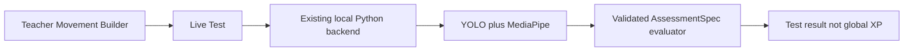
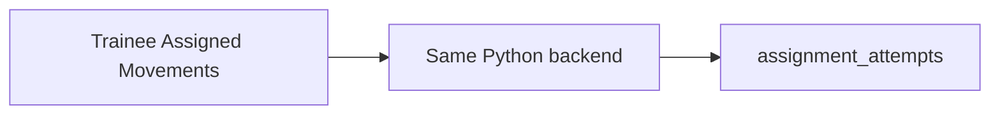

# Phase 7 — Template-scored dynamic assessment (Wrist Stall vertical slice)

**Status:** IMPLEMENTATION VERIFIED AUTOMATICALLY — production rollout pending; physical camera characterization deferred
**Sequence:** `07` of `01 → 02 → 03 → 04 → 05 → 06 → 07 → 08`  
**Prerequisite:** Phase 6 complete enough that Teacher-reviewed custom movements work, **and** Phase 5 `assignment_attempts` + revision `spec` exist. If missing, **STOP**. Do not score into `sessions`.

## Implementing agent instructions

- Re-read current `main`, [AGENTS.md](../../AGENTS.md), [backend/AGENTS.md](../../backend/AGENTS.md), [00-master-plan.md](00-master-plan.md), Phase 6 handoff, and this file before editing.
- Work only on existing `main`. Do not create another branch.
- Implement **only this phase**. Official 12 rule modules stay intact. First merge is **Bottle + Wrist only** (`balance_stall.wrist_v1`). Do **not** add shaker, Grip, or prop-on-prop behavior in that first change.
- Teacher Movement Builder **Live Test** must use the **existing local Python CV backend** (same process as Trainee practice). No Flutter webcam. No second Teacher backend.
- Template-scored Teacher movements **never** award global XP. Persist to `assignment_attempts`.
- Do not implement [docs/dynamic-movements-proposal.md](../dynamic-movements-proposal.md) Basic Toss / throw_catch.
- Do not delete [teacher_app/](../../teacher_app/).
- Update this document’s Status and Completion report when done.

---

## 1. Status

IMPLEMENTATION VERIFIED AUTOMATICALLY — production rollout pending; physical camera characterization deferred

Phase 7 is **not** PRODUCTION CLOSED. Automated implementation and local/emulator gates are complete. Production Firestore Phase 7 rules are **not deployed**. Real-camera Wrist Stall accuracy is **not verified**. Phase 8 is **not started**.

| Gate | State |
|---|---|
| Phase 7A | PASS |
| Phase 7B | PASS |
| Phase 7C | PASS |
| Phase 7D | PASS |
| Phase 7E | PASS locally (code + emulator rules; production Firestore rules not deployed) |
| Phase 7F automated verification | PASS |
| Physical Wrist Stall camera characterization | **DEFERRED BY HUMAN OPERATOR** — not a failing automated gate |
| Real-camera Wrist Stall accuracy | **NOT VERIFIED** |
| Production Firestore Phase 7 rules | **NOT DEPLOYED** |
| Production Phase 7 E2E | **NOT VERIFIED** |
| Phase 7 overall | **NOT COMPLETE** |
| Phase 8 | **NOT STARTED** |

Phase 7E writes template-scored revisions, freezes `assessment_spec` on Teacher-created assignments, and persists append-only `template_score` attempts. Live Firestore rules in project `elixr-app-2026` remain the previous production set until a later **explicitly authorized** Firestore-rules-only rollout. Do not treat this document as evidence that production Firebase was updated.

Physical Wrist Stall A–L characterization was **explicitly deferred by the human operator**. That is a documented thesis/project validation limitation. It is **not** classified as an automated-gate failure. The product must **not** claim that Wrist Stall accuracy has been physically validated. Do not fabricate camera results. Future UAT or demo testing may characterize physical accuracy later; that work is not required to close this documentation task and is not requested here.

See [§24 Phase 7F verification](#24-phase-7f-verification) through [§31 future post-deploy plan](#31-future-post-deploy-plan-do-not-execute).

## 2. Goal

Add a versioned, validated `AssessmentSpec` for Teacher-created movements; ship a Balance/Stall vertical slice (**Wrist Stall** as a new Teacher-created movement, not an official catalog member); reuse YOLO + MediaPipe + HoldValidator + Assessment V2; let Teachers Live Test via the existing Python backend; fall back to Teacher-reviewed when the spec is unsupported.

## 3. User-visible outcome

- Teacher Movement Builder: pick template family **Balance/Stall → Wrist Stall**. First supported vertical slice is **Bottle + Wrist only**. Teacher chooses presentation fields (title, laterality) — **not** raw CV thresholds, **not** shaker/Grip/prop-on-prop in this change.
- **Live Test:** Teacher runs a short local session on the **same** local Python backend. Result is **ephemeral** (U6): no `sessions`, no XP, no required `assignment_attempts`. No `leaderboard` writes.
- Trainee assigned a `template_scored` `balance_stall.wrist_v1` revision is automatically assessed; scores go **only** to `assignment_attempts`.
- Classroom/template scores are **controlled-client capstone data**. Do **not** describe them as tamper-proof against a hostile modified client. This limitation **does not affect global XP** because Teacher-created results are isolated from `sessions` / `leaderboard`.
- Unsupported specs: builder warns and saves as `teacher_reviewed`.
- Official Movements screen still shows only the 12 official names.

## 4. Verified current repo behavior

- All 12 official movements are hold-shaped; completion via [hold_validator.py](../../backend/assessment/hold_validator.py) and [scoring.py](../../backend/assessment/scoring.py) RubricTracker (0..3 / 0..12).
- [common_checks.py](../../backend/assessment/rules/common_checks.py) has stall proximity, stability, `pose_wrist_point()` for geometry — **not** a Wrist Stall movement.
- Calibration: [calibration.py](../../backend/assessment/calibration.py); ELIXR owns scales/thresholds in `backend/config.py`.
- `validate_movement_name` rejects unknown official names. Phase 7 must add a **parallel** validated custom-spec path (e.g. `prepare` with `assessment_spec_id` / `revision_id`) rather than injecting free-form names into the official map.
- No `eval`, no teacher-authored Python.
- [docs/dynamic-movements-proposal.md](../dynamic-movements-proposal.md) is throw/catch — **out of scope**.

## 5. Dependencies / prerequisites

- Phase 5 revision documents with `assessment_mode` + `spec` JSON.
- Phase 4 XP gate (so a mistaken `sessions` write still cannot award custom names).
- Phase 6 camera record path is separate; Live Test uses **practice/scoring** lifecycle (`prepare` → readiness → `activate` → `stop`), not submission recording.

## 6. In scope

- `AssessmentSpec` schema version `1` + Pydantic on backend + Dart parse/validate.
- Capability validator: supported template IDs vs fallback.
- Generic primitives **only** as needed for Wrist Stall (contact region, upright prop, hold duration using **ELIXR constants**, not teacher thresholds).
- New evaluator registered for locked template id **`balance_stall.wrist_v1`**.
- Flutter Teacher Live Test screen talking to existing WebSocket.
- Trainee template-scored attempts → `assignment_attempts` with rubric + `awards_global_xp: false`.
- Tests: validator rejects extra keys, executable expressions, threshold overrides, shaker/grip primitives.
- **Stop after Wrist Stall (Bottle).** Grip / prop-on-prop / shaker are **out of this first change set** and need a later human-approved follow-on (not a Phase 7 stretch in the same merge).

## 7. Explicit non-goals

- Official catalog addition of Wrist Stall.
- Teacher-defined numeric thresholds, formulas, `eval`, JS/Python snippets.
- Throw/catch / Basic Toss.
- Global XP.
- Flutter camera.
- Second CV backend.
- Deleting `teacher_app`.
- Shaker, Grip, or prop-on-prop templates in the first Wrist Stall change.
- Changing official 12 rule files except shared helpers **reuse** (allowed) or accidental edits (forbidden).

## 8. Architecture / runtime flow



Trainee scored path:



**Prepare contract (conceptual):** protocol v1 remains; add optional fields such as `assignment_attempt_id`, `movement_revision_id`, `assessment_spec` **hash** (backend loads spec from a trusted source — **do not** accept arbitrary spec JSON from the client on `prepare` without signing/allowlisting). Recommended: backend fetches revision from Firestore **or** Flutter sends spec only after local validator, and backend **re-validates** with Pydantic and ignores unknown fields / rejects threshold overrides. Capstone constraint: Python today has **no** Firebase. Therefore:

**Trust model (required wording):** classroom/template scores are written by the Windows client after local Python inference. That is appropriate for the **controlled capstone** environment. Do **not** describe template scores as tamper-proof against a hostile modified client. Isolation from `sessions` / `leaderboard` still protects **global XP**.

Live Test: same prepare path with `live_test: true`; Flutter **must not** call `recordCompletedSession`.

## 9. Data models and persisted schema affected

`teacher_movements/.../revisions.spec` example shape (illustrative):

```json
{
  "schema_version": 1,
  "template_id": "balance_stall.wrist_v1",
  "prop": "bottle",
  "target": "wrist",
  "laterality": "either"
}
```

Forbidden keys: `threshold`, `thresholds`, `eval`, `formula`, `code`, `python`, `hold_seconds` (hold uses ELIXR `HOLD_CONFIRMATION_SECONDS` unless a **named enum** like `default` is allowed with no numeric override).

First slice **locks** `template_id` to `balance_stall.wrist_v1` and `prop` to `bottle`. Do not accept `shaker` or other targets in this change.

`assignment_attempts` rubric fields aligned with Assessment V2 (`rubric_technique` etc. or nested `rubric` map) + `performance_level`. Still `awards_global_xp: false`.

Do not add Wrist Stall to `coachingMovementNames` or `enabled_scored_movements.json`.

## 10. Authentication / authorization / privacy rules

- Live Test is local; no extra Firebase reads of trainee evidence.
- Trainee scored attempts: same Classroom Authorization create rules as Phase 5.
- Teachers read classroom rubric via attempt metadata (Classroom Authorization / frozen teacher_id). Video still Assignment Submission Authorization if a clip exists (Phase 6). Template-scored may not need video.
- Public Profile Privacy does not hide classroom rubric from assigning Teacher.

## 11. Cross-layer contracts affected

- WS `prepare` fields + `command_ack` + feedback `assessment` payload for custom spec sessions.
- Pydantic models in `backend/schemas/`.
- Dart parsers.
- README protocol notes.
- Rule engine dispatch for template_id **without** removing official `_RULES` entries.
- Possibly `session_id` lifecycle reused for Live Test but **must not** save official `sessions` rows.

## 12. Existing files that must be inspected

- [backend/assessment/rule_engine.py](../../backend/assessment/rule_engine.py)
- [backend/assessment/rules/hand_stall.py](../../backend/assessment/rules/hand_stall.py)
- [backend/assessment/rules/common_checks.py](../../backend/assessment/rules/common_checks.py)
- [backend/assessment/hold_validator.py](../../backend/assessment/hold_validator.py)
- [backend/assessment/scoring.py](../../backend/assessment/scoring.py)
- [backend/assessment/calibration.py](../../backend/assessment/calibration.py)
- [backend/config.py](../../backend/config.py)
- [backend/schemas/commands.py](../../backend/schemas/commands.py)
- [backend/tests/test_cross_layer_movement_consistency.py](../../backend/tests/test_cross_layer_movement_consistency.py)
- [lib/services/websocket_service.dart](../../lib/services/websocket_service.dart)
- [lib/data/models/ws_protocol.dart](../../lib/data/models/ws_protocol.dart)
- Phase 5 movement builder UI

## 13. Likely files to modify / create / delete

**Create:** `backend/assessment/specs/` (Pydantic AssessmentSpec, capability validator, wrist evaluator), Dart spec models, Teacher Live Test screen, tests.

**Modify:** `websocket.py` prepare/evaluate branch for spec sessions; Flutter practice/assignment runner to persist `assignment_attempts` instead of `sessions` when `origin == teacher_created`.

**Delete:** nothing in official rule modules; nothing in `teacher_app`.

## 14. Backward compatibility / migration strategy

- Official 12 paths unchanged: missing spec ⇒ existing `evaluate_movement(name)`.
- Existing Teacher-reviewed revisions stay `teacher_reviewed`.
- Unsupported stored `template_scored` revisions keep falling back to Teacher-reviewed. Grip/prop-on-prop remain future work.

## 15. Step-by-step implementation order

1. Pydantic `AssessmentSpec` v1 + tests (reject thresholds/eval/unknown keys).
2. Capability validator: **only** `balance_stall.wrist_v1` + `prop: bottle` supported; else unsupported.
3. Wrist evaluator reusing stall helpers + HoldValidator + RubricTracker; synthetic landmark tests (bottle/wrist only).
4. WS prepare branch: validate spec, do not register as official catalog name.
5. Flutter: Builder + Live Test using existing WebSocketService; assert no XP calls.
6. Trainee assignment run → `assignment_attempts` only.
7. Confirm official 12 consistency tests still pass.
8. **Stop.** Do not add shaker, Grip, or prop-on-prop in this change.
9. Update this file.

## 16. Acceptance criteria

1. `balance_stall.wrist_v1` (Bottle + Wrist) can be Live Tested via **the same** local Python backend.
2. Scores persist only to `assignment_attempts`; Live Test is ephemeral (no `sessions`, no XP).
3. Results never increase `leaderboard.total_xp`. Template scores are **not** claimed tamper-proof.
4. Official 12 evaluators unchanged in behavior (characterization tests still pass).
5. Spec cannot carry teacher raw thresholds or executable code; shaker/grip rejected.
6. Unsupported specs fallback to Teacher-reviewed.
7. Python still sole webcam owner including Live Test teardown.
8. `teacher_app` intact.

## 17. Required tests

- Pydantic: golden Wrist spec; rejects `thresholds`, `eval`, extra primitives.
- Wrist evaluator: positive / boundary / missing landmarks (`unknown`, not `unstable`).
- Rubric bounds 0..3 / 0..12.
- WS: invalid spec → protocol error; valid spec → feedback assessment.
- Flutter: Live Test does not call `recordCompletedSession`.
- Cross-layer official 12 fixture still length 12.
- FPS/hold: reuse existing hold tests patterns; no frame-count scoring.

## 18. Verification commands

```powershell
dart format --output=none --set-exit-if-changed lib test
flutter analyze
flutter test
cd packages\elixr_core; flutter test
backend\.venv\Scripts\python.exe -m pytest -q backend\tests
backend\.venv\Scripts\python.exe -m compileall backend\api backend\assessment backend\schemas backend\vision backend\main.py backend\config.py
flutter build windows
```

## 19. Manual verification checklist

- [ ] Teacher Live Test Wrist Stall: preview, readiness, score, stop, camera released.
- [x] Trainee assignment persist path exists locally (`template_score` on `assignment_attempts`); production Firestore rules rollout is still PENDING.
- [ ] Trainee assignment: result on Teacher student/assignment UI; global XP unchanged.
- [ ] Official Hand Stall still works.
- [ ] Builder rejects a hacked spec with a numeric threshold if the UI is bypassed (or backend rejects).
- [ ] Physical Wrist Stall A–L camera characterization: **DEFERRED BY HUMAN OPERATOR**. Not performed. Not classified as an automated failure. Real-camera accuracy remains **NOT VERIFIED**.
- [ ] Production Firestore Phase 7 rules deployment: **NOT AUTHORIZED** in this close-out. Prepared command is documented in §30 and must not be run without a new explicit human authorization.
- [ ] Production Phase 7 E2E after authorized rules deploy: **NOT VERIFIED**.

## 20. Performance / storage / privacy risks

- Live Test must not leak trainee videos (none).
- Do not block asyncio on inference (`asyncio.to_thread` remains).
- Hostile spec JSON / forged rubric writes: validator + `assignment_attempts` rules are the control; **capstone client-trusted**. Global XP remains isolated.

## 21. Explicit “Do not” list

- Do not `eval` or run teacher code.
- Do not let teachers set `HOLD_*` or proximity floats.
- Do not add Wrist Stall to official 12.
- Do not implement Basic Toss.
- Do not write template scores to `sessions`.
- Do not add a Teacher-only Python service.
- Do not add Flutter `camera` dependency.
- Do not delete `teacher_app`.
- Do not expand shaker / Grip / prop-on-prop in this Wrist Stall change set.
- Do not claim classroom/template scores are tamper-proof.

## 22. Phase 7F close-out report

```
Phase 7F close-out — AUTOMATED VERIFICATION COMPLETE
PHYSICAL CAMERA CHARACTERIZATION DEFERRED / NOT VERIFIED

- Status: IMPLEMENTATION VERIFIED AUTOMATICALLY — production rollout pending;
  physical camera characterization deferred
- Do NOT write: PRODUCTION CLOSED
- template_id shipped locally: balance_stall.wrist_v1
- Prop: bottle only
- Live Test uses existing Python: yes (local implementation)
- Tamper-proof claim avoided: yes
  (controlled-client capstone classroom assessment data)
- PHASE7F_AUTOMATED_VERIFICATION: PASS
- PHASE7F_PHYSICAL_CHARACTERIZATION: DEFERRED
- PHYSICAL_CAMERA_CHARACTERIZATION: DEFERRED
- REAL_CAMERA_ACCURACY_VERIFIED: NO
- Physical characterization classified as failure: NO
- TEMPLATE_WRITES_SESSIONS: NO
- TEMPLATE_WRITES_LEADERBOARD: NO
- TEMPLATE_AWARDS_GLOBAL_XP: NO
- OFFICIAL_12_UNCHANGED: YES
- Production Firestore Phase 7 rules deployed: NO
- Production Firebase changed: NO
- Phase 8 started: NO
- PHASE7_OVERALL_COMPLETE: NO
- READY_FOR_PHASE7_FIRESTORE_DEPLOY_AUTHORIZATION: YES
  (authorization is not deployment; previous Phase 6 authorizations are not reusable)

Automated evidence preserved from HEAD 94f5dcc25ef2a6fd88c8e8f6a79b9d7112cba4c7
(not rerun in this documentation-only task):
- dart format: 402 files, 0 changed
- flutter analyze: 0 errors; 1 pre-existing warning; 14 pre-existing info items
- root Flutter: 1461 passed, 0 failed
- packages/elixr_core: 91 passed, 0 failed
- backend: 1219 passed, 0 failed
- explicit Phase 7 backend/spec/protocol/official consistency: 105 passed
- official 12: unchanged
- compileall: PASS
- Phase 7E focused Firestore emulator: 46 passed, 0 failed
- full Firestore emulator: 437 passed, 0 failed
- Windows release build: PASS
  (build\windows\x64\runner\Release\elixr_application.exe)

Not verified:
- physical Wrist Stall A–L camera characterization (deferred by human operator)
- real-camera Wrist Stall accuracy
- trainee physical / production-app + emulator manual E2E
  (production Windows app has no Firestore emulator wiring)
- production Phase 7 E2E
- production Firestore Phase 7 rule enforcement
```

## 23. Handoff requirements for Phase 8

Phase 8 must **not** start until Phase 7 is PRODUCTION CLOSED. That requires an authorized Firestore-rules-only production deploy **and** a later controlled production E2E. This document does not authorize either.

When Phase 7 is later PRODUCTION CLOSED, Phase 8 still requires:

1. Teacher-reviewed (Phase 6) and template-scored Wrist Stall (Phase 7) both exist.
2. Feature list vs teacher_app can be compared (Android roster vs Windows Groups, etc.).
3. No remaining required Teacher behavior lives **only** in `teacher_app` except Android packaging.
4. `teacher_app/` still present until Phase 8 gates pass.

## 24. Phase 7F verification

Phase 7F automated verification is **PASS**.

Physical camera characterization is **DEFERRED / NOT VERIFIED**.

| Item | Result |
|---|---|
| Phase 7F automated gates | PASS |
| Physical Wrist Stall A–L characterization | **NOT PERFORMED** — human decision: **DEFERRED** |
| REAL_CAMERA_ACCURACY_VERIFIED | **NO** |
| Classified as a failing automated gate | **NO** |
| Trainee physical / app+emulator manual E2E | **NOT AVAILABLE** |
| Production Firebase | **UNCHANGED** |

Deferred physical characterization is a known validation limitation, not a failed automated suite. Future UAT or demo testing **may** characterize physical accuracy later. It is not required to fabricate results, and it does not block recording this repository documentation. Do **not** request camera testing as part of this close-out.

Trainee physical / production-app + emulator manual E2E is unavailable because the production Windows app has no Firestore emulator wiring. Redirecting that path to production Firebase ad hoc is refused.

## 25. Automated evidence (preserved)

Recorded at starting/current implementation HEAD `94f5dcc25ef2a6fd88c8e8f6a79b9d7112cba4c7`. This documentation task did **not** rerun those suites: no application, backend, or rule source changed.

| Check | Result |
|---|---|
| `dart format --output=none --set-exit-if-changed` | 402 files, 0 changed |
| `flutter analyze` | 0 errors; 1 pre-existing warning; 14 pre-existing info items |
| Root `flutter test` | **1461 passed**, 0 failed |
| `packages/elixr_core` `flutter test` | **91 passed**, 0 failed |
| Backend `pytest` | **1219 passed**, 0 failed |
| Explicit Phase 7 backend / spec / protocol / official consistency | **105 passed** |
| Official 12 | **UNCHANGED** |
| `compileall` | PASS |
| Phase 7E focused Firestore emulator | **46 passed**, 0 failed |
| Full Firestore emulator | **437 passed**, 0 failed |
| Windows release build | **PASS** |

Windows executable from that build:

`build\windows\x64\runner\Release\elixr_application.exe`

Analyzer: 0 errors. Pre-existing non-error diagnostics remain.

## 26. Frozen Wrist Stall baseline

Repository constants at the Phase 7F implementation HEAD. These are recorded for later characterization; they were **not** tuned in this task.

| Constant | Value |
|---|---|
| `STALL_PROXIMITY` | `0.12` |
| `HAND_STALL_UPRIGHT_ASPECT_RATIO` | `1.25` |
| `STALL_STABILITY_THRESHOLD` | `0.06` |
| `STALL_HISTORY_FRAMES` | `12` |
| Pose minimum visibility | `0.5` |
| `READINESS_STABLE_DURATION_S` | `1.0` |
| `HOLD_CONFIRMATION_SECONDS` | `2.5` |
| `HOLD_UNKNOWN_GRACE_SECONDS` | `0.75` |
| `HOLD_MAX_FRAME_GAP_SECONDS` | `0.35` |
| `HOLD_MIN_POSITIVE_RATIO` | `0.85` |
| Calibration | Pose shoulder-width based; reference `0.30`; clamped `0.6..1.6`; fallback `1.0` / `default` |

Recording these values does **not** claim they were physically validated.

## 27. Global XP / session isolation

Template completion writes **only**:

- `assignment_attempts` with `attempt_kind = template_score`

It does **not** write:

- `sessions`
- `leaderboard`
- `leaderboard_processed_sessions`

It does **not** award:

- global XP
- daily quests
- achievements
- mastery

| Flag | Value |
|---|---|
| `TEMPLATE_WRITES_SESSIONS` | **NO** |
| `TEMPLATE_WRITES_LEADERBOARD` | **NO** |
| `TEMPLATE_AWARDS_GLOBAL_XP` | **NO** |

Teacher Live Test remains ephemeral: no `sessions`, no XP, no required `assignment_attempts`.

## 28. Trust model

Template-scored classroom results are **controlled-client capstone classroom assessment data**.

Do **not** call them tamper-proof.

The local Python backend performs inference. The authenticated Windows client persists the classroom result. A hostile modified client is outside the capstone trust model.

Phase 7 Firestore rules (local, not yet production) freeze classroom identity and enforce `awards_global_xp = false`. That design protects the global XP / session / leaderboard path even though classroom scores themselves are not a trusted server-authoritative ranking against a hostile client.

## 29. Production Firestore rule evidence

Production Firestore Phase 7 rules: **NOT DEPLOYED**.

Active Firebase project: `elixr-app-2026`.

Read-only live rules recheck on 2026-08-22 (`firebase_get_security_rules`, no deploy):

| Item | Value |
|---|---|
| `LIVE_FIRESTORE_RULES_READABLE` | **YES** |
| Local `firestore.rules` LF-normalized SHA-256 | `1ae4debfd9b50671391e619590c56567eacad31375b486f6937b0cb943583b0e` |
| Live production Firestore rules LF-normalized SHA-256 | `6839dedc5bf43bf1a1808624e3db12c9d6aa5f66b1622b328c4716b0eaf2efad` |
| `LOCAL_FIRESTORE_RULES_DIFFER_FROM_LIVE` | **YES** |
| Local hash changed unexpectedly vs prior Phase 7F evidence | **NO** |
| Live hash changed since prior Phase 7F evidence | **NO** |
| `PHASE7_RULE_DIFF_IS_ADDITIVE` | **YES** |

Local `firestore.rules` adds Phase 7 support that live production currently lacks:

- exact AssessmentSpec v1 validation (`validAssessmentSpecV1`)
- `template_scored` revision creation
- frozen template assignment `assessment_spec`
- `template_score` classroom result creation/read

Live production rules do **not** contain `validAssessmentSpecV1`, `template_scored` support, `template_score` support, or `assessment_spec` assignment snapshot authorization. Do not imply production already supports the new write path.

Existing Phase 5/6 contracts were verified unchanged by emulator tests at the implementation HEAD. This documentation task did not change `firestore.rules`.

## 30. Production rollout authorization gate

The next production-changing action is a **FIRESTORE-RULES-ONLY** deployment.

Prepared command — **DO NOT RUN** without a new explicit human authorization:

```text
npx --yes firebase-tools@latest deploy --only firestore:rules --project elixr-app-2026
```

Do **not** use `--only firestore`. That target may also include Firestore indexes depending on Firebase CLI target semantics and `firebase.json` configuration. The authorized target is **Firestore rules only**.

This document does **not** create or constitute that authorization. Previous Phase 6 deployment authorizations are **not reusable**.

Do not deploy Storage, Functions, indexes, Hosting, IAM, or App Check as part of the Phase 7 rules gate.

### Immediate pre-deploy checks (required before any authorized run)

If any item mismatches: **STOP** and re-review. Do not deploy over an unexpected live rules version.

1. `branch = main`
2. `HEAD = origin/main`
3. Working tree clean
4. Expected docs / current Phase 7 commit is the reviewed HEAD
5. Firebase project = `elixr-app-2026`
6. Local `firestore.rules` LF-normalized SHA-256 still equals `1ae4debfd9b50671391e619590c56567eacad31375b486f6937b0cb943583b0e`
7. Live pre-deploy Firestore rules LF-normalized SHA-256 still equals `6839dedc5bf43bf1a1808624e3db12c9d6aa5f66b1622b328c4716b0eaf2efad`
8. No unexpected production rules update (`LIVE_FIRESTORE_RULES_CHANGED_SINCE_PHASE7F` must remain **NO**)
9. Emulator Phase 7 rule tests remain green
10. Deploy target = `firestore:rules` only

## 31. Future post-deploy plan (DO NOT EXECUTE)

After a **new explicit human authorization** and a successful rules-only deploy, a later agent must:

1. Read live Firestore rules back.
2. Calculate LF-normalized SHA-256.
3. Require live == intended local (`1ae4debfd9b50671391e619590c56567eacad31375b486f6937b0cb943583b0e` unless a reviewed rules change landed first).
4. Verify the deployment targeted Firestore rules only.
5. Verify Storage untouched.
6. Verify indexes untouched.
7. Verify Phase 6 production behavior remains available.
8. Perform a controlled Phase 7 production workflow:
   - Teacher template movement create
   - Teacher assignment create
   - Trainee template assessment
   - `template_score` created
   - assigning Teacher can read the result
   - global XP / session counts unchanged

Only after that can Phase 7 become **PRODUCTION CLOSED**.

This task executed **none** of those steps.
