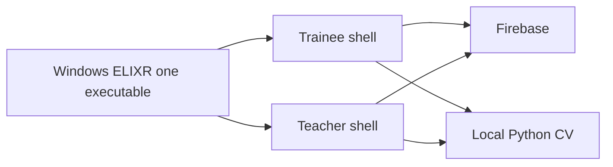

# Phase 8 — `teacher_app` removal and hardening

**Status:** PHASE 8 CLOSED — `teacher_app` deleted; physical camera characterization remains deferred from Phase 7  
**Sequence:** `08` of `01 → 02 → 03 → 04 → 05 → 06 → 07 → 08`  
**Prerequisite:** Phases 1–7 complete **and** every migration gate below passed before deletion.

**Phase 7 lifecycle note (2026-08-26):** Template scoring and Teacher
Movement Builder Live Test are retired. Historical template movements,
assignments, and scores remain readable, while current teacher-created work is
`teacher_reviewed` only. The Phase 7 entries below are historical evidence,
not an active feature promise.

## Implementing agent instructions

- Re-read current `main`, [AGENTS.md](../../AGENTS.md), [00-master-plan.md](00-master-plan.md), all prior phase completion reports, and this file before editing.
- Work only on existing `main`. Do not create another branch.
- `teacher_app/` was deleted in this phase. Do not restore it.
- Update this document’s Status and Completion report when done.
- Report tests actually run versus `Not verified`.

---

## 1. Status

PHASE 8 CLOSED — `teacher_app` deleted on 2026-08-22 after `AUTHORIZED TO START PHASE8` and Gate 9 `ANDROID TEACHER INSTALLS ARE NO LONGER REQUIRED.`

The Windows executable is the only in-repo Teacher product. Existing Android Teacher installs will not receive updates from this repository. That is an accepted capstone cutoff.

The former Phase 7 functional write path is retired. Physical Wrist Stall camera characterization remains **DEFERRED / NOT VERIFIED**. Phase 8 did not claim real-camera accuracy.

No Phase 9 exists. Follow-on work needs a new human-approved plan.

| Gate | State |
|---|---|
| Phase 1 role routing / Teacher register / email verify | **PASS** |
| Phase 2 groups / membership / legacy links retained | **PASS** |
| Phase 3 Dashboard / Students / progress / coaching | **PASS** |
| Phase 4 Global / My Students / Group + official XP gate | **PASS** |
| Phase 5 movements / assignments / `assignment_attempts` | **PASS** |
| Phase 6 Teacher-reviewed video + Storage lifecycle | **PASS** |
| Phase 7 Wrist Stall Live Test on existing Python backend | **HISTORICAL PASS** — path retired; real-camera accuracy **NOT VERIFIED** |
| Gate 8 migrated teacher_app behaviors as Windows/`elixr_core` tests | **PASS** |
| Gate 9 Android Teacher installs no longer required | **PASS** — 2026-08-22 |
| `teacher_app` deleted | **YES** |
| Phase 8 overall | **CLOSED** |

See [§22](#22-completion-report) for commands and review notes.

## 2. Goal

Verify Windows Teacher feature parity with the useful behavior of the Android companion, migrate remaining tests/contracts into the main app / `elixr_core`, delete `teacher_app` completely, remove obsolete Android-only Teacher config/docs, update CI and documentation, and perform security/privacy/cross-layer review.

## 3. User-visible outcome

- One Windows ELIXR executable is the Teacher product.
- Android `elixr_teacher` app is gone from the repo; README/CI no longer tell people to run it.
- Teachers who only had Android accounts can use Windows with the same Firebase identity.
- No leftover google-services / Android Teacher applicationId as an active product (files deleted with the tree).

## 4. Verified current repo behavior (pre-deletion inventory)

Start inventory recorded on `main` at HEAD `825132d6343463d1bc5313732c185b32e1bde705` after Phase 8 start authorization. Confirm again immediately before any delete.

| teacher_app capability | Windows replacement | Test evidence | Parity |
|---|---|---|---|
| Teacher register + email verify | Phase 1 `registerTeacher` + `/verify-email` | `test/services/auth_teacher_flow_test.dart`; `test/core/router/app_redirect_test.dart` | **PASS** |
| Teacher-only login reject / missing profile fail-closed | Phase 1 `createMissingProfile: false` | same auth + redirect tests | **PASS** |
| Roster invite QR / rotate / revoke | Phase 2 `group_invites`; QR optional, not required | `packages/elixr_core/test/repositories/group_repository_test.dart`; `test/features/teacher/teacher_groups_controller_test.dart` | **PASS** (Windows Groups; Android QR is packaging UX) |
| Approve/reject joins | Phase 2 membership | Windows groups controller + `elixr_core` membership tests | **PASS** |
| Student progress + `waitingForAccess` | Phase 3 | `test/features/teacher/students/teacher_student_detail_controller_test.dart` | **PASS** |
| Coaching notes | Phase 3 | Windows coaching section tests + `packages/elixr_core/test` coaching note tests | **PASS** |
| Roster ranking | Phase 4 My Students / Group | `test/features/teacher/leaderboard/*` | **PASS** |
| Session evidence JPEG download | Phase 3 + General Evidence Access | existing evidence/progress tests | **PASS** |
| Video review | Phase 6 (never on Android) | Phase 6 Windows/Storage tests | **PASS** (Windows-only capability) |
| Groups / assignments / historical template score | Phases 2, 5, 7 (never on Android) | Phase 5–7 Windows/backend tests | **PASS** for historical visibility; template write/runtime path retired |

Required Gate 8 behaviors already existed outside `teacher_app/test`. Remaining Android-shell tests (Material roster/QR widgets, Android theme, `ElixrTeacherApp` router) were deleted with the tree.

CI now has a parallel `elixr_core` job: format, analyze, and `flutter test`. No `teacher_app` CI was added.

Android client config `google-services.json` was deleted with the tree. It was not copied into docs.

U5: Windows Groups write `group_invites`. The Android Teacher-level `teacher_invites` writer was removed with `teacher_app`. Legacy `teacher_invites` and `teacher_student_links` remain readable. This phase did **not** delete those production documents.

## 5. Dependencies / prerequisites

**Hard gates (all must be true):**

1. Phase 1: role routing + Teacher shell + explicit Teacher register + no trainee onboarding for Teachers.
2. Phase 2: groups + membership + non-destructive legacy links retained **or** a documented completed compatibility window.
3. Phase 3: Dashboard/Students/progress/coaching on Windows.
4. Phase 4: Global/My Students/Group + official XP gate.
5. Phase 5: movements/assignments/`assignment_attempts`; official assignment-context **required** pointer; `assignment_attempts` never awards global XP.
6. Phase 6: Teacher-reviewed video + Assignment Submission Authorization + client reconciler + **`assignment_submissions/` Object Lifecycle** hard backstop.
7. Phase 7: `balance_stall.wrist_v1` (Bottle + Wrist) + Live Test on **existing** Python backend.
8. Migrated tests: teacher_app auth/router/progress/coaching/ranking **behaviors** exist as Windows/`elixr_core` tests (not merely “we will rewrite later”).
9. Human confirmation that Android Teacher installs are no longer required for the capstone.

If gate 8 fails, port tests **before** deletion in this same phase, sequentially, then delete.

## 6. In scope

- Parity checklist executed and recorded.
- Move remaining useful tests into `test/` or `packages/elixr_core/test/`.
- Delete `teacher_app/` directory (lib, android, test, pubspec, README, analysis_options, firebase_options).
- Grep the repo for `teacher_app`, `elixr_teacher`, `com.codewithjenah.elixr_teacher` and update docs/CI/scripts.
- CI: format/analyze/test for main app + elixr_core + backend; Windows build job if feasible.
- Review [firestore.rules](../../firestore.rules), [firestore.indexes.json](../../firestore.indexes.json), [storage.rules](../../storage.rules), and **Storage Object Lifecycle** on `assignment_submissions/` only (must not cover profile or session_evidence).
- Security/privacy review note in completion report (five authorization layers still distinct).
- Cross-layer contract review (WS, movements, XP domains).
- Root [README.md](../../README.md) / AGENTS.md updates if they mention two apps.

## 7. Explicit non-goals

- Redesigning Groups or video in this phase.
- Weakening rules “because Android is gone.”
- Deleting `teacher_student_links` (legacy consent may still be required).
- Claiming Firebase production deploy happened unless a human requested and it was run.
- Adding Markdown lint tooling.

## 8. Architecture / runtime flow

After deletion:



No Android Teacher client remains in-repo.

## 9. Data models and persisted schema affected

- No required new collections.
- Confirm indexes cover groups, memberships, assignments, attempts, leaderboard.
- Confirm Storage paths: profile, session_evidence, assignment_submissions.
- Confirm `assignment_submissions/` lifecycle (~30-day age) is configured and was tested on a non-prod bucket (`Not verified` if not).
- **U5:** deprecate remaining Teacher-level `teacher_invites` after Windows Groups fully replace that writer. Do not delete production consent `teacher_student_links` unless a separate human-approved cleanup.

## 10. Authentication / authorization / privacy rules

Full review checklist (must appear in completion report):

- Role immutability.
- Public Profile Privacy ≠ Classroom Authorization.
- Progress Access ≠ General Evidence Access ≠ Assignment Submission Authorization.
- Locked profile does not hide assignment work from assigning Teacher.
- Unrelated Teachers: no privileged reads.
- `sessions` still not globally readable; classroom data in `assignment_attempts`.
- Official XP only from official `sessions`.
- Video rules do not use General Evidence Access.
- `assignment_submissions/` lifecycle does not apply to profile or session_evidence.
- Coaching notes: Classroom Authorization OR approved legacy link; no silent consent.
- Invite `list: if false` still holds.

## 11. Cross-layer contracts affected

- CI workflow.
- Documentation.
- Possibly Melos/workspace — none today; do not add unless needed.
- Firebase `firebase_options` in **main** app remains; teacher_app options deleted with tree.

## 12. Existing files that must be inspected

- Entire `teacher_app/`
- [../../.github/workflows/ci.yml](../../.github/workflows/ci.yml)
- [README.md](../../README.md), [AGENTS.md](../../AGENTS.md)
- [docs/phase1-teacher-rankings-plan.md](../phase1-teacher-rankings-plan.md) — mark superseded, do not delete unless human wants; at least add a pointer to this directory
- Grep hits for `elixr_teacher`, `teacher_app`
- Rules and indexes
- `packages/elixr_core` tests vs teacher_app tests

## 13. Likely files to modify / create / delete

**Delete:** `teacher_app/` (entire tree).

**Modify:** CI, README, AGENTS.md, any path references, maybe analysis_options at repo root if it included teacher_app.

**Create:** none required except this completion report update.

## 14. Backward compatibility / migration strategy

- Firebase Auth Teacher users continue to work on Windows.
- Android installs already in the wild will not receive updates from this repo — document as accepted capstone cutoff.
- Dual-write compatibility from Phase 2: Windows Groups must already fully replace `teacher_app` as the invite writer **before** delete (U5 deprecation gate).

## 15. Step-by-step implementation order

1. Fill the parity table with Pass/Fail evidence (commands + manual).
2. Port any failing/missing tests from `teacher_app/test` into main/core.
3. Run full verification set **with teacher_app still present**.
4. Security/privacy/contract review notes.
5. Delete `teacher_app/`.
6. Fix compile/docs/CI references.
7. Run full verification set **without** teacher_app.
8. `flutter build windows`.
9. Update this file Status.

If step 1–2 fail, **do not perform step 5**.

## 16. Acceptance criteria

1. Every Phase 8 gate in §5 is Pass.
2. `teacher_app/` directory does not exist.
3. Repo grep clean of live product references (historical docs may mention it as removed).
4. CI green without teacher_app.
5. `elixr_core` tests run in CI.
6. Rules/indexes/storage reviewed.
7. Python tests + Windows build run.
8. Five authorization terms still documented and implemented distinctly.
9. Teacher Live Test still uses local Python; no Flutter camera.

## 17. Required tests

- The full Flutter + core + backend suites.
- Ported teacher_app cases: Teacher register role, non-Teacher reject, verify-email redirect, waitingForAccess, coaching create constraints, roster/group ranking filters.
- Rules review (emulator preferred).
- No test may depend on `package:elixr_teacher`.

## 18. Verification commands

**Before delete:**

```powershell
dart format --output=none --set-exit-if-changed lib test
flutter analyze
flutter test
cd packages\elixr_core; flutter test
cd ..\..\teacher_app; flutter test
backend\.venv\Scripts\python.exe -m pytest -q backend\tests
backend\.venv\Scripts\python.exe -m compileall backend\api backend\assessment backend\schemas backend\vision backend\main.py backend\config.py
flutter build windows
```

**After delete:** same **except** `teacher_app` test (directory gone). Confirm `flutter test` / `elixr_core` / pytest / `flutter build windows` / `flutter analyze`.

## 19. Manual verification checklist

- [ ] Teacher register → shell.
- [ ] Trainee register → trainee shell + practice.
- [ ] Groups join/approve.
- [ ] Progress wait vs granted.
- [ ] Global XP official only (`sessions`); `assignment_attempts` never awards XP; Teacher-created no XP.
- [ ] Official assignment completion: `sessions` + pointer attempt; XP once.
- [ ] Assignment video: assigning Teacher yes; other Teacher no; trainee cannot self-approve; no evidence grant required.
- [ ] Locked profile still on leaderboard and in class.
- [ ] Wrist Stall Live Test on same backend.
- [ ] Camera released.

## 20. Performance / storage / privacy risks

- Orphan Android clients.
- Leftover Storage videos: client reconciler + lifecycle backstop should bound `assignment_submissions/`; confirm lifecycle prefix is not too broad. Account deletion remains the erasure path for metadata.
- Accidental rules widening during “cleanup.”

## 21. Explicit “Do not” list

- Do not delete `teacher_app` before gates pass.
- Do not delete `packages/elixr_core` Teacher repositories.
- Do not delete `teacher_student_links` as part of app removal.
- Do not weaken Storage video rules.
- Do not mix `assignment_attempts` into `sessions`.
- Do not add a new branch.
- Do not deploy Firebase without explicit human request.

## 22. Completion report

```
Phase 8 completion
- Parity table (pass/fail):
  Teacher register + email verify: PASS
  Teacher-only login reject / missing profile fail-closed: PASS
  Group invite rotate / revoke (QR optional): PASS
  Approve/reject joins: PASS
  Student progress + waitingForAccess: PASS
  Coaching notes: PASS
  My Students / Group ranking: PASS
  Session evidence JPEG: PASS
  Video review / assignments / template score: PASS (Windows-only)
- Tests ported:
  Required Gate 8 behaviors already existed in Windows / elixr_core tests.
  No package:elixr_teacher tests were copied.
  Android-shell Material/QR/theme tests were deleted with the tree.
- teacher_app deleted: YES
- Commands before delete (2026-08-22):
  dart format lib test: 402 files, 0 changed
  flutter analyze: exit 0; 0 errors; 1 pre-existing warning; 14 pre-existing info
  root flutter test: 1461 passed
  packages/elixr_core flutter test: 91 passed
  teacher_app flutter test: 95 passed
  backend pytest: 1219 passed
  compileall: PASS
  flutter build windows: PASS
    (build\windows\x64\runner\Release\elixr_application.exe)
- Commands after delete (2026-08-22):
  dart format lib test: 402 files, 0 changed
  flutter analyze: exit 0; 0 errors; 1 pre-existing warning; 14 pre-existing info
  root flutter test: 1461 passed
  packages/elixr_core flutter test: 91 passed
  backend pytest: 1219 passed
  compileall: PASS
  flutter build windows: PASS
    (build\windows\x64\runner\Release\elixr_application.exe)
  teacher_app directory: absent
- Rules review notes:
  firestore.rules were not modified.
  Role immutability, official XP from official sessions, awards_global_xp=false
  on classroom attempts, and the five authorization layers remain distinct.
  teacher_invites list: if false remains. Production invite/consent documents
  were not deleted.
  Indexes unchanged. groups, group_memberships, assignment_attempts, and
  leaderboard composites remain. group_assignments has no composite in
  firestore.indexes.json; that pre-existed Phase 8 and was not added here.
- Privacy review notes:
  Public Profile Privacy remains separate from Classroom Authorization.
  Progress Access, General Evidence Access, and Assignment Submission
  Authorization remain separate.
  Locked profile does not hide assignment work from the assigning Teacher.
  Unrelated Teachers have no privileged reads.
  sessions are not globally readable.
  Video rules do not use General Evidence Access.
  assignment_submissions/ lifecycle prefix remains assignment_submissions/ only
  (age 30 days). It does not cover profile or session_evidence.
  Coaching notes still require Classroom Authorization or an approved legacy
  link. No silent consent.
  Classroom/template scores remain controlled-client capstone classroom
  assessment data.
- Contract review notes:
  WebSocket / movement / XP domains were not changed.
  Teacher Live Test still uses the local Python backend.
  No Flutter camera owner was added.
  elixr_core format/analyze/test is now a CI job.
  Historical phase docs may still mention teacher_app as the then-current
  companion. Live product files no longer instruct anyone to run it.
- Not verified:
  Phase 8 manual UI checklist
  Firestore emulator re-run
  Firebase deploy (not requested)
  production Android leftover-client behavior
  physical Wrist Stall camera characterization (deferred from Phase 7)
  real-camera accuracy
```

## 23. Handoff requirements for the next phase

There is **no Phase 9** in this program. Follow-on work (Grip/shaker templates, assignment-score classroom boards) requires a **new** human-approved plan. Do not silently continue. Do not add Cloud Functions merely for video TTL (U3 already specifies lifecycle).

`teacher_app/` was deleted. Do not restore it. Do not start unrelated features.
