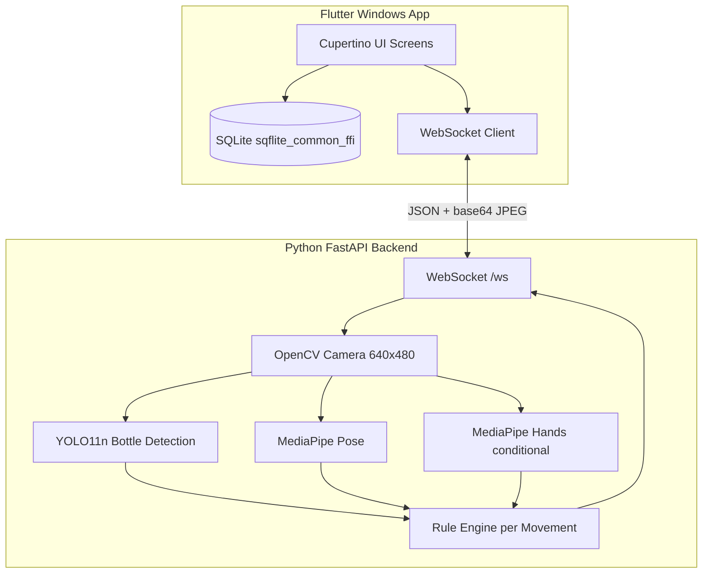

# ELIXR Development Plan

## Current State

The workspace is a **fresh Flutter Windows project** with the default counter demo in [`lib/main.dart`](lib/main.dart). That file has syntax errors on lines 31 and 105 (`ColorScheme` / `MainAxisAlignment` missing) and must be replaced entirely. **No Python backend, database, or custom UI exists yet.**

Your choices for this plan:
- **Camera feed:** Python captures via OpenCV and sends **annotated JPEG frames over WebSocket**; Flutter renders with `Image.memory`.
- **User role:** Single role **`Trainee`** (stored in DB for schema consistency; registration UI can hide or auto-set it).

---

## Target Architecture



**Dev workflow (no packaging):**
```bash
# Terminal 1
cd backend && uvicorn main:app --reload --host 127.0.0.1 --port 8000

# Terminal 2
flutter run -d windows
```

---

## Repository Layout

```
elixr_application/
├── lib/
│   ├── main.dart                    # sqflite FFI init, runApp
│   ├── app.dart                     # CupertinoApp, theme, router
│   ├── core/
│   │   ├── theme/app_theme.dart     # Pink/black tokens, card styles
│   │   ├── constants/               # Colors, spacing, WS URL, movements
│   │   ├── router/app_router.dart   # go_router routes + auth redirect
│   │   └── widgets/                 # ElixCard, ElixButton, Sidebar, etc.
│   ├── data/
│   │   ├── models/                  # User, Session, Feedback, Movement
│   │   ├── database/
│   │   │   ├── database_helper.dart
│   │   │   └── migrations.dart
│   │   └── repositories/            # Auth, Session, Progress repos
│   ├── services/
│   │   ├── auth_service.dart
│   │   ├── session_service.dart
│   │   └── websocket_service.dart
│   └── features/
│       ├── auth/                    # login, register screens
│       ├── dashboard/
│       ├── movements/
│       ├── practice/
│       ├── history/
│       └── progress/
├── backend/
│   ├── main.py                      # FastAPI app factory
│   ├── requirements.txt
│   ├── config.py                    # FPS, frame skip, resolution
│   ├── api/
│   │   ├── health.py                # GET /health
│   │   └── websocket.py             # WS /ws session loop
│   ├── vision/
│   │   ├── camera.py
│   │   ├── bottle_detector.py       # YOLO11n, COCO "bottle" class
│   │   ├── pose_detector.py
│   │   └── hands_detector.py
│   ├── assessment/
│   │   ├── rule_engine.py
│   │   ├── scoring.py
│   │   └── rules/                   # One module per Easy movement first
│   └── schemas/
│       └── feedback.py              # Pydantic response models
├── assets/                          # Optional logo/icons later
└── README.md                        # Dev setup (Flutter + Python)
```

**Architecture pattern:** Feature-first UI + thin repositories/services (pragmatic clean architecture—no over-abstracted domain layer unless it earns its keep).

---

## Flutter Dependencies ([`pubspec.yaml`](pubspec.yaml))

| Package | Purpose |
|---------|---------|
| `sqflite_common_ffi` + `path` | SQLite on Windows desktop |
| `crypto` | Password hashing (SHA-256 + random salt) |
| `web_socket_channel` | Real-time backend connection |
| `provider` | Auth session + practice state |
| `go_router` | Declarative routing with auth guard |
| `intl` | Date/time formatting in history |
| `fl_chart` | Progress charts (avg score, per-movement bars) |

Keep `cupertino_icons`. Use **`CupertinoApp`** as root with custom `CupertinoThemeData` (dark charcoal background, pink primary).

---

## UI Theme and Navigation

**Design tokens** in [`lib/core/theme/app_theme.dart`](lib/core/theme/app_theme.dart):

| Token | Value |
|-------|-------|
| Background | `#0D0D0F` (near-black) |
| Card surface | `#1A1A1F` with soft shadow |
| Primary accent | `#FF4D8D` (pink) |
| Secondary accent | `#FF7EB3` (soft pink) |
| Text primary | `#F5F5F5` |
| Text secondary | `#A0A0A8` |
| Success | `#6EE7B7` |
| Error | `#FF6B6B` |

**Reusable widgets:** `ElixCard` (rounded 16–20px, subtle border/glass blur optional), `ElixPrimaryButton`, `ElixSidebar` (Windows-appropriate left nav), `FeedbackChip` (positive/warning/error by `feedback_type`).

**Navigation:** Persistent **left sidebar** on dashboard shell (not bottom nav—better for Windows desktop):
- Dashboard
- Movements
- History
- Progress
- Logout

Auth screens (login/register) are full-screen without sidebar.

---

## SQLite Schema

Implemented in [`lib/data/database/database_helper.dart`](lib/data/database/database_helper.dart):

**`users`**
- `id`, `full_name`, `username` (UNIQUE), `password_hash`, `role` (default `'Trainee'`), `created_at`

**`sessions`**
- `id`, `user_id` (FK), `movement_name`, `difficulty`, `score`, `duration_seconds`, `created_at`

**`feedbacks`**
- `id`, `session_id` (FK), `message`, `feedback_type` (`positive` / `warning` / `error`), `created_at`

**Auth:** Hash with `crypto`: `salt + sha256(salt + password)`. Login compares derived hash. Current user ID held in `AuthService` (Provider) after login—no JWT needed for local-only app.

---

## Movement Catalog (Phase 1 data)

Static config in [`lib/core/constants/movements.dart`](lib/core/constants/movements.dart):

| Difficulty | Movements (Phase 1 enabled) |
|------------|-------------------------------|
| Easy | Normal Grip, Bartender's Grip, Reverse Grip, Hand Stall, Arm Stall, Elbow Stall |
| Medium | Clip, Tap, Basket, Switching, Front Flip, Side Flip (UI visible, `enabled: false` until later) |
| Hard | Shadow Pass, Behind the Back, Bump (future scope badge) |

Each movement entry includes: `name`, `difficulty`, `description`, `requiresHandsDetection` (bool), `enabled` (bool).

---

## Python Backend

### Dependencies ([`backend/requirements.txt`](backend/requirements.txt))

```
fastapi
uvicorn[standard]
opencv-python
ultralytics
mediapipe
numpy
pydantic
python-multipart
```

**YOLO11n:** Use pretrained Ultralytics `yolo11n.pt`; filter detections for COCO class **`bottle`** (class id 39). No custom training required for prototype.

### WebSocket Protocol (`ws://127.0.0.1:8000/ws`)

**Client → Server (JSON text):**
```json
{ "action": "start", "movement": "Hand Stall", "difficulty": "Easy" }
{ "action": "stop" }
```

**Server → Client (JSON text, ~15–30 FPS throttled):**
```json
{
  "bottle_detected": true,
  "movement": "Hand Stall",
  "score": 85,
  "feedback": "Good hand stall position.",
  "feedback_type": "positive",
  "posture_status": "stable",
  "frame_jpeg_base64": "<optional annotated frame>"
}
```

Flutter practice screen decodes `frame_jpeg_base64` into `Uint8List` and displays via `Image.memory` inside a dark camera panel. When backend is offline, show connection error card with retry.

### CV Pipeline ([`backend/vision/`](backend/vision/))

1. **Camera** — OpenCV `VideoCapture(0)`, 640×480
2. **YOLO11n** — every **2–3 frames** (configurable skip)
3. **MediaPipe Pose** — every frame (or every 2 frames under load)
4. **MediaPipe Hands** — only when `movement.requiresHandsDetection == true`
5. **Annotate frame** — draw bottle bbox, pose landmarks, feedback overlay
6. **Encode** — JPEG quality ~70 for bandwidth

**Idle optimization:** No CV processing until WebSocket receives `start`; release camera on `stop` or disconnect.

### Rule Engine ([`backend/assessment/rule_engine.py`](backend/assessment/rule_engine.py))

Threshold-based, landmark-driven evaluation (academic naming in code comments):

| Check | Logic |
|-------|-------|
| Bottle visibility | No bbox → `"Bottle not detected. Keep the bottle visible."` |
| Shoulder alignment | `\|left_shoulder.y - right_shoulder.y\| > threshold` → alignment feedback |
| Hand-bottle proximity | Distance from bottle center to wrist/palm landmarks |
| Hand stall | Bottle bbox near palm landmark within threshold |
| Elbow stall | Bottle bbox near elbow landmark within threshold |
| Stance stability | Hip/knee/ankle spread + frame-to-frame jitter |
| Grip movements | Wrist-elbow-shoulder angle ranges per movement config |

Each movement gets a rule module under `backend/assessment/rules/` (e.g. `hand_stall.py`, `normal_grip.py`). **Phase 3:** implement Easy movements first; Medium/Hard return "coming soon" or basic posture-only checks.

**Scoring:** Rolling score 0–100 from positive vs warning events over session window; Flutter receives live `score` and persists final value on stop.

---

## Feature Screens (Phase 1 UI)

| Screen | Key elements |
|--------|--------------|
| **Login** | Dark full-screen, pink CTA, username/password, link to register |
| **Register** | Full name, username, password, confirm password; role auto-set Trainee |
| **Dashboard** | Greeting, stat cards (sessions count, avg score), quick actions: Start Practice, History, Progress |
| **Movements** | Grouped by Easy/Medium/Hard cards; disabled state for non-Easy |
| **Practice** | Left/center: live camera panel; right: timer, movement name, bottle status indicator, scrolling feedback cards, Start/Stop |
| **Session Summary** | Modal/page after stop: score, duration, feedback list, Save & Continue |
| **History** | List of past sessions with movement, score, duration, date, feedback summary |
| **Progress** | Cards: avg score, total sessions, best score, most practiced; `fl_chart` bar chart by movement |

---

## Phased Implementation

### Phase 1 — Flutter foundation (UI + DB + auth)

1. Fix/replace [`lib/main.dart`](lib/main.dart); add sqflite FFI init for Windows
2. Build theme, shared widgets, sidebar shell, go_router with auth redirect
3. Implement database helper + migrations + repositories
4. Login/register with hashed passwords; persist logged-in user
5. Dashboard, movements (static catalog), history (empty state), progress (empty state) screens
6. Seed-friendly empty states and pink/black polish

**Exit criteria:** User can register, login, navigate all screens; DB tables created; no backend required yet.

### Phase 2 — FastAPI + WebSocket mock

1. Create [`backend/`](backend/) with FastAPI, `/health`, `/ws`
2. Mock loop: no AI yet—alternate sample feedback JSON + placeholder annotated frame (or solid color with text overlay)
3. [`lib/services/websocket_service.dart`](lib/services/websocket_service.dart): connect, send start/stop, stream parse
4. Wire practice screen: live frame display, feedback cards, timer, connection status

**Exit criteria:** Flutter practice screen shows mock real-time feedback and JPEG frames when backend is running.

### Phase 3 — Computer vision modules

1. OpenCV camera capture at 640×480
2. YOLO11n bottle detection (COCO bottle class)
3. MediaPipe Pose landmarks (shoulders, elbows, wrists, hips, knees, ankles)
4. MediaPipe Hands (conditional on movement)
5. Unit-testable rule functions with landmark/bbox inputs
6. Integrate into WebSocket loop with frame-skip tuning

**Exit criteria:** Backend detects bottle + pose on webcam; rule engine returns real feedback for Easy movements.

### Phase 4 — End-to-end session persistence

1. Connect real AI feedback to Flutter practice UI
2. On session stop: save `sessions` + `feedbacks` rows for logged-in user
3. History screen loads from SQLite with feedback summaries
4. Progress screen aggregates: avg/best/total/most-practiced + charts

**Exit criteria:** Full train → feedback → save → history → progress loop works locally.

### Phase 5 — Polish and performance

1. UI animations (page transitions, feedback card fade-in, score pulse)
2. Consistent spacing/icons across screens
3. Backend profiling: target 15–30 FPS; tune YOLO skip interval
4. Error handling: camera unavailable, backend disconnected, model load failure
5. Update [`README.md`](README.md) with dev setup; **defer PyInstaller / `.exe`**

---

## Key Files to Create First (Phase 1)

| File | Responsibility |
|------|----------------|
| [`lib/app.dart`](lib/app.dart) | CupertinoApp + Provider scope |
| [`lib/core/theme/app_theme.dart`](lib/core/theme/app_theme.dart) | Pink/black design system |
| [`lib/data/database/database_helper.dart`](lib/data/database/database_helper.dart) | Schema + CRUD |
| [`lib/features/auth/login_screen.dart`](lib/features/auth/login_screen.dart) | Auth UI |
| [`lib/features/dashboard/dashboard_screen.dart`](lib/features/dashboard/dashboard_screen.dart) | Home shell |

---

## Risks and Mitigations

| Risk | Mitigation |
|------|------------|
| Webcam access conflicts (Python only) | Document that only backend opens camera; Flutter never uses camera plugin |
| YOLO FPS too low | Frame skip (every 2–3 frames); smaller input size; run on CPU with yolo11n |
| MediaPipe + YOLO CPU load | Conditional Hands; reduce JPEG encode frequency if needed |
| Windows SQLite path | Use `sqflite_common_ffi` with `databaseFactory = databaseFactoryFfi` in `main()` |
| OneDrive sync issues | Note in README: DB lives in app documents dir; avoid syncing `.db` during dev |

---

## README Dev Section (to add)

Document:
- Flutter SDK + Windows desktop enabled
- Python 3.10+ venv in `backend/`
- First-run: `pip install -r requirements.txt` (downloads yolo11n weights on first inference)
- Two-terminal startup commands
- Default WS URL: `ws://127.0.0.1:8000/ws`
- Troubleshooting: camera index, firewall, backend not running

---

## Out of Scope (explicit)

- `.exe` / PyInstaller / Flutter release builds
- Custom YOLO bottle model training
- Medium/Hard movement rule completeness (UI stubs only until Easy works)
- Cloud sync, multi-user server, instructor dashboards
